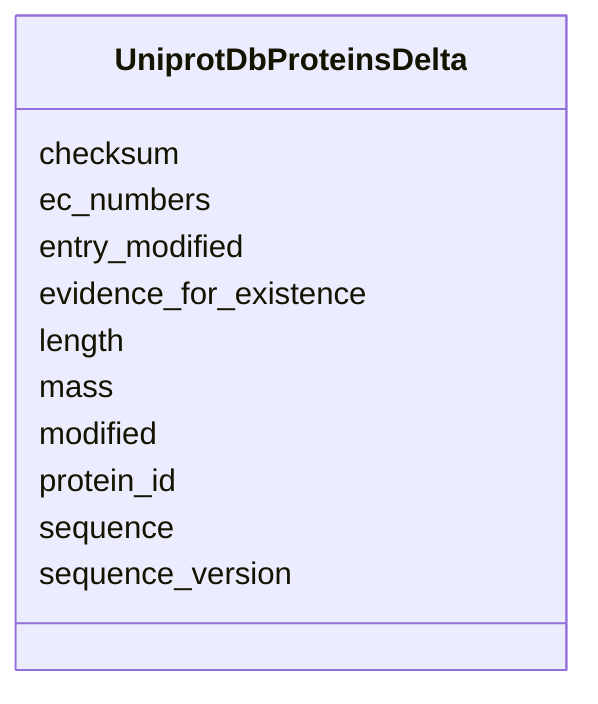

# Class: UniprotDbProteinsDelta 


URI: [https://w3id.org/kbase/kbase_uniprot_bacteria/UniprotDbProteinsDelta](https://w3id.org/kbase/kbase_uniprot_bacteria/UniprotDbProteinsDelta)





<!-- no inheritance hierarchy -->


## Slots

| Name | Cardinality and Range | Description | Inheritance |
| ---  | --- | --- | --- |
| [protein_id](protein_id.md) | 0..1 <br/> [String](String.md) |  | direct |
| [ec_numbers](ec_numbers.md) | 0..1 <br/> [String](String.md) |  | direct |
| [evidence_for_existence](evidence_for_existence.md) | 0..1 <br/> [String](String.md) |  | direct |
| [length](length.md) | 0..1 <br/> [String](String.md) |  | direct |
| [mass](mass.md) | 0..1 <br/> [String](String.md) |  | direct |
| [checksum](checksum.md) | 0..1 <br/> [String](String.md) |  | direct |
| [modified](modified.md) | 0..1 <br/> [String](String.md) |  | direct |
| [sequence_version](sequence_version.md) | 0..1 <br/> [String](String.md) |  | direct |
| [sequence](sequence.md) | 0..1 <br/> [String](String.md) |  | direct |
| [entry_modified](entry_modified.md) | 0..1 <br/> [String](String.md) |  | direct |


## Identifier and Mapping Information


### Annotations

| property | value |
| --- | --- |
| source_table | uniprot_db_proteins_delta |


### Schema Source


* from schema: https://w3id.org/kbase/kbase_uniprot_bacteria


## Mappings

| Mapping Type | Mapped Value |
| ---  | ---  |
| self | https://w3id.org/kbase/kbase_uniprot_bacteria/UniprotDbProteinsDelta |
| native | https://w3id.org/kbase/kbase_uniprot_bacteria/UniprotDbProteinsDelta |


## LinkML Source

<!-- TODO: investigate https://stackoverflow.com/questions/37606292/how-to-create-tabbed-code-blocks-in-mkdocs-or-sphinx -->

### Direct

<details>
```yaml
name: UniprotDbProteinsDelta
annotations:
  source_table:
    tag: source_table
    value: uniprot_db_proteins_delta
from_schema: https://w3id.org/kbase/kbase_uniprot_bacteria
attributes:
  protein_id:
    name: protein_id
    from_schema: https://w3id.org/kbase/kbase_uniprot_bacteria
    rank: 1000
    identifier: false
    domain_of:
    - UniprotDbProteinsDelta
    range: string
  ec_numbers:
    name: ec_numbers
    from_schema: https://w3id.org/kbase/kbase_uniprot_bacteria
    rank: 1000
    domain_of:
    - UniprotDbProteinsDelta
    range: string
  evidence_for_existence:
    name: evidence_for_existence
    from_schema: https://w3id.org/kbase/kbase_uniprot_bacteria
    rank: 1000
    domain_of:
    - UniprotDbProteinsDelta
    range: string
  length:
    name: length
    from_schema: https://w3id.org/kbase/kbase_uniprot_bacteria
    rank: 1000
    domain_of:
    - UniprotDbProteinsDelta
    range: string
  mass:
    name: mass
    from_schema: https://w3id.org/kbase/kbase_uniprot_bacteria
    rank: 1000
    domain_of:
    - UniprotDbProteinsDelta
    range: string
  checksum:
    name: checksum
    from_schema: https://w3id.org/kbase/kbase_uniprot_bacteria
    rank: 1000
    domain_of:
    - UniprotDbProteinsDelta
    range: string
  modified:
    name: modified
    from_schema: https://w3id.org/kbase/kbase_uniprot_bacteria
    rank: 1000
    domain_of:
    - UniprotDbProteinsDelta
    range: string
  sequence_version:
    name: sequence_version
    from_schema: https://w3id.org/kbase/kbase_uniprot_bacteria
    rank: 1000
    domain_of:
    - UniprotDbProteinsDelta
    range: string
  sequence:
    name: sequence
    from_schema: https://w3id.org/kbase/kbase_uniprot_bacteria
    rank: 1000
    domain_of:
    - UniprotDbProteinsDelta
    range: string
  entry_modified:
    name: entry_modified
    from_schema: https://w3id.org/kbase/kbase_uniprot_bacteria
    rank: 1000
    domain_of:
    - UniprotDbProteinsDelta
    range: string

```
</details>

### Induced

<details>
```yaml
name: UniprotDbProteinsDelta
annotations:
  source_table:
    tag: source_table
    value: uniprot_db_proteins_delta
from_schema: https://w3id.org/kbase/kbase_uniprot_bacteria
attributes:
  protein_id:
    name: protein_id
    from_schema: https://w3id.org/kbase/kbase_uniprot_bacteria
    rank: 1000
    identifier: false
    alias: protein_id
    owner: UniprotDbProteinsDelta
    domain_of:
    - UniprotDbProteinsDelta
    range: string
  ec_numbers:
    name: ec_numbers
    from_schema: https://w3id.org/kbase/kbase_uniprot_bacteria
    rank: 1000
    alias: ec_numbers
    owner: UniprotDbProteinsDelta
    domain_of:
    - UniprotDbProteinsDelta
    range: string
  evidence_for_existence:
    name: evidence_for_existence
    from_schema: https://w3id.org/kbase/kbase_uniprot_bacteria
    rank: 1000
    alias: evidence_for_existence
    owner: UniprotDbProteinsDelta
    domain_of:
    - UniprotDbProteinsDelta
    range: string
  length:
    name: length
    from_schema: https://w3id.org/kbase/kbase_uniprot_bacteria
    rank: 1000
    alias: length
    owner: UniprotDbProteinsDelta
    domain_of:
    - UniprotDbProteinsDelta
    range: string
  mass:
    name: mass
    from_schema: https://w3id.org/kbase/kbase_uniprot_bacteria
    rank: 1000
    alias: mass
    owner: UniprotDbProteinsDelta
    domain_of:
    - UniprotDbProteinsDelta
    range: string
  checksum:
    name: checksum
    from_schema: https://w3id.org/kbase/kbase_uniprot_bacteria
    rank: 1000
    alias: checksum
    owner: UniprotDbProteinsDelta
    domain_of:
    - UniprotDbProteinsDelta
    range: string
  modified:
    name: modified
    from_schema: https://w3id.org/kbase/kbase_uniprot_bacteria
    rank: 1000
    alias: modified
    owner: UniprotDbProteinsDelta
    domain_of:
    - UniprotDbProteinsDelta
    range: string
  sequence_version:
    name: sequence_version
    from_schema: https://w3id.org/kbase/kbase_uniprot_bacteria
    rank: 1000
    alias: sequence_version
    owner: UniprotDbProteinsDelta
    domain_of:
    - UniprotDbProteinsDelta
    range: string
  sequence:
    name: sequence
    from_schema: https://w3id.org/kbase/kbase_uniprot_bacteria
    rank: 1000
    alias: sequence
    owner: UniprotDbProteinsDelta
    domain_of:
    - UniprotDbProteinsDelta
    range: string
  entry_modified:
    name: entry_modified
    from_schema: https://w3id.org/kbase/kbase_uniprot_bacteria
    rank: 1000
    alias: entry_modified
    owner: UniprotDbProteinsDelta
    domain_of:
    - UniprotDbProteinsDelta
    range: string

```
</details>