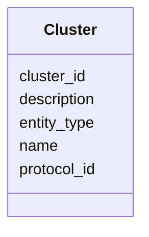

# Class: Cluster 


_UniRef100 cluster of identical sequences_


URI: [https://w3id.org/kbase/kbase_uniref100/Cluster](https://w3id.org/kbase/kbase_uniref100/Cluster)





<!-- no inheritance hierarchy -->


## Slots

| Name | Cardinality and Range | Description | Inheritance |
| ---  | --- | --- | --- |
| [cluster_id](cluster_id.md) | 1 <br/> [String](String.md) | UniRef100 cluster ID | direct |
| [name](name.md) | 0..1 <br/> [String](String.md) | Representative sequence name | direct |
| [entity_type](entity_type.md) | 0..1 <br/> [String](String.md) | Entity type (protein) | direct |
| [description](description.md) | 0..1 <br/> [String](String.md) | Cluster description | direct |
| [protocol_id](protocol_id.md) | 0..1 <br/> [String](String.md) | Clustering protocol ID | direct |


## Usages

| used by | used in | type | used |
| ---  | --- | --- | --- |
| [ClusterMember](ClusterMember.md) | [cluster_id](cluster_id.md) | range | [Cluster](Cluster.md) |


## Identifier and Mapping Information


### Annotations

| property | value |
| --- | --- |
| source_table | cluster |


### Schema Source


* from schema: https://w3id.org/kbase/kbase_uniref100


## Mappings

| Mapping Type | Mapped Value |
| ---  | ---  |
| self | https://w3id.org/kbase/kbase_uniref100/Cluster |
| native | https://w3id.org/kbase/kbase_uniref100/Cluster |


## LinkML Source

<!-- TODO: investigate https://stackoverflow.com/questions/37606292/how-to-create-tabbed-code-blocks-in-mkdocs-or-sphinx -->

### Direct

<details>
```yaml
name: Cluster
annotations:
  source_table:
    tag: source_table
    value: cluster
description: UniRef100 cluster of identical sequences
from_schema: https://w3id.org/kbase/kbase_uniref100
attributes:
  cluster_id:
    name: cluster_id
    description: UniRef100 cluster ID
    from_schema: https://w3id.org/kbase/kbase_uniref100
    rank: 1000
    identifier: true
    domain_of:
    - Cluster
    - ClusterMember
    required: true
  name:
    name: name
    description: Representative sequence name
    from_schema: https://w3id.org/kbase/kbase_uniref100
    rank: 1000
    domain_of:
    - Cluster
  entity_type:
    name: entity_type
    description: Entity type (protein)
    from_schema: https://w3id.org/kbase/kbase_uniref100
    rank: 1000
    domain_of:
    - Cluster
    - Entity
  description:
    name: description
    description: Cluster description
    from_schema: https://w3id.org/kbase/kbase_uniref100
    rank: 1000
    domain_of:
    - Cluster
  protocol_id:
    name: protocol_id
    description: Clustering protocol ID
    from_schema: https://w3id.org/kbase/kbase_uniref100
    rank: 1000
    domain_of:
    - Cluster

```
</details>

### Induced

<details>
```yaml
name: Cluster
annotations:
  source_table:
    tag: source_table
    value: cluster
description: UniRef100 cluster of identical sequences
from_schema: https://w3id.org/kbase/kbase_uniref100
attributes:
  cluster_id:
    name: cluster_id
    description: UniRef100 cluster ID
    from_schema: https://w3id.org/kbase/kbase_uniref100
    rank: 1000
    identifier: true
    alias: cluster_id
    owner: Cluster
    domain_of:
    - Cluster
    - ClusterMember
    range: string
  name:
    name: name
    description: Representative sequence name
    from_schema: https://w3id.org/kbase/kbase_uniref100
    rank: 1000
    alias: name
    owner: Cluster
    domain_of:
    - Cluster
    range: string
  entity_type:
    name: entity_type
    description: Entity type (protein)
    from_schema: https://w3id.org/kbase/kbase_uniref100
    rank: 1000
    alias: entity_type
    owner: Cluster
    domain_of:
    - Cluster
    - Entity
    range: string
  description:
    name: description
    description: Cluster description
    from_schema: https://w3id.org/kbase/kbase_uniref100
    rank: 1000
    alias: description
    owner: Cluster
    domain_of:
    - Cluster
    range: string
  protocol_id:
    name: protocol_id
    description: Clustering protocol ID
    from_schema: https://w3id.org/kbase/kbase_uniref100
    rank: 1000
    alias: protocol_id
    owner: Cluster
    domain_of:
    - Cluster
    range: string

```
</details>