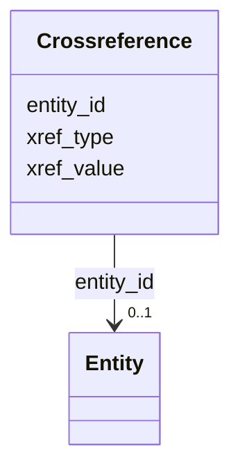

# Class: Crossreference 


_Cross-references to external databases_


URI: [https://w3id.org/kbase/kbase_uniref100/Crossreference](https://w3id.org/kbase/kbase_uniref100/Crossreference)





<!-- no inheritance hierarchy -->


## Slots

| Name | Cardinality and Range | Description | Inheritance |
| ---  | --- | --- | --- |
| [entity_id](entity_id.md) | 0..1 <br/> [Entity](Entity.md) |  | direct |
| [xref_type](xref_type.md) | 0..1 <br/> [String](String.md) | Cross-reference database type | direct |
| [xref_value](xref_value.md) | 0..1 <br/> [String](String.md) | External identifier value | direct |


## Identifier and Mapping Information


### Annotations

| property | value |
| --- | --- |
| source_table | crossreference |


### Schema Source


* from schema: https://w3id.org/kbase/kbase_uniref100


## Mappings

| Mapping Type | Mapped Value |
| ---  | ---  |
| self | https://w3id.org/kbase/kbase_uniref100/Crossreference |
| native | https://w3id.org/kbase/kbase_uniref100/Crossreference |


## LinkML Source

<!-- TODO: investigate https://stackoverflow.com/questions/37606292/how-to-create-tabbed-code-blocks-in-mkdocs-or-sphinx -->

### Direct

<details>
```yaml
name: Crossreference
annotations:
  source_table:
    tag: source_table
    value: crossreference
description: Cross-references to external databases
from_schema: https://w3id.org/kbase/kbase_uniref100
attributes:
  entity_id:
    name: entity_id
    from_schema: https://w3id.org/kbase/kbase_uniref100
    domain_of:
    - ClusterMember
    - Crossreference
    - Entity
    range: Entity
  xref_type:
    name: xref_type
    description: Cross-reference database type
    from_schema: https://w3id.org/kbase/kbase_uniref100
    rank: 1000
    domain_of:
    - Crossreference
  xref_value:
    name: xref_value
    description: External identifier value
    from_schema: https://w3id.org/kbase/kbase_uniref100
    rank: 1000
    domain_of:
    - Crossreference

```
</details>

### Induced

<details>
```yaml
name: Crossreference
annotations:
  source_table:
    tag: source_table
    value: crossreference
description: Cross-references to external databases
from_schema: https://w3id.org/kbase/kbase_uniref100
attributes:
  entity_id:
    name: entity_id
    from_schema: https://w3id.org/kbase/kbase_uniref100
    alias: entity_id
    owner: Crossreference
    domain_of:
    - ClusterMember
    - Crossreference
    - Entity
    range: Entity
  xref_type:
    name: xref_type
    description: Cross-reference database type
    from_schema: https://w3id.org/kbase/kbase_uniref100
    rank: 1000
    alias: xref_type
    owner: Crossreference
    domain_of:
    - Crossreference
    range: string
  xref_value:
    name: xref_value
    description: External identifier value
    from_schema: https://w3id.org/kbase/kbase_uniref100
    rank: 1000
    alias: xref_value
    owner: Crossreference
    domain_of:
    - Crossreference
    range: string

```
</details>