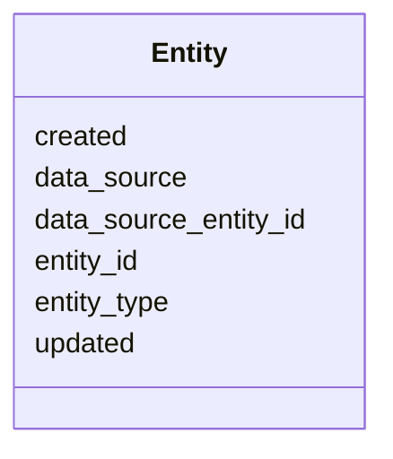

# Class: Entity 


_UniProt entity (protein sequence)_


URI: [https://w3id.org/kbase/kbase_uniref100/Entity](https://w3id.org/kbase/kbase_uniref100/Entity)





<!-- no inheritance hierarchy -->


## Slots

| Name | Cardinality and Range | Description | Inheritance |
| ---  | --- | --- | --- |
| [entity_id](entity_id.md) | 1 <br/> [String](String.md) | Internal entity ID | direct |
| [data_source_entity_id](data_source_entity_id.md) | 0..1 <br/> [String](String.md) | Original UniProt ID | direct |
| [entity_type](entity_type.md) | 0..1 <br/> [String](String.md) | Entity type | direct |
| [data_source](data_source.md) | 0..1 <br/> [String](String.md) | Source database | direct |
| [updated](updated.md) | 0..1 <br/> [String](String.md) | Last update timestamp | direct |
| [created](created.md) | 0..1 <br/> [String](String.md) | Creation timestamp | direct |


## Usages

| used by | used in | type | used |
| ---  | --- | --- | --- |
| [ClusterMember](ClusterMember.md) | [entity_id](entity_id.md) | range | [Entity](Entity.md) |
| [Crossreference](Crossreference.md) | [entity_id](entity_id.md) | range | [Entity](Entity.md) |


## Identifier and Mapping Information


### Annotations

| property | value |
| --- | --- |
| source_table | entity |


### Schema Source


* from schema: https://w3id.org/kbase/kbase_uniref100


## Mappings

| Mapping Type | Mapped Value |
| ---  | ---  |
| self | https://w3id.org/kbase/kbase_uniref100/Entity |
| native | https://w3id.org/kbase/kbase_uniref100/Entity |


## LinkML Source

<!-- TODO: investigate https://stackoverflow.com/questions/37606292/how-to-create-tabbed-code-blocks-in-mkdocs-or-sphinx -->

### Direct

<details>
```yaml
name: Entity
annotations:
  source_table:
    tag: source_table
    value: entity
description: UniProt entity (protein sequence)
from_schema: https://w3id.org/kbase/kbase_uniref100
attributes:
  entity_id:
    name: entity_id
    description: Internal entity ID
    from_schema: https://w3id.org/kbase/kbase_uniref100
    identifier: true
    domain_of:
    - ClusterMember
    - Crossreference
    - Entity
    required: true
  data_source_entity_id:
    name: data_source_entity_id
    description: Original UniProt ID
    from_schema: https://w3id.org/kbase/kbase_uniref100
    rank: 1000
    domain_of:
    - Entity
  entity_type:
    name: entity_type
    description: Entity type
    from_schema: https://w3id.org/kbase/kbase_uniref100
    domain_of:
    - Cluster
    - Entity
  data_source:
    name: data_source
    description: Source database
    from_schema: https://w3id.org/kbase/kbase_uniref100
    rank: 1000
    domain_of:
    - Entity
  updated:
    name: updated
    description: Last update timestamp
    from_schema: https://w3id.org/kbase/kbase_uniref100
    rank: 1000
    domain_of:
    - Entity
  created:
    name: created
    description: Creation timestamp
    from_schema: https://w3id.org/kbase/kbase_uniref100
    rank: 1000
    domain_of:
    - Entity

```
</details>

### Induced

<details>
```yaml
name: Entity
annotations:
  source_table:
    tag: source_table
    value: entity
description: UniProt entity (protein sequence)
from_schema: https://w3id.org/kbase/kbase_uniref100
attributes:
  entity_id:
    name: entity_id
    description: Internal entity ID
    from_schema: https://w3id.org/kbase/kbase_uniref100
    identifier: true
    alias: entity_id
    owner: Entity
    domain_of:
    - ClusterMember
    - Crossreference
    - Entity
    range: string
    required: true
  data_source_entity_id:
    name: data_source_entity_id
    description: Original UniProt ID
    from_schema: https://w3id.org/kbase/kbase_uniref100
    rank: 1000
    alias: data_source_entity_id
    owner: Entity
    domain_of:
    - Entity
    range: string
  entity_type:
    name: entity_type
    description: Entity type
    from_schema: https://w3id.org/kbase/kbase_uniref100
    alias: entity_type
    owner: Entity
    domain_of:
    - Cluster
    - Entity
    range: string
  data_source:
    name: data_source
    description: Source database
    from_schema: https://w3id.org/kbase/kbase_uniref100
    rank: 1000
    alias: data_source
    owner: Entity
    domain_of:
    - Entity
    range: string
  updated:
    name: updated
    description: Last update timestamp
    from_schema: https://w3id.org/kbase/kbase_uniref100
    rank: 1000
    alias: updated
    owner: Entity
    domain_of:
    - Entity
    range: string
  created:
    name: created
    description: Creation timestamp
    from_schema: https://w3id.org/kbase/kbase_uniref100
    rank: 1000
    alias: created
    owner: Entity
    domain_of:
    - Entity
    range: string

```
</details>