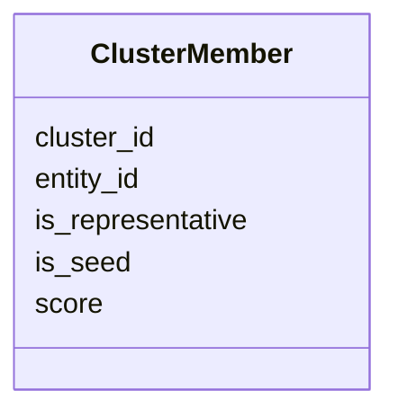

# Class: ClusterMember 


_Member of a UniRef50 cluster. Links individual protein entities to their parent clusters with membership metadata._


URI: [https://w3id.org/kbase/kbase_uniref50/ClusterMember](https://w3id.org/kbase/kbase_uniref50/ClusterMember)





<!-- no inheritance hierarchy -->


## Slots

| Name | Cardinality and Range | Description | Inheritance |
| ---  | --- | --- | --- |
| [cluster_id](cluster_id.md) | 0..1 <br/> [String](String.md) | Parent cluster identifier | direct |
| [entity_id](entity_id.md) | 0..1 <br/> [String](String.md) | Member entity identifier | direct |
| [is_representative](is_representative.md) | 0..1 <br/> [Boolean](Boolean.md) | Whether this member is the cluster representative | direct |
| [is_seed](is_seed.md) | 0..1 <br/> [Boolean](Boolean.md) | Whether this member was used as clustering seed | direct |
| [score](score.md) | 0..1 <br/> [Float](Float.md) | Membership score/similarity to representative | direct |


## Identifier and Mapping Information


### Annotations

| property | value |
| --- | --- |
| source_table | clustermember |


### Schema Source


* from schema: https://w3id.org/kbase/kbase_uniref50


## Mappings

| Mapping Type | Mapped Value |
| ---  | ---  |
| self | https://w3id.org/kbase/kbase_uniref50/ClusterMember |
| native | https://w3id.org/kbase/kbase_uniref50/ClusterMember |


## LinkML Source

<!-- TODO: investigate https://stackoverflow.com/questions/37606292/how-to-create-tabbed-code-blocks-in-mkdocs-or-sphinx -->

### Direct

<details>
```yaml
name: ClusterMember
annotations:
  source_table:
    tag: source_table
    value: clustermember
description: Member of a UniRef50 cluster. Links individual protein entities to their
  parent clusters with membership metadata.
from_schema: https://w3id.org/kbase/kbase_uniref50
attributes:
  cluster_id:
    name: cluster_id
    description: Parent cluster identifier
    comments:
    - Foreign key to Cluster.cluster_id
    from_schema: https://w3id.org/kbase/kbase_uniref50
    domain_of:
    - Cluster
    - ClusterMember
    range: string
  entity_id:
    name: entity_id
    description: Member entity identifier
    comments:
    - Foreign key to Entity.entity_id
    from_schema: https://w3id.org/kbase/kbase_uniref50
    rank: 1000
    domain_of:
    - ClusterMember
    - CrossReference
    - Entity
    range: string
  is_representative:
    name: is_representative
    description: Whether this member is the cluster representative
    from_schema: https://w3id.org/kbase/kbase_uniref50
    rank: 1000
    domain_of:
    - ClusterMember
    range: boolean
  is_seed:
    name: is_seed
    description: Whether this member was used as clustering seed
    from_schema: https://w3id.org/kbase/kbase_uniref50
    rank: 1000
    domain_of:
    - ClusterMember
    range: boolean
  score:
    name: score
    description: Membership score/similarity to representative
    from_schema: https://w3id.org/kbase/kbase_uniref50
    rank: 1000
    domain_of:
    - ClusterMember
    range: float

```
</details>

### Induced

<details>
```yaml
name: ClusterMember
annotations:
  source_table:
    tag: source_table
    value: clustermember
description: Member of a UniRef50 cluster. Links individual protein entities to their
  parent clusters with membership metadata.
from_schema: https://w3id.org/kbase/kbase_uniref50
attributes:
  cluster_id:
    name: cluster_id
    description: Parent cluster identifier
    comments:
    - Foreign key to Cluster.cluster_id
    from_schema: https://w3id.org/kbase/kbase_uniref50
    alias: cluster_id
    owner: ClusterMember
    domain_of:
    - Cluster
    - ClusterMember
    range: string
  entity_id:
    name: entity_id
    description: Member entity identifier
    comments:
    - Foreign key to Entity.entity_id
    from_schema: https://w3id.org/kbase/kbase_uniref50
    rank: 1000
    alias: entity_id
    owner: ClusterMember
    domain_of:
    - ClusterMember
    - CrossReference
    - Entity
    range: string
  is_representative:
    name: is_representative
    description: Whether this member is the cluster representative
    from_schema: https://w3id.org/kbase/kbase_uniref50
    rank: 1000
    alias: is_representative
    owner: ClusterMember
    domain_of:
    - ClusterMember
    range: boolean
  is_seed:
    name: is_seed
    description: Whether this member was used as clustering seed
    from_schema: https://w3id.org/kbase/kbase_uniref50
    rank: 1000
    alias: is_seed
    owner: ClusterMember
    domain_of:
    - ClusterMember
    range: boolean
  score:
    name: score
    description: Membership score/similarity to representative
    from_schema: https://w3id.org/kbase/kbase_uniref50
    rank: 1000
    alias: score
    owner: ClusterMember
    domain_of:
    - ClusterMember
    range: float

```
</details>