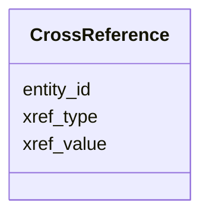

# Class: CrossReference 


_External database cross-reference for entities. Links UniRef entries to UniProt, NCBI, and other databases._


URI: [https://w3id.org/kbase/kbase_uniref50/CrossReference](https://w3id.org/kbase/kbase_uniref50/CrossReference)





<!-- no inheritance hierarchy -->


## Slots

| Name | Cardinality and Range | Description | Inheritance |
| ---  | --- | --- | --- |
| [entity_id](entity_id.md) | 0..1 <br/> [String](String.md) | Entity being cross-referenced | direct |
| [xref_type](xref_type.md) | 0..1 <br/> [String](String.md) | Type of cross-reference (UniProt, NCBI, etc | direct |
| [xref_value](xref_value.md) | 0..1 <br/> [String](String.md) | Cross-reference identifier value | direct |


## Identifier and Mapping Information


### Annotations

| property | value |
| --- | --- |
| source_table | crossreference |


### Schema Source


* from schema: https://w3id.org/kbase/kbase_uniref50


## Mappings

| Mapping Type | Mapped Value |
| ---  | ---  |
| self | https://w3id.org/kbase/kbase_uniref50/CrossReference |
| native | https://w3id.org/kbase/kbase_uniref50/CrossReference |


## LinkML Source

<!-- TODO: investigate https://stackoverflow.com/questions/37606292/how-to-create-tabbed-code-blocks-in-mkdocs-or-sphinx -->

### Direct

<details>
```yaml
name: CrossReference
annotations:
  source_table:
    tag: source_table
    value: crossreference
description: External database cross-reference for entities. Links UniRef entries
  to UniProt, NCBI, and other databases.
from_schema: https://w3id.org/kbase/kbase_uniref50
attributes:
  entity_id:
    name: entity_id
    description: Entity being cross-referenced
    comments:
    - Foreign key to Entity.entity_id
    from_schema: https://w3id.org/kbase/kbase_uniref50
    domain_of:
    - ClusterMember
    - CrossReference
    - Entity
    range: string
  xref_type:
    name: xref_type
    description: Type of cross-reference (UniProt, NCBI, etc.)
    from_schema: https://w3id.org/kbase/kbase_uniref50
    rank: 1000
    domain_of:
    - CrossReference
    range: string
  xref_value:
    name: xref_value
    description: Cross-reference identifier value
    from_schema: https://w3id.org/kbase/kbase_uniref50
    rank: 1000
    domain_of:
    - CrossReference
    range: string

```
</details>

### Induced

<details>
```yaml
name: CrossReference
annotations:
  source_table:
    tag: source_table
    value: crossreference
description: External database cross-reference for entities. Links UniRef entries
  to UniProt, NCBI, and other databases.
from_schema: https://w3id.org/kbase/kbase_uniref50
attributes:
  entity_id:
    name: entity_id
    description: Entity being cross-referenced
    comments:
    - Foreign key to Entity.entity_id
    from_schema: https://w3id.org/kbase/kbase_uniref50
    alias: entity_id
    owner: CrossReference
    domain_of:
    - ClusterMember
    - CrossReference
    - Entity
    range: string
  xref_type:
    name: xref_type
    description: Type of cross-reference (UniProt, NCBI, etc.)
    from_schema: https://w3id.org/kbase/kbase_uniref50
    rank: 1000
    alias: xref_type
    owner: CrossReference
    domain_of:
    - CrossReference
    range: string
  xref_value:
    name: xref_value
    description: Cross-reference identifier value
    from_schema: https://w3id.org/kbase/kbase_uniref50
    rank: 1000
    alias: xref_value
    owner: CrossReference
    domain_of:
    - CrossReference
    range: string

```
</details>