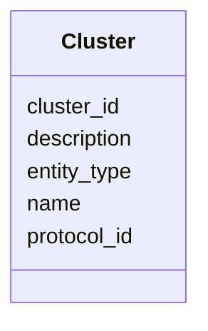

# Class: Cluster 


_UniRef90 protein sequence cluster. Groups proteins with ≥90% sequence identity and ≥80% coverage to a representative sequence._

_EXAMPLE CLUSTERS: - "Cluster: LysM peptidoglycan-binding domain-containing protein" - "Cluster: mucin-6" - "Cluster: SDR family NAD(P)-dependent oxidoreductase"_


URI: [https://w3id.org/kbase/kbase_uniref90/Cluster](https://w3id.org/kbase/kbase_uniref90/Cluster)





<!-- no inheritance hierarchy -->


## Slots

| Name | Cardinality and Range | Description | Inheritance |
| ---  | --- | --- | --- |
| [cluster_id](cluster_id.md) | 1 <br/> [String](String.md) | Unique cluster identifier (CDM UUID) | direct |
| [name](name.md) | 0..1 <br/> [String](String.md) | Cluster name with representative protein description | direct |
| [entity_type](entity_type.md) | 0..1 <br/> [String](String.md) | Type of entity (protein) | direct |
| [description](description.md) | 0..1 <br/> [String](String.md) | Additional cluster description (optional) | direct |
| [protocol_id](protocol_id.md) | 0..1 <br/> [String](String.md) | Clustering protocol identifier | direct |


## Identifier and Mapping Information


### Annotations

| property | value |
| --- | --- |
| source_table | cluster |


### Schema Source


* from schema: https://w3id.org/kbase/kbase_uniref90


## Mappings

| Mapping Type | Mapped Value |
| ---  | ---  |
| self | https://w3id.org/kbase/kbase_uniref90/Cluster |
| native | https://w3id.org/kbase/kbase_uniref90/Cluster |


## LinkML Source

<!-- TODO: investigate https://stackoverflow.com/questions/37606292/how-to-create-tabbed-code-blocks-in-mkdocs-or-sphinx -->

### Direct

<details>
```yaml
name: Cluster
annotations:
  source_table:
    tag: source_table
    value: cluster
description: 'UniRef90 protein sequence cluster. Groups proteins with ≥90% sequence
  identity and ≥80% coverage to a representative sequence.

  EXAMPLE CLUSTERS: - "Cluster: LysM peptidoglycan-binding domain-containing protein"
  - "Cluster: mucin-6" - "Cluster: SDR family NAD(P)-dependent oxidoreductase"'
from_schema: https://w3id.org/kbase/kbase_uniref90
attributes:
  cluster_id:
    name: cluster_id
    description: Unique cluster identifier (CDM UUID)
    examples:
    - value: CDM:c811d1d9-3235-4b7a-9012-9387f87a1188
    from_schema: https://w3id.org/kbase/kbase_uniref90
    rank: 1000
    identifier: true
    domain_of:
    - Cluster
    - ClusterMember
    range: string
    required: true
  name:
    name: name
    description: Cluster name with representative protein description
    examples:
    - value: 'Cluster: LysM peptidoglycan-binding domain-containing protein'
    - value: 'Cluster: mucin-6'
    from_schema: https://w3id.org/kbase/kbase_uniref90
    rank: 1000
    domain_of:
    - Cluster
    range: string
  entity_type:
    name: entity_type
    description: Type of entity (protein)
    examples:
    - value: protein
    from_schema: https://w3id.org/kbase/kbase_uniref90
    rank: 1000
    domain_of:
    - Cluster
    - Entity
    range: string
  description:
    name: description
    description: Additional cluster description (optional)
    from_schema: https://w3id.org/kbase/kbase_uniref90
    rank: 1000
    domain_of:
    - Cluster
    range: string
  protocol_id:
    name: protocol_id
    description: Clustering protocol identifier
    examples:
    - value: UniRef 100
    from_schema: https://w3id.org/kbase/kbase_uniref90
    rank: 1000
    domain_of:
    - Cluster
    range: string

```
</details>

### Induced

<details>
```yaml
name: Cluster
annotations:
  source_table:
    tag: source_table
    value: cluster
description: 'UniRef90 protein sequence cluster. Groups proteins with ≥90% sequence
  identity and ≥80% coverage to a representative sequence.

  EXAMPLE CLUSTERS: - "Cluster: LysM peptidoglycan-binding domain-containing protein"
  - "Cluster: mucin-6" - "Cluster: SDR family NAD(P)-dependent oxidoreductase"'
from_schema: https://w3id.org/kbase/kbase_uniref90
attributes:
  cluster_id:
    name: cluster_id
    description: Unique cluster identifier (CDM UUID)
    examples:
    - value: CDM:c811d1d9-3235-4b7a-9012-9387f87a1188
    from_schema: https://w3id.org/kbase/kbase_uniref90
    rank: 1000
    identifier: true
    alias: cluster_id
    owner: Cluster
    domain_of:
    - Cluster
    - ClusterMember
    range: string
  name:
    name: name
    description: Cluster name with representative protein description
    examples:
    - value: 'Cluster: LysM peptidoglycan-binding domain-containing protein'
    - value: 'Cluster: mucin-6'
    from_schema: https://w3id.org/kbase/kbase_uniref90
    rank: 1000
    alias: name
    owner: Cluster
    domain_of:
    - Cluster
    range: string
  entity_type:
    name: entity_type
    description: Type of entity (protein)
    examples:
    - value: protein
    from_schema: https://w3id.org/kbase/kbase_uniref90
    rank: 1000
    alias: entity_type
    owner: Cluster
    domain_of:
    - Cluster
    - Entity
    range: string
  description:
    name: description
    description: Additional cluster description (optional)
    from_schema: https://w3id.org/kbase/kbase_uniref90
    rank: 1000
    alias: description
    owner: Cluster
    domain_of:
    - Cluster
    range: string
  protocol_id:
    name: protocol_id
    description: Clustering protocol identifier
    examples:
    - value: UniRef 100
    from_schema: https://w3id.org/kbase/kbase_uniref90
    rank: 1000
    alias: protocol_id
    owner: Cluster
    domain_of:
    - Cluster
    range: string

```
</details>