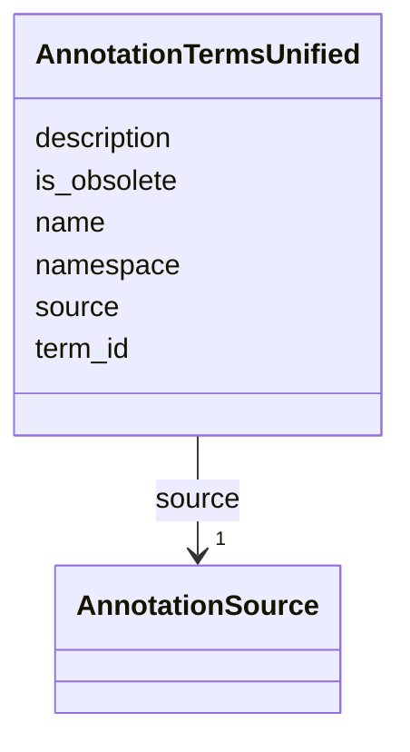

# Class: AnnotationTermsUnified 


_Unified annotation terms across sources (GO, KEGG, EC, COG, MetaCyc). Provides a single interface for querying functional annotations regardless of source ontology._

_TOTAL TERMS: 67,353 across all sources_

_USAGE: Query this table when you need to search across annotation databases. Use the source column to filter by specific database. For GO-specific queries with hierarchy, use go_terms and go_hierarchy_flat._

_EXAMPLE QUERIES: - Find all kinase-related terms: WHERE name LIKE '%kinase%' - Get all EC numbers: WHERE source = 'ec' - Search by ID: WHERE term_id = 'GO:0008150'_


URI: [https://w3id.org/kbase/nmdc_core/AnnotationTermsUnified](https://w3id.org/kbase/nmdc_core/AnnotationTermsUnified)





<!-- no inheritance hierarchy -->


## Slots

| Name | Cardinality and Range | Description | Inheritance |
| ---  | --- | --- | --- |
| [source](source.md) | 1 <br/> [AnnotationSource](AnnotationSource.md) | Source ontology/database for this term | direct |
| [term_id](term_id.md) | 1 <br/> [String](String.md) | Term identifier with format varying by source | direct |
| [name](name.md) | 0..1 <br/> [String](String.md) | Human-readable term name/label | direct |
| [description](description.md) | 0..1 <br/> [String](String.md) | Term description or definition | direct |
| [namespace](namespace.md) | 0..1 <br/> [String](String.md) | Ontology namespace (primarily for GO terms) | direct |
| [is_obsolete](is_obsolete.md) | 0..1 <br/> [Boolean](Boolean.md) | Whether term is deprecated and should not be used for new annotations | direct |


## Identifier and Mapping Information


### Annotations

| property | value |
| --- | --- |
| source_table | annotation_terms_unified |


### Schema Source


* from schema: https://w3id.org/kbase/nmdc_core


## Mappings

| Mapping Type | Mapped Value |
| ---  | ---  |
| self | https://w3id.org/kbase/nmdc_core/AnnotationTermsUnified |
| native | https://w3id.org/kbase/nmdc_core/AnnotationTermsUnified |


## LinkML Source

<!-- TODO: investigate https://stackoverflow.com/questions/37606292/how-to-create-tabbed-code-blocks-in-mkdocs-or-sphinx -->

### Direct

<details>
```yaml
name: AnnotationTermsUnified
annotations:
  source_table:
    tag: source_table
    value: annotation_terms_unified
description: 'Unified annotation terms across sources (GO, KEGG, EC, COG, MetaCyc).
  Provides a single interface for querying functional annotations regardless of source
  ontology.

  TOTAL TERMS: 67,353 across all sources

  USAGE: Query this table when you need to search across annotation databases. Use
  the source column to filter by specific database. For GO-specific queries with hierarchy,
  use go_terms and go_hierarchy_flat.

  EXAMPLE QUERIES: - Find all kinase-related terms: WHERE name LIKE ''%kinase%'' -
  Get all EC numbers: WHERE source = ''ec'' - Search by ID: WHERE term_id = ''GO:0008150'''
from_schema: https://w3id.org/kbase/nmdc_core
attributes:
  source:
    name: source
    description: Source ontology/database for this term. Determines ID format and
      available metadata.
    examples:
    - value: go
      description: Gene Ontology - largest source with 48K+ terms
    - value: ec
      description: Enzyme Commission - 8,813 enzyme classifications
    - value: kegg_ko
      description: KEGG Orthology - 8,104 functional orthologs
    - value: cog
      description: COG categories - 26 broad functional groups
    from_schema: https://w3id.org/kbase/nmdc_core
    rank: 1000
    domain_of:
    - AnnotationTermsUnified
    range: AnnotationSource
    required: true
  term_id:
    name: term_id
    description: Term identifier with format varying by source. GO uses GO:NNNNNNN,
      EC uses X.X.X.X, KEGG KO uses KXXXXX.
    examples:
    - value: GO:0008150
      description: biological_process - root term for BP namespace
    - value: GO:0003674
      description: molecular_function - root term for MF namespace
    - value: K00001
      description: KEGG alcohol dehydrogenase ortholog
    - value: 1.1.1.1
      description: EC number for alcohol dehydrogenase
    - value: J
      description: COG category - Translation, ribosomal structure
    from_schema: https://w3id.org/kbase/nmdc_core
    rank: 1000
    identifier: true
    domain_of:
    - AnnotationTermsUnified
    range: string
    required: true
  name:
    name: name
    description: Human-readable term name/label
    examples:
    - value: biological_process
      description: Root GO term name
    - value: mitochondrion inheritance
      description: Specific GO biological process
    - value: Alcohol dehydrogenase
      description: EC enzyme name
    from_schema: https://w3id.org/kbase/nmdc_core
    rank: 1000
    domain_of:
    - AnnotationTermsUnified
    - GoTerms
    - EcTerms
    - KeggKoTerms
    - KeggPathwayTerms
    - StudyTable
    - MetabolomicsGold
    - MetacycPathways
    range: string
  description:
    name: description
    description: Term description or definition. For GO terms, contains the formal
      definition with citations. May be empty for some sources.
    from_schema: https://w3id.org/kbase/nmdc_core
    rank: 1000
    domain_of:
    - AnnotationTermsUnified
    - EcTerms
    - CogCategories
    - StudyTable
    - MetacycPathways
    range: string
  namespace:
    name: namespace
    description: Ontology namespace (primarily for GO terms). One of biological_process,
      molecular_function, or cellular_component.
    examples:
    - value: biological_process
    - value: molecular_function
    - value: cellular_component
    from_schema: https://w3id.org/kbase/nmdc_core
    rank: 1000
    domain_of:
    - AnnotationTermsUnified
    - GoTerms
    - GoHierarchyFlat
    range: string
  is_obsolete:
    name: is_obsolete
    description: Whether term is deprecated and should not be used for new annotations.
      About 18% of GO terms are obsolete.
    examples:
    - value: 'False'
      description: Active term - safe to use
    - value: 'True'
      description: Obsolete - check for replacement
    from_schema: https://w3id.org/kbase/nmdc_core
    rank: 1000
    domain_of:
    - AnnotationTermsUnified
    - GoTerms
    - GoHierarchyFlat
    - EcTerms
    range: boolean

```
</details>

### Induced

<details>
```yaml
name: AnnotationTermsUnified
annotations:
  source_table:
    tag: source_table
    value: annotation_terms_unified
description: 'Unified annotation terms across sources (GO, KEGG, EC, COG, MetaCyc).
  Provides a single interface for querying functional annotations regardless of source
  ontology.

  TOTAL TERMS: 67,353 across all sources

  USAGE: Query this table when you need to search across annotation databases. Use
  the source column to filter by specific database. For GO-specific queries with hierarchy,
  use go_terms and go_hierarchy_flat.

  EXAMPLE QUERIES: - Find all kinase-related terms: WHERE name LIKE ''%kinase%'' -
  Get all EC numbers: WHERE source = ''ec'' - Search by ID: WHERE term_id = ''GO:0008150'''
from_schema: https://w3id.org/kbase/nmdc_core
attributes:
  source:
    name: source
    description: Source ontology/database for this term. Determines ID format and
      available metadata.
    examples:
    - value: go
      description: Gene Ontology - largest source with 48K+ terms
    - value: ec
      description: Enzyme Commission - 8,813 enzyme classifications
    - value: kegg_ko
      description: KEGG Orthology - 8,104 functional orthologs
    - value: cog
      description: COG categories - 26 broad functional groups
    from_schema: https://w3id.org/kbase/nmdc_core
    rank: 1000
    alias: source
    owner: AnnotationTermsUnified
    domain_of:
    - AnnotationTermsUnified
    range: AnnotationSource
    required: true
  term_id:
    name: term_id
    description: Term identifier with format varying by source. GO uses GO:NNNNNNN,
      EC uses X.X.X.X, KEGG KO uses KXXXXX.
    examples:
    - value: GO:0008150
      description: biological_process - root term for BP namespace
    - value: GO:0003674
      description: molecular_function - root term for MF namespace
    - value: K00001
      description: KEGG alcohol dehydrogenase ortholog
    - value: 1.1.1.1
      description: EC number for alcohol dehydrogenase
    - value: J
      description: COG category - Translation, ribosomal structure
    from_schema: https://w3id.org/kbase/nmdc_core
    rank: 1000
    identifier: true
    alias: term_id
    owner: AnnotationTermsUnified
    domain_of:
    - AnnotationTermsUnified
    range: string
    required: true
  name:
    name: name
    description: Human-readable term name/label
    examples:
    - value: biological_process
      description: Root GO term name
    - value: mitochondrion inheritance
      description: Specific GO biological process
    - value: Alcohol dehydrogenase
      description: EC enzyme name
    from_schema: https://w3id.org/kbase/nmdc_core
    rank: 1000
    alias: name
    owner: AnnotationTermsUnified
    domain_of:
    - AnnotationTermsUnified
    - GoTerms
    - EcTerms
    - KeggKoTerms
    - KeggPathwayTerms
    - StudyTable
    - MetabolomicsGold
    - MetacycPathways
    range: string
  description:
    name: description
    description: Term description or definition. For GO terms, contains the formal
      definition with citations. May be empty for some sources.
    from_schema: https://w3id.org/kbase/nmdc_core
    rank: 1000
    alias: description
    owner: AnnotationTermsUnified
    domain_of:
    - AnnotationTermsUnified
    - EcTerms
    - CogCategories
    - StudyTable
    - MetacycPathways
    range: string
  namespace:
    name: namespace
    description: Ontology namespace (primarily for GO terms). One of biological_process,
      molecular_function, or cellular_component.
    examples:
    - value: biological_process
    - value: molecular_function
    - value: cellular_component
    from_schema: https://w3id.org/kbase/nmdc_core
    rank: 1000
    alias: namespace
    owner: AnnotationTermsUnified
    domain_of:
    - AnnotationTermsUnified
    - GoTerms
    - GoHierarchyFlat
    range: string
  is_obsolete:
    name: is_obsolete
    description: Whether term is deprecated and should not be used for new annotations.
      About 18% of GO terms are obsolete.
    examples:
    - value: 'False'
      description: Active term - safe to use
    - value: 'True'
      description: Obsolete - check for replacement
    from_schema: https://w3id.org/kbase/nmdc_core
    rank: 1000
    alias: is_obsolete
    owner: AnnotationTermsUnified
    domain_of:
    - AnnotationTermsUnified
    - GoTerms
    - GoHierarchyFlat
    - EcTerms
    range: boolean

```
</details>