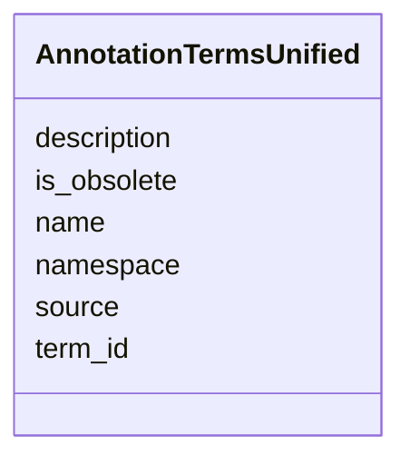

# Class: AnnotationTermsUnified 


_Unified annotation terms across sources (GO, KEGG, EC, COG, etc.)_


URI: [https://w3id.org/kbase/nmdc_core/AnnotationTermsUnified](https://w3id.org/kbase/nmdc_core/AnnotationTermsUnified)





<!-- no inheritance hierarchy -->


## Slots

| Name | Cardinality and Range | Description | Inheritance |
| ---  | --- | --- | --- |
| [source](source.md) | 0..1 <br/> [String](String.md) | Source ontology/database (GO, KEGG, EC, etc | direct |
| [term_id](term_id.md) | 1 <br/> [String](String.md) | Term identifier | direct |
| [name](name.md) | 0..1 <br/> [String](String.md) | Term name | direct |
| [description](description.md) | 0..1 <br/> [String](String.md) | Term description | direct |
| [namespace](namespace.md) | 0..1 <br/> [String](String.md) | Ontology namespace | direct |
| [is_obsolete](is_obsolete.md) | 0..1 <br/> [Boolean](Boolean.md) |  | direct |


## Identifier and Mapping Information


### Annotations

| property | value |
| --- | --- |
| source_table | annotation_terms_unified |


### Schema Source


* from schema: https://w3id.org/kbase/nmdc_core


## Mappings

| Mapping Type | Mapped Value |
| ---  | ---  |
| self | https://w3id.org/kbase/nmdc_core/AnnotationTermsUnified |
| native | https://w3id.org/kbase/nmdc_core/AnnotationTermsUnified |


## LinkML Source

<!-- TODO: investigate https://stackoverflow.com/questions/37606292/how-to-create-tabbed-code-blocks-in-mkdocs-or-sphinx -->

### Direct

<details>
```yaml
name: AnnotationTermsUnified
annotations:
  source_table:
    tag: source_table
    value: annotation_terms_unified
description: Unified annotation terms across sources (GO, KEGG, EC, COG, etc.)
from_schema: https://w3id.org/kbase/nmdc_core
attributes:
  source:
    name: source
    description: Source ontology/database (GO, KEGG, EC, etc.)
    from_schema: https://w3id.org/kbase/nmdc_core
    rank: 1000
    domain_of:
    - AnnotationTermsUnified
  term_id:
    name: term_id
    description: Term identifier
    from_schema: https://w3id.org/kbase/nmdc_core
    rank: 1000
    identifier: true
    domain_of:
    - AnnotationTermsUnified
    required: true
  name:
    name: name
    description: Term name
    from_schema: https://w3id.org/kbase/nmdc_core
    rank: 1000
    domain_of:
    - AnnotationTermsUnified
    - GoTerms
    - EcTerms
    - KeggKoTerms
    - KeggPathwayTerms
    - CogCategories
    - StudyTable
    - MetabolomicsGold
  description:
    name: description
    description: Term description
    from_schema: https://w3id.org/kbase/nmdc_core
    rank: 1000
    domain_of:
    - AnnotationTermsUnified
    - EcTerms
    - CogCategories
    - StudyTable
  namespace:
    name: namespace
    description: Ontology namespace
    from_schema: https://w3id.org/kbase/nmdc_core
    rank: 1000
    domain_of:
    - AnnotationTermsUnified
    - GoTerms
  is_obsolete:
    name: is_obsolete
    from_schema: https://w3id.org/kbase/nmdc_core
    rank: 1000
    domain_of:
    - AnnotationTermsUnified
    - GoTerms
    range: boolean

```
</details>

### Induced

<details>
```yaml
name: AnnotationTermsUnified
annotations:
  source_table:
    tag: source_table
    value: annotation_terms_unified
description: Unified annotation terms across sources (GO, KEGG, EC, COG, etc.)
from_schema: https://w3id.org/kbase/nmdc_core
attributes:
  source:
    name: source
    description: Source ontology/database (GO, KEGG, EC, etc.)
    from_schema: https://w3id.org/kbase/nmdc_core
    rank: 1000
    alias: source
    owner: AnnotationTermsUnified
    domain_of:
    - AnnotationTermsUnified
    range: string
  term_id:
    name: term_id
    description: Term identifier
    from_schema: https://w3id.org/kbase/nmdc_core
    rank: 1000
    identifier: true
    alias: term_id
    owner: AnnotationTermsUnified
    domain_of:
    - AnnotationTermsUnified
    range: string
  name:
    name: name
    description: Term name
    from_schema: https://w3id.org/kbase/nmdc_core
    rank: 1000
    alias: name
    owner: AnnotationTermsUnified
    domain_of:
    - AnnotationTermsUnified
    - GoTerms
    - EcTerms
    - KeggKoTerms
    - KeggPathwayTerms
    - CogCategories
    - StudyTable
    - MetabolomicsGold
    range: string
  description:
    name: description
    description: Term description
    from_schema: https://w3id.org/kbase/nmdc_core
    rank: 1000
    alias: description
    owner: AnnotationTermsUnified
    domain_of:
    - AnnotationTermsUnified
    - EcTerms
    - CogCategories
    - StudyTable
    range: string
  namespace:
    name: namespace
    description: Ontology namespace
    from_schema: https://w3id.org/kbase/nmdc_core
    rank: 1000
    alias: namespace
    owner: AnnotationTermsUnified
    domain_of:
    - AnnotationTermsUnified
    - GoTerms
    range: string
  is_obsolete:
    name: is_obsolete
    from_schema: https://w3id.org/kbase/nmdc_core
    rank: 1000
    alias: is_obsolete
    owner: AnnotationTermsUnified
    domain_of:
    - AnnotationTermsUnified
    - GoTerms
    range: boolean

```
</details>