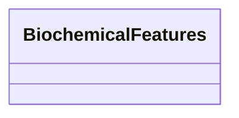

# Class: BiochemicalFeatures 


_Biochemical features from metabolomics for machine learning. Compound intensities or presence/absence._


URI: [https://w3id.org/kbase/nmdc_core/BiochemicalFeatures](https://w3id.org/kbase/nmdc_core/BiochemicalFeatures)





<!-- no inheritance hierarchy -->


## Slots

| Name | Cardinality and Range | Description | Inheritance |
| ---  | --- | --- | --- |


## Identifier and Mapping Information


### Annotations

| property | value |
| --- | --- |
| source_table | biochemical_features |


### Schema Source


* from schema: https://w3id.org/kbase/nmdc_core


## Mappings

| Mapping Type | Mapped Value |
| ---  | ---  |
| self | https://w3id.org/kbase/nmdc_core/BiochemicalFeatures |
| native | https://w3id.org/kbase/nmdc_core/BiochemicalFeatures |


## LinkML Source

<!-- TODO: investigate https://stackoverflow.com/questions/37606292/how-to-create-tabbed-code-blocks-in-mkdocs-or-sphinx -->

### Direct

<details>
```yaml
name: BiochemicalFeatures
annotations:
  source_table:
    tag: source_table
    value: biochemical_features
description: Biochemical features from metabolomics for machine learning. Compound
  intensities or presence/absence.
from_schema: https://w3id.org/kbase/nmdc_core

```
</details>

### Induced

<details>
```yaml
name: BiochemicalFeatures
annotations:
  source_table:
    tag: source_table
    value: biochemical_features
description: Biochemical features from metabolomics for machine learning. Compound
  intensities or presence/absence.
from_schema: https://w3id.org/kbase/nmdc_core

```
</details>