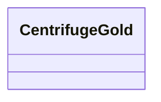

# Class: CentrifugeGold 


_Centrifuge taxonomic classifications for GOLD samples. Fast metagenomic classifier based on FM-index compression._

_TOOL: Centrifuge (Kim et al. 2016) - Very fast classification - Low memory usage via FM-index - Works with large databases_


URI: [https://w3id.org/kbase/nmdc_core/CentrifugeGold](https://w3id.org/kbase/nmdc_core/CentrifugeGold)





<!-- no inheritance hierarchy -->


## Slots

| Name | Cardinality and Range | Description | Inheritance |
| ---  | --- | --- | --- |


## Identifier and Mapping Information


### Annotations

| property | value |
| --- | --- |
| source_table | centrifuge_gold |


### Schema Source


* from schema: https://w3id.org/kbase/nmdc_core


## Mappings

| Mapping Type | Mapped Value |
| ---  | ---  |
| self | https://w3id.org/kbase/nmdc_core/CentrifugeGold |
| native | https://w3id.org/kbase/nmdc_core/CentrifugeGold |


## LinkML Source

<!-- TODO: investigate https://stackoverflow.com/questions/37606292/how-to-create-tabbed-code-blocks-in-mkdocs-or-sphinx -->

### Direct

<details>
```yaml
name: CentrifugeGold
annotations:
  source_table:
    tag: source_table
    value: centrifuge_gold
description: 'Centrifuge taxonomic classifications for GOLD samples. Fast metagenomic
  classifier based on FM-index compression.

  TOOL: Centrifuge (Kim et al. 2016) - Very fast classification - Low memory usage
  via FM-index - Works with large databases'
from_schema: https://w3id.org/kbase/nmdc_core

```
</details>

### Induced

<details>
```yaml
name: CentrifugeGold
annotations:
  source_table:
    tag: source_table
    value: centrifuge_gold
description: 'Centrifuge taxonomic classifications for GOLD samples. Fast metagenomic
  classifier based on FM-index compression.

  TOOL: Centrifuge (Kim et al. 2016) - Very fast classification - Low memory usage
  via FM-index - Works with large databases'
from_schema: https://w3id.org/kbase/nmdc_core

```
</details>