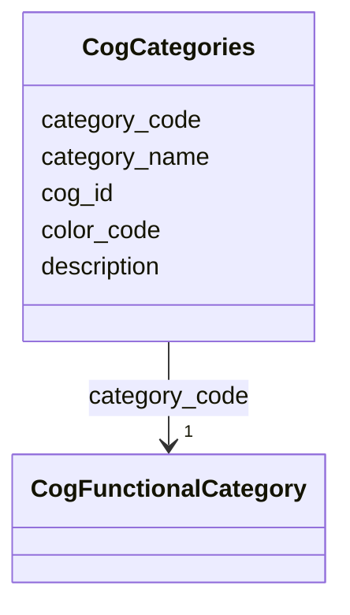

# Class: CogCategories 


_COG functional categories with descriptions and colors. Single-letter codes representing 26 major functional groups._

_TOTAL CATEGORIES: 26_

_CATEGORY GROUPS: - Information Storage/Processing (A, B, J, K, L) - Cellular Processes/Signaling (D, M, N, O, T, U, V, W, Y, Z, X) - Metabolism (C, E, F, G, H, I, P, Q) - Poorly Characterized (R, S)_

_USAGE: For broad functional classification of genes/proteins. Each gene may have multiple COG category assignments._


URI: [https://w3id.org/kbase/nmdc_core/CogCategories](https://w3id.org/kbase/nmdc_core/CogCategories)





<!-- no inheritance hierarchy -->


## Slots

| Name | Cardinality and Range | Description | Inheritance |
| ---  | --- | --- | --- |
| [cog_id](cog_id.md) | 1 <br/> [String](String.md) | Internal COG category ID (same as category_code) | direct |
| [category_code](category_code.md) | 1 <br/> [CogFunctionalCategory](CogFunctionalCategory.md) | Single-letter COG category code (A-Z) | direct |
| [category_name](category_name.md) | 0..1 <br/> [String](String.md) | Full category name | direct |
| [description](description.md) | 0..1 <br/> [String](String.md) | Detailed category description (often same as name) | direct |
| [color_code](color_code.md) | 0..1 <br/> [String](String.md) | Hex color code for visualization (without # prefix) | direct |


## Identifier and Mapping Information


### Annotations

| property | value |
| --- | --- |
| source_table | cog_categories |


### Schema Source


* from schema: https://w3id.org/kbase/nmdc_core


## Mappings

| Mapping Type | Mapped Value |
| ---  | ---  |
| self | https://w3id.org/kbase/nmdc_core/CogCategories |
| native | https://w3id.org/kbase/nmdc_core/CogCategories |


## LinkML Source

<!-- TODO: investigate https://stackoverflow.com/questions/37606292/how-to-create-tabbed-code-blocks-in-mkdocs-or-sphinx -->

### Direct

<details>
```yaml
name: CogCategories
annotations:
  source_table:
    tag: source_table
    value: cog_categories
description: 'COG functional categories with descriptions and colors. Single-letter
  codes representing 26 major functional groups.

  TOTAL CATEGORIES: 26

  CATEGORY GROUPS: - Information Storage/Processing (A, B, J, K, L) - Cellular Processes/Signaling
  (D, M, N, O, T, U, V, W, Y, Z, X) - Metabolism (C, E, F, G, H, I, P, Q) - Poorly
  Characterized (R, S)

  USAGE: For broad functional classification of genes/proteins. Each gene may have
  multiple COG category assignments.'
from_schema: https://w3id.org/kbase/nmdc_core
attributes:
  cog_id:
    name: cog_id
    description: Internal COG category ID (same as category_code)
    examples:
    - value: J
    - value: C
    from_schema: https://w3id.org/kbase/nmdc_core
    rank: 1000
    identifier: true
    domain_of:
    - CogCategories
    range: string
    required: true
  category_code:
    name: category_code
    description: Single-letter COG category code (A-Z)
    examples:
    - value: J
      description: Translation - most abundant in bacteria
    - value: C
      description: Energy production - metabolic core
    - value: K
      description: Transcription
    - value: S
      description: Function unknown - poorly characterized
    from_schema: https://w3id.org/kbase/nmdc_core
    rank: 1000
    domain_of:
    - CogCategories
    range: CogFunctionalCategory
    required: true
  category_name:
    name: category_name
    description: Full category name
    examples:
    - value: Translation, ribosomal structure and biogenesis
      description: Category J
    - value: Energy production and conversion
      description: Category C
    - value: Cell wall/membrane/envelope biogenesis
      description: Category M
    from_schema: https://w3id.org/kbase/nmdc_core
    rank: 1000
    domain_of:
    - CogCategories
    range: string
  description:
    name: description
    description: Detailed category description (often same as name)
    from_schema: https://w3id.org/kbase/nmdc_core
    domain_of:
    - AnnotationTermsUnified
    - EcTerms
    - CogCategories
    - StudyTable
    - MetacycPathways
    range: string
  color_code:
    name: color_code
    description: 'Hex color code for visualization (without # prefix). 6-character
      RGB code for consistent color schemes.'
    examples:
    - value: FCCCFC
      description: Pink - Category J
    - value: CCFCCC
      description: Light green - Category C
    - value: FCFCAC
      description: Yellow - Category T
    from_schema: https://w3id.org/kbase/nmdc_core
    rank: 1000
    domain_of:
    - CogCategories
    range: string
    pattern: '[A-F0-9]{6}'

```
</details>

### Induced

<details>
```yaml
name: CogCategories
annotations:
  source_table:
    tag: source_table
    value: cog_categories
description: 'COG functional categories with descriptions and colors. Single-letter
  codes representing 26 major functional groups.

  TOTAL CATEGORIES: 26

  CATEGORY GROUPS: - Information Storage/Processing (A, B, J, K, L) - Cellular Processes/Signaling
  (D, M, N, O, T, U, V, W, Y, Z, X) - Metabolism (C, E, F, G, H, I, P, Q) - Poorly
  Characterized (R, S)

  USAGE: For broad functional classification of genes/proteins. Each gene may have
  multiple COG category assignments.'
from_schema: https://w3id.org/kbase/nmdc_core
attributes:
  cog_id:
    name: cog_id
    description: Internal COG category ID (same as category_code)
    examples:
    - value: J
    - value: C
    from_schema: https://w3id.org/kbase/nmdc_core
    rank: 1000
    identifier: true
    alias: cog_id
    owner: CogCategories
    domain_of:
    - CogCategories
    range: string
    required: true
  category_code:
    name: category_code
    description: Single-letter COG category code (A-Z)
    examples:
    - value: J
      description: Translation - most abundant in bacteria
    - value: C
      description: Energy production - metabolic core
    - value: K
      description: Transcription
    - value: S
      description: Function unknown - poorly characterized
    from_schema: https://w3id.org/kbase/nmdc_core
    rank: 1000
    alias: category_code
    owner: CogCategories
    domain_of:
    - CogCategories
    range: CogFunctionalCategory
    required: true
  category_name:
    name: category_name
    description: Full category name
    examples:
    - value: Translation, ribosomal structure and biogenesis
      description: Category J
    - value: Energy production and conversion
      description: Category C
    - value: Cell wall/membrane/envelope biogenesis
      description: Category M
    from_schema: https://w3id.org/kbase/nmdc_core
    rank: 1000
    alias: category_name
    owner: CogCategories
    domain_of:
    - CogCategories
    range: string
  description:
    name: description
    description: Detailed category description (often same as name)
    from_schema: https://w3id.org/kbase/nmdc_core
    alias: description
    owner: CogCategories
    domain_of:
    - AnnotationTermsUnified
    - EcTerms
    - CogCategories
    - StudyTable
    - MetacycPathways
    range: string
  color_code:
    name: color_code
    description: 'Hex color code for visualization (without # prefix). 6-character
      RGB code for consistent color schemes.'
    examples:
    - value: FCCCFC
      description: Pink - Category J
    - value: CCFCCC
      description: Light green - Category C
    - value: FCFCAC
      description: Yellow - Category T
    from_schema: https://w3id.org/kbase/nmdc_core
    rank: 1000
    alias: color_code
    owner: CogCategories
    domain_of:
    - CogCategories
    range: string
    pattern: '[A-F0-9]{6}'

```
</details>