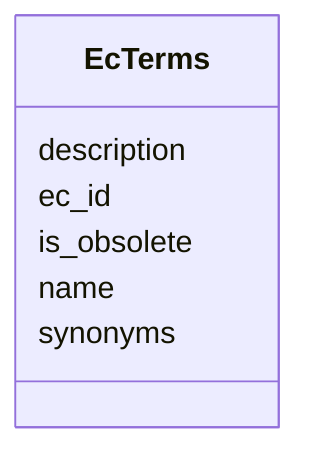

# Class: EcTerms 


_Enzyme Commission (EC) number terms. EC provides hierarchical classification of enzymes based on reactions catalyzed._

_TOTAL TERMS: 8,813_

_EC NUMBER HIERARCHY: - Level 1: X.-.-.- (7 classes: oxidoreductases, transferases, etc.) - Level 2: X.X.-.- (subclasses by bond type/group transferred) - Level 3: X.X.X.- (sub-subclasses by specific reaction) - Level 4: X.X.X.X (specific enzyme)_

_EXAMPLE: 1.1.1.1 (Alcohol dehydrogenase) - 1.-.-.- Oxidoreductases (act on CH-OH group donors) - 1.1.-.- Acting on CH-OH group of donors - 1.1.1.- With NAD(+) or NADP(+) as acceptor - 1.1.1.1 Alcohol dehydrogenase_


URI: [https://w3id.org/kbase/nmdc_core/EcTerms](https://w3id.org/kbase/nmdc_core/EcTerms)





<!-- no inheritance hierarchy -->


## Slots

| Name | Cardinality and Range | Description | Inheritance |
| ---  | --- | --- | --- |
| [ec_id](ec_id.md) | 1 <br/> [String](String.md) | EC number in X | direct |
| [name](name.md) | 0..1 <br/> [String](String.md) | Enzyme name or class description | direct |
| [description](description.md) | 0..1 <br/> [String](String.md) | Detailed enzyme description (may repeat name for specific enzymes) | direct |
| [synonyms](synonyms.md) | 0..1 <br/> [String](String.md) | Alternative enzyme names | direct |
| [is_obsolete](is_obsolete.md) | 0..1 <br/> [Boolean](Boolean.md) | Whether this EC number is deprecated/transferred | direct |


## Identifier and Mapping Information


### Annotations

| property | value |
| --- | --- |
| source_table | ec_terms |


### Schema Source


* from schema: https://w3id.org/kbase/nmdc_core


## Mappings

| Mapping Type | Mapped Value |
| ---  | ---  |
| self | https://w3id.org/kbase/nmdc_core/EcTerms |
| native | https://w3id.org/kbase/nmdc_core/EcTerms |


## LinkML Source

<!-- TODO: investigate https://stackoverflow.com/questions/37606292/how-to-create-tabbed-code-blocks-in-mkdocs-or-sphinx -->

### Direct

<details>
```yaml
name: EcTerms
annotations:
  source_table:
    tag: source_table
    value: ec_terms
description: 'Enzyme Commission (EC) number terms. EC provides hierarchical classification
  of enzymes based on reactions catalyzed.

  TOTAL TERMS: 8,813

  EC NUMBER HIERARCHY: - Level 1: X.-.-.- (7 classes: oxidoreductases, transferases,
  etc.) - Level 2: X.X.-.- (subclasses by bond type/group transferred) - Level 3:
  X.X.X.- (sub-subclasses by specific reaction) - Level 4: X.X.X.X (specific enzyme)

  EXAMPLE: 1.1.1.1 (Alcohol dehydrogenase) - 1.-.-.- Oxidoreductases (act on CH-OH
  group donors) - 1.1.-.- Acting on CH-OH group of donors - 1.1.1.- With NAD(+) or
  NADP(+) as acceptor - 1.1.1.1 Alcohol dehydrogenase'
from_schema: https://w3id.org/kbase/nmdc_core
attributes:
  ec_id:
    name: ec_id
    description: EC number in X.X.X.X format. Dashes (-) indicate partial classification
      at higher hierarchy levels.
    examples:
    - value: 1.-.-.-
      description: Class 1 - Oxidoreductases (top level)
    - value: 1.1.-.-
      description: Subclass - Acting on CH-OH group
    - value: 1.1.1.-
      description: Sub-subclass - NAD/NADP acceptor
    - value: 1.1.1.1
      description: Alcohol dehydrogenase (full EC number)
    - value: 1.1.1.10
      description: L-xylulose reductase
    from_schema: https://w3id.org/kbase/nmdc_core
    rank: 1000
    identifier: true
    domain_of:
    - EcTerms
    range: string
    required: true
    pattern: \d+\.[-\d]+\.[-\d]+\.[-\d]+
  name:
    name: name
    description: Enzyme name or class description
    examples:
    - value: Oxidoreductases.
      description: Class 1 name
    - value: Acting on the CH-OH group of donors.
      description: Subclass description
    - value: With NAD(+) or NADP(+) as acceptor.
      description: Sub-subclass description
    - value: Alcohol dehydrogenase
      description: Specific enzyme name
    - value: L-xylulose reductase
      description: Another specific enzyme
    from_schema: https://w3id.org/kbase/nmdc_core
    domain_of:
    - AnnotationTermsUnified
    - GoTerms
    - EcTerms
    - KeggKoTerms
    - KeggPathwayTerms
    - StudyTable
    - MetabolomicsGold
    - MetacycPathways
    range: string
  description:
    name: description
    description: Detailed enzyme description (may repeat name for specific enzymes)
    examples:
    - value: alcohol dehydrogenase
      description: Description for EC 1.1.1.1
    from_schema: https://w3id.org/kbase/nmdc_core
    domain_of:
    - AnnotationTermsUnified
    - EcTerms
    - CogCategories
    - StudyTable
    - MetacycPathways
    range: string
  synonyms:
    name: synonyms
    description: Alternative enzyme names
    examples:
    - value: aldehyde reductase
      description: Synonym for alcohol dehydrogenase
    from_schema: https://w3id.org/kbase/nmdc_core
    domain_of:
    - GoTerms
    - EcTerms
    - TraitUnified
    range: string
  is_obsolete:
    name: is_obsolete
    description: Whether this EC number is deprecated/transferred
    examples:
    - value: 'False'
    from_schema: https://w3id.org/kbase/nmdc_core
    domain_of:
    - AnnotationTermsUnified
    - GoTerms
    - GoHierarchyFlat
    - EcTerms
    range: boolean

```
</details>

### Induced

<details>
```yaml
name: EcTerms
annotations:
  source_table:
    tag: source_table
    value: ec_terms
description: 'Enzyme Commission (EC) number terms. EC provides hierarchical classification
  of enzymes based on reactions catalyzed.

  TOTAL TERMS: 8,813

  EC NUMBER HIERARCHY: - Level 1: X.-.-.- (7 classes: oxidoreductases, transferases,
  etc.) - Level 2: X.X.-.- (subclasses by bond type/group transferred) - Level 3:
  X.X.X.- (sub-subclasses by specific reaction) - Level 4: X.X.X.X (specific enzyme)

  EXAMPLE: 1.1.1.1 (Alcohol dehydrogenase) - 1.-.-.- Oxidoreductases (act on CH-OH
  group donors) - 1.1.-.- Acting on CH-OH group of donors - 1.1.1.- With NAD(+) or
  NADP(+) as acceptor - 1.1.1.1 Alcohol dehydrogenase'
from_schema: https://w3id.org/kbase/nmdc_core
attributes:
  ec_id:
    name: ec_id
    description: EC number in X.X.X.X format. Dashes (-) indicate partial classification
      at higher hierarchy levels.
    examples:
    - value: 1.-.-.-
      description: Class 1 - Oxidoreductases (top level)
    - value: 1.1.-.-
      description: Subclass - Acting on CH-OH group
    - value: 1.1.1.-
      description: Sub-subclass - NAD/NADP acceptor
    - value: 1.1.1.1
      description: Alcohol dehydrogenase (full EC number)
    - value: 1.1.1.10
      description: L-xylulose reductase
    from_schema: https://w3id.org/kbase/nmdc_core
    rank: 1000
    identifier: true
    alias: ec_id
    owner: EcTerms
    domain_of:
    - EcTerms
    range: string
    required: true
    pattern: \d+\.[-\d]+\.[-\d]+\.[-\d]+
  name:
    name: name
    description: Enzyme name or class description
    examples:
    - value: Oxidoreductases.
      description: Class 1 name
    - value: Acting on the CH-OH group of donors.
      description: Subclass description
    - value: With NAD(+) or NADP(+) as acceptor.
      description: Sub-subclass description
    - value: Alcohol dehydrogenase
      description: Specific enzyme name
    - value: L-xylulose reductase
      description: Another specific enzyme
    from_schema: https://w3id.org/kbase/nmdc_core
    alias: name
    owner: EcTerms
    domain_of:
    - AnnotationTermsUnified
    - GoTerms
    - EcTerms
    - KeggKoTerms
    - KeggPathwayTerms
    - StudyTable
    - MetabolomicsGold
    - MetacycPathways
    range: string
  description:
    name: description
    description: Detailed enzyme description (may repeat name for specific enzymes)
    examples:
    - value: alcohol dehydrogenase
      description: Description for EC 1.1.1.1
    from_schema: https://w3id.org/kbase/nmdc_core
    alias: description
    owner: EcTerms
    domain_of:
    - AnnotationTermsUnified
    - EcTerms
    - CogCategories
    - StudyTable
    - MetacycPathways
    range: string
  synonyms:
    name: synonyms
    description: Alternative enzyme names
    examples:
    - value: aldehyde reductase
      description: Synonym for alcohol dehydrogenase
    from_schema: https://w3id.org/kbase/nmdc_core
    alias: synonyms
    owner: EcTerms
    domain_of:
    - GoTerms
    - EcTerms
    - TraitUnified
    range: string
  is_obsolete:
    name: is_obsolete
    description: Whether this EC number is deprecated/transferred
    examples:
    - value: 'False'
    from_schema: https://w3id.org/kbase/nmdc_core
    alias: is_obsolete
    owner: EcTerms
    domain_of:
    - AnnotationTermsUnified
    - GoTerms
    - GoHierarchyFlat
    - EcTerms
    range: boolean

```
</details>