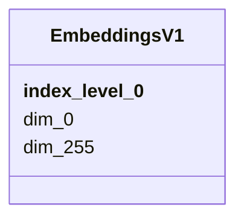

# Class: EmbeddingsV1 


_Vector embeddings version 1 for samples and entities. Enables similarity search and multi-modal analysis across samples._

_DIMENSIONALITY: 256 dimensions (dim_0 through dim_255) INDEX: Sample IDs (nmdc:bsm-XX-XXXXXXXX format)_

_USAGE: For finding similar samples, compute cosine similarity between embedding vectors. Embeddings combine information from taxonomy, traits, abiotic factors, and biochemical features._

_EXAMPLE IDs: - nmdc:bsm-11-3a6fv767 - nmdc:bsm-11-2hve6455 - nmdc:bsm-11-s8ktn043_


URI: [https://w3id.org/kbase/nmdc_core/EmbeddingsV1](https://w3id.org/kbase/nmdc_core/EmbeddingsV1)





<!-- no inheritance hierarchy -->


## Slots

| Name | Cardinality and Range | Description | Inheritance |
| ---  | --- | --- | --- |
| [__index_level_0__](__index_level_0__.md) | 1 <br/> [String](String.md) | Sample identifier (biosample ID) | direct |
| [dim_0](dim_0.md) | 0..1 <br/> [Float](Float.md) | First embedding dimension | direct |
| [dim_255](dim_255.md) | 0..1 <br/> [Float](Float.md) | Last embedding dimension (256 total dimensions, 0-255) | direct |


## Identifier and Mapping Information


### Annotations

| property | value |
| --- | --- |
| source_table | embeddings_v1 |


### Schema Source


* from schema: https://w3id.org/kbase/nmdc_core


## Mappings

| Mapping Type | Mapped Value |
| ---  | ---  |
| self | https://w3id.org/kbase/nmdc_core/EmbeddingsV1 |
| native | https://w3id.org/kbase/nmdc_core/EmbeddingsV1 |


## LinkML Source

<!-- TODO: investigate https://stackoverflow.com/questions/37606292/how-to-create-tabbed-code-blocks-in-mkdocs-or-sphinx -->

### Direct

<details>
```yaml
name: EmbeddingsV1
annotations:
  source_table:
    tag: source_table
    value: embeddings_v1
description: 'Vector embeddings version 1 for samples and entities. Enables similarity
  search and multi-modal analysis across samples.

  DIMENSIONALITY: 256 dimensions (dim_0 through dim_255) INDEX: Sample IDs (nmdc:bsm-XX-XXXXXXXX
  format)

  USAGE: For finding similar samples, compute cosine similarity between embedding
  vectors. Embeddings combine information from taxonomy, traits, abiotic factors,
  and biochemical features.

  EXAMPLE IDs: - nmdc:bsm-11-3a6fv767 - nmdc:bsm-11-2hve6455 - nmdc:bsm-11-s8ktn043'
from_schema: https://w3id.org/kbase/nmdc_core
attributes:
  __index_level_0__:
    name: __index_level_0__
    description: Sample identifier (biosample ID). Used as row index for embedding
      lookups.
    examples:
    - value: nmdc:bsm-11-3a6fv767
    - value: nmdc:bsm-11-2hve6455
    - value: nmdc:bsm-11-s8ktn043
    from_schema: https://w3id.org/kbase/nmdc_core
    rank: 1000
    identifier: true
    domain_of:
    - EmbeddingsV1
    range: string
    required: true
  dim_0:
    name: dim_0
    description: First embedding dimension
    examples:
    - value: '-0.1364271342754364'
    - value: '-0.2726755142211914'
    from_schema: https://w3id.org/kbase/nmdc_core
    rank: 1000
    domain_of:
    - EmbeddingsV1
    range: float
  dim_255:
    name: dim_255
    description: Last embedding dimension (256 total dimensions, 0-255)
    from_schema: https://w3id.org/kbase/nmdc_core
    rank: 1000
    domain_of:
    - EmbeddingsV1
    range: float

```
</details>

### Induced

<details>
```yaml
name: EmbeddingsV1
annotations:
  source_table:
    tag: source_table
    value: embeddings_v1
description: 'Vector embeddings version 1 for samples and entities. Enables similarity
  search and multi-modal analysis across samples.

  DIMENSIONALITY: 256 dimensions (dim_0 through dim_255) INDEX: Sample IDs (nmdc:bsm-XX-XXXXXXXX
  format)

  USAGE: For finding similar samples, compute cosine similarity between embedding
  vectors. Embeddings combine information from taxonomy, traits, abiotic factors,
  and biochemical features.

  EXAMPLE IDs: - nmdc:bsm-11-3a6fv767 - nmdc:bsm-11-2hve6455 - nmdc:bsm-11-s8ktn043'
from_schema: https://w3id.org/kbase/nmdc_core
attributes:
  __index_level_0__:
    name: __index_level_0__
    description: Sample identifier (biosample ID). Used as row index for embedding
      lookups.
    examples:
    - value: nmdc:bsm-11-3a6fv767
    - value: nmdc:bsm-11-2hve6455
    - value: nmdc:bsm-11-s8ktn043
    from_schema: https://w3id.org/kbase/nmdc_core
    rank: 1000
    identifier: true
    alias: __index_level_0__
    owner: EmbeddingsV1
    domain_of:
    - EmbeddingsV1
    range: string
    required: true
  dim_0:
    name: dim_0
    description: First embedding dimension
    examples:
    - value: '-0.1364271342754364'
    - value: '-0.2726755142211914'
    from_schema: https://w3id.org/kbase/nmdc_core
    rank: 1000
    alias: dim_0
    owner: EmbeddingsV1
    domain_of:
    - EmbeddingsV1
    range: float
  dim_255:
    name: dim_255
    description: Last embedding dimension (256 total dimensions, 0-255)
    from_schema: https://w3id.org/kbase/nmdc_core
    rank: 1000
    alias: dim_255
    owner: EmbeddingsV1
    domain_of:
    - EmbeddingsV1
    range: float

```
</details>