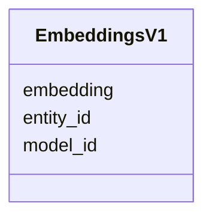

# Class: EmbeddingsV1 


_Vector embeddings version 1_


URI: [https://w3id.org/kbase/nmdc_core/EmbeddingsV1](https://w3id.org/kbase/nmdc_core/EmbeddingsV1)





<!-- no inheritance hierarchy -->


## Slots

| Name | Cardinality and Range | Description | Inheritance |
| ---  | --- | --- | --- |
| [entity_id](entity_id.md) | 0..1 <br/> [String](String.md) | Entity being embedded | direct |
| [embedding](embedding.md) | 0..1 <br/> [String](String.md) | Vector embedding | direct |
| [model_id](model_id.md) | 0..1 <br/> [String](String.md) | Embedding model used | direct |


## Identifier and Mapping Information


### Annotations

| property | value |
| --- | --- |
| source_table | embeddings_v1 |


### Schema Source


* from schema: https://w3id.org/kbase/nmdc_core


## Mappings

| Mapping Type | Mapped Value |
| ---  | ---  |
| self | https://w3id.org/kbase/nmdc_core/EmbeddingsV1 |
| native | https://w3id.org/kbase/nmdc_core/EmbeddingsV1 |


## LinkML Source

<!-- TODO: investigate https://stackoverflow.com/questions/37606292/how-to-create-tabbed-code-blocks-in-mkdocs-or-sphinx -->

### Direct

<details>
```yaml
name: EmbeddingsV1
annotations:
  source_table:
    tag: source_table
    value: embeddings_v1
description: Vector embeddings version 1
from_schema: https://w3id.org/kbase/nmdc_core
attributes:
  entity_id:
    name: entity_id
    description: Entity being embedded
    from_schema: https://w3id.org/kbase/nmdc_core
    rank: 1000
    domain_of:
    - EmbeddingsV1
  embedding:
    name: embedding
    description: Vector embedding
    from_schema: https://w3id.org/kbase/nmdc_core
    rank: 1000
    domain_of:
    - EmbeddingsV1
  model_id:
    name: model_id
    description: Embedding model used
    from_schema: https://w3id.org/kbase/nmdc_core
    rank: 1000
    domain_of:
    - EmbeddingsV1

```
</details>

### Induced

<details>
```yaml
name: EmbeddingsV1
annotations:
  source_table:
    tag: source_table
    value: embeddings_v1
description: Vector embeddings version 1
from_schema: https://w3id.org/kbase/nmdc_core
attributes:
  entity_id:
    name: entity_id
    description: Entity being embedded
    from_schema: https://w3id.org/kbase/nmdc_core
    rank: 1000
    alias: entity_id
    owner: EmbeddingsV1
    domain_of:
    - EmbeddingsV1
    range: string
  embedding:
    name: embedding
    description: Vector embedding
    from_schema: https://w3id.org/kbase/nmdc_core
    rank: 1000
    alias: embedding
    owner: EmbeddingsV1
    domain_of:
    - EmbeddingsV1
    range: string
  model_id:
    name: model_id
    description: Embedding model used
    from_schema: https://w3id.org/kbase/nmdc_core
    rank: 1000
    alias: model_id
    owner: EmbeddingsV1
    domain_of:
    - EmbeddingsV1
    range: string

```
</details>