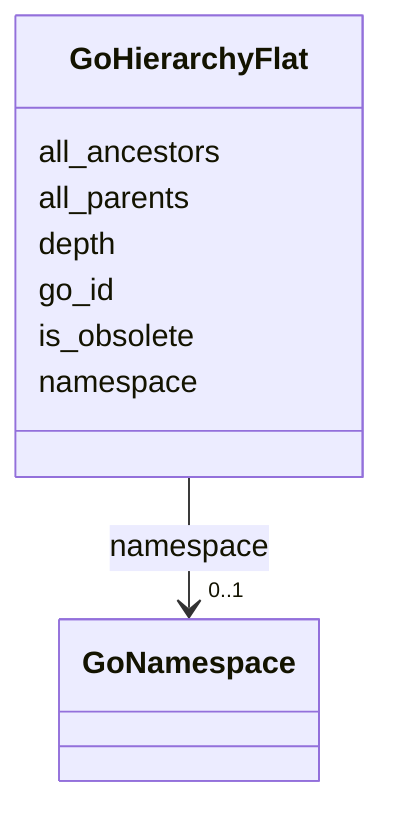

# Class: GoHierarchyFlat 


_Flattened GO hierarchy for efficient ancestor/descendant queries. Pre-computed transitive closure of is_a and part_of relationships._

_USAGE: Essential for GO enrichment analysis and hierarchical queries. Use all_ancestors for finding parent terms, all_parents for direct parents. Depth indicates distance from root (root terms have depth 1)._

_EXAMPLE QUERIES: - Find all ancestors of a term: SELECT all_ancestors WHERE go_id = 'GO:0000001' - Find terms at specific depth: WHERE depth = 5 - Non-obsolete with ancestors: WHERE is_obsolete = false AND all_ancestors IS NOT NULL_


URI: [https://w3id.org/kbase/nmdc_core/GoHierarchyFlat](https://w3id.org/kbase/nmdc_core/GoHierarchyFlat)





<!-- no inheritance hierarchy -->


## Slots

| Name | Cardinality and Range | Description | Inheritance |
| ---  | --- | --- | --- |
| [go_id](go_id.md) | 0..1 <br/> [String](String.md) | GO term this row describes | direct |
| [namespace](namespace.md) | 0..1 <br/> [GoNamespace](GoNamespace.md) | GO namespace of this term | direct |
| [all_parents](all_parents.md) | 0..1 <br/> [String](String.md) | Semicolon-separated direct parent GO IDs (immediate is_a/part_of parents) | direct |
| [all_ancestors](all_ancestors.md) | 0..1 <br/> [String](String.md) | Semicolon-separated all ancestor GO IDs (transitive closure) | direct |
| [depth](depth.md) | 0..1 <br/> [Integer](Integer.md) | Maximum depth from root (root terms have depth 1) | direct |
| [is_obsolete](is_obsolete.md) | 0..1 <br/> [Boolean](Boolean.md) | Whether term is deprecated | direct |


## Identifier and Mapping Information


### Annotations

| property | value |
| --- | --- |
| source_table | go_hierarchy_flat |


### Schema Source


* from schema: https://w3id.org/kbase/nmdc_core


## Mappings

| Mapping Type | Mapped Value |
| ---  | ---  |
| self | https://w3id.org/kbase/nmdc_core/GoHierarchyFlat |
| native | https://w3id.org/kbase/nmdc_core/GoHierarchyFlat |


## LinkML Source

<!-- TODO: investigate https://stackoverflow.com/questions/37606292/how-to-create-tabbed-code-blocks-in-mkdocs-or-sphinx -->

### Direct

<details>
```yaml
name: GoHierarchyFlat
annotations:
  source_table:
    tag: source_table
    value: go_hierarchy_flat
description: 'Flattened GO hierarchy for efficient ancestor/descendant queries. Pre-computed
  transitive closure of is_a and part_of relationships.

  USAGE: Essential for GO enrichment analysis and hierarchical queries. Use all_ancestors
  for finding parent terms, all_parents for direct parents. Depth indicates distance
  from root (root terms have depth 1).

  EXAMPLE QUERIES: - Find all ancestors of a term: SELECT all_ancestors WHERE go_id
  = ''GO:0000001'' - Find terms at specific depth: WHERE depth = 5 - Non-obsolete
  with ancestors: WHERE is_obsolete = false AND all_ancestors IS NOT NULL'
from_schema: https://w3id.org/kbase/nmdc_core
attributes:
  go_id:
    name: go_id
    description: GO term this row describes
    comments:
    - Foreign key to GoTerms.go_id
    examples:
    - value: GO:0000001
      description: mitochondrion inheritance
    from_schema: https://w3id.org/kbase/nmdc_core
    domain_of:
    - GoTerms
    - GoHierarchyFlat
    range: string
    pattern: GO:\d{7}
  namespace:
    name: namespace
    description: GO namespace of this term
    examples:
    - value: biological_process
    from_schema: https://w3id.org/kbase/nmdc_core
    domain_of:
    - AnnotationTermsUnified
    - GoTerms
    - GoHierarchyFlat
    range: GoNamespace
  all_parents:
    name: all_parents
    description: Semicolon-separated direct parent GO IDs (immediate is_a/part_of
      parents). Empty for root terms.
    examples:
    - value: GO:0048308;GO:0048311
      description: Two direct parents
    - value: GO:0008150
      description: Single parent (biological_process root)
    from_schema: https://w3id.org/kbase/nmdc_core
    rank: 1000
    domain_of:
    - GoHierarchyFlat
    range: string
  all_ancestors:
    name: all_ancestors
    description: Semicolon-separated all ancestor GO IDs (transitive closure). Includes
      all terms reachable through is_a and part_of relations.
    examples:
    - value: GO:0006996;GO:0008150;GO:0009987;GO:0016043;GO:0048308
      description: Multiple ancestors from root to direct parents
    from_schema: https://w3id.org/kbase/nmdc_core
    rank: 1000
    domain_of:
    - GoHierarchyFlat
    range: string
  depth:
    name: depth
    description: Maximum depth from root (root terms have depth 1). Useful for filtering
      by specificity - higher depth = more specific term.
    examples:
    - value: '1'
      description: Root terms (biological_process, molecular_function)
    - value: '5'
      description: Mid-level terms
    - value: '10'
      description: Highly specific terms
    from_schema: https://w3id.org/kbase/nmdc_core
    rank: 1000
    domain_of:
    - GoHierarchyFlat
    range: integer
    minimum_value: 1
  is_obsolete:
    name: is_obsolete
    description: Whether term is deprecated
    examples:
    - value: 'False'
    from_schema: https://w3id.org/kbase/nmdc_core
    domain_of:
    - AnnotationTermsUnified
    - GoTerms
    - GoHierarchyFlat
    - EcTerms
    range: boolean

```
</details>

### Induced

<details>
```yaml
name: GoHierarchyFlat
annotations:
  source_table:
    tag: source_table
    value: go_hierarchy_flat
description: 'Flattened GO hierarchy for efficient ancestor/descendant queries. Pre-computed
  transitive closure of is_a and part_of relationships.

  USAGE: Essential for GO enrichment analysis and hierarchical queries. Use all_ancestors
  for finding parent terms, all_parents for direct parents. Depth indicates distance
  from root (root terms have depth 1).

  EXAMPLE QUERIES: - Find all ancestors of a term: SELECT all_ancestors WHERE go_id
  = ''GO:0000001'' - Find terms at specific depth: WHERE depth = 5 - Non-obsolete
  with ancestors: WHERE is_obsolete = false AND all_ancestors IS NOT NULL'
from_schema: https://w3id.org/kbase/nmdc_core
attributes:
  go_id:
    name: go_id
    description: GO term this row describes
    comments:
    - Foreign key to GoTerms.go_id
    examples:
    - value: GO:0000001
      description: mitochondrion inheritance
    from_schema: https://w3id.org/kbase/nmdc_core
    alias: go_id
    owner: GoHierarchyFlat
    domain_of:
    - GoTerms
    - GoHierarchyFlat
    range: string
    pattern: GO:\d{7}
  namespace:
    name: namespace
    description: GO namespace of this term
    examples:
    - value: biological_process
    from_schema: https://w3id.org/kbase/nmdc_core
    alias: namespace
    owner: GoHierarchyFlat
    domain_of:
    - AnnotationTermsUnified
    - GoTerms
    - GoHierarchyFlat
    range: GoNamespace
  all_parents:
    name: all_parents
    description: Semicolon-separated direct parent GO IDs (immediate is_a/part_of
      parents). Empty for root terms.
    examples:
    - value: GO:0048308;GO:0048311
      description: Two direct parents
    - value: GO:0008150
      description: Single parent (biological_process root)
    from_schema: https://w3id.org/kbase/nmdc_core
    rank: 1000
    alias: all_parents
    owner: GoHierarchyFlat
    domain_of:
    - GoHierarchyFlat
    range: string
  all_ancestors:
    name: all_ancestors
    description: Semicolon-separated all ancestor GO IDs (transitive closure). Includes
      all terms reachable through is_a and part_of relations.
    examples:
    - value: GO:0006996;GO:0008150;GO:0009987;GO:0016043;GO:0048308
      description: Multiple ancestors from root to direct parents
    from_schema: https://w3id.org/kbase/nmdc_core
    rank: 1000
    alias: all_ancestors
    owner: GoHierarchyFlat
    domain_of:
    - GoHierarchyFlat
    range: string
  depth:
    name: depth
    description: Maximum depth from root (root terms have depth 1). Useful for filtering
      by specificity - higher depth = more specific term.
    examples:
    - value: '1'
      description: Root terms (biological_process, molecular_function)
    - value: '5'
      description: Mid-level terms
    - value: '10'
      description: Highly specific terms
    from_schema: https://w3id.org/kbase/nmdc_core
    rank: 1000
    alias: depth
    owner: GoHierarchyFlat
    domain_of:
    - GoHierarchyFlat
    range: integer
    minimum_value: 1
  is_obsolete:
    name: is_obsolete
    description: Whether term is deprecated
    examples:
    - value: 'False'
    from_schema: https://w3id.org/kbase/nmdc_core
    alias: is_obsolete
    owner: GoHierarchyFlat
    domain_of:
    - AnnotationTermsUnified
    - GoTerms
    - GoHierarchyFlat
    - EcTerms
    range: boolean

```
</details>