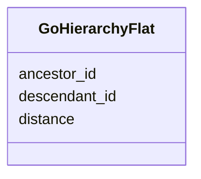

# Class: GoHierarchyFlat 


_Flattened GO hierarchy for efficient querying_


URI: [https://w3id.org/kbase/nmdc_core/GoHierarchyFlat](https://w3id.org/kbase/nmdc_core/GoHierarchyFlat)





<!-- no inheritance hierarchy -->


## Slots

| Name | Cardinality and Range | Description | Inheritance |
| ---  | --- | --- | --- |
| [ancestor_id](ancestor_id.md) | 0..1 <br/> [String](String.md) | Ancestor GO term | direct |
| [descendant_id](descendant_id.md) | 0..1 <br/> [String](String.md) | Descendant GO term | direct |
| [distance](distance.md) | 0..1 <br/> [Integer](Integer.md) | Path distance | direct |


## Identifier and Mapping Information


### Annotations

| property | value |
| --- | --- |
| source_table | go_hierarchy_flat |


### Schema Source


* from schema: https://w3id.org/kbase/nmdc_core


## Mappings

| Mapping Type | Mapped Value |
| ---  | ---  |
| self | https://w3id.org/kbase/nmdc_core/GoHierarchyFlat |
| native | https://w3id.org/kbase/nmdc_core/GoHierarchyFlat |


## LinkML Source

<!-- TODO: investigate https://stackoverflow.com/questions/37606292/how-to-create-tabbed-code-blocks-in-mkdocs-or-sphinx -->

### Direct

<details>
```yaml
name: GoHierarchyFlat
annotations:
  source_table:
    tag: source_table
    value: go_hierarchy_flat
description: Flattened GO hierarchy for efficient querying
from_schema: https://w3id.org/kbase/nmdc_core
attributes:
  ancestor_id:
    name: ancestor_id
    description: Ancestor GO term
    from_schema: https://w3id.org/kbase/nmdc_core
    rank: 1000
    domain_of:
    - GoHierarchyFlat
  descendant_id:
    name: descendant_id
    description: Descendant GO term
    from_schema: https://w3id.org/kbase/nmdc_core
    rank: 1000
    domain_of:
    - GoHierarchyFlat
  distance:
    name: distance
    description: Path distance
    from_schema: https://w3id.org/kbase/nmdc_core
    rank: 1000
    domain_of:
    - GoHierarchyFlat
    range: integer

```
</details>

### Induced

<details>
```yaml
name: GoHierarchyFlat
annotations:
  source_table:
    tag: source_table
    value: go_hierarchy_flat
description: Flattened GO hierarchy for efficient querying
from_schema: https://w3id.org/kbase/nmdc_core
attributes:
  ancestor_id:
    name: ancestor_id
    description: Ancestor GO term
    from_schema: https://w3id.org/kbase/nmdc_core
    rank: 1000
    alias: ancestor_id
    owner: GoHierarchyFlat
    domain_of:
    - GoHierarchyFlat
    range: string
  descendant_id:
    name: descendant_id
    description: Descendant GO term
    from_schema: https://w3id.org/kbase/nmdc_core
    rank: 1000
    alias: descendant_id
    owner: GoHierarchyFlat
    domain_of:
    - GoHierarchyFlat
    range: string
  distance:
    name: distance
    description: Path distance
    from_schema: https://w3id.org/kbase/nmdc_core
    rank: 1000
    alias: distance
    owner: GoHierarchyFlat
    domain_of:
    - GoHierarchyFlat
    range: integer

```
</details>