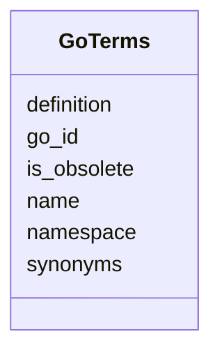

# Class: GoTerms 


_Gene Ontology terms_


URI: [https://w3id.org/kbase/nmdc_core/GoTerms](https://w3id.org/kbase/nmdc_core/GoTerms)





<!-- no inheritance hierarchy -->


## Slots

| Name | Cardinality and Range | Description | Inheritance |
| ---  | --- | --- | --- |
| [go_id](go_id.md) | 1 <br/> [String](String.md) | GO term ID (e | direct |
| [name](name.md) | 0..1 <br/> [String](String.md) | Term name | direct |
| [namespace](namespace.md) | 0..1 <br/> [String](String.md) | GO namespace (BP, MF, CC) | direct |
| [definition](definition.md) | 0..1 <br/> [String](String.md) | Term definition | direct |
| [synonyms](synonyms.md) | 0..1 <br/> [String](String.md) | Term synonyms | direct |
| [is_obsolete](is_obsolete.md) | 0..1 <br/> [Boolean](Boolean.md) |  | direct |


## Identifier and Mapping Information


### Annotations

| property | value |
| --- | --- |
| source_table | go_terms |


### Schema Source


* from schema: https://w3id.org/kbase/nmdc_core


## Mappings

| Mapping Type | Mapped Value |
| ---  | ---  |
| self | https://w3id.org/kbase/nmdc_core/GoTerms |
| native | https://w3id.org/kbase/nmdc_core/GoTerms |


## LinkML Source

<!-- TODO: investigate https://stackoverflow.com/questions/37606292/how-to-create-tabbed-code-blocks-in-mkdocs-or-sphinx -->

### Direct

<details>
```yaml
name: GoTerms
annotations:
  source_table:
    tag: source_table
    value: go_terms
description: Gene Ontology terms
from_schema: https://w3id.org/kbase/nmdc_core
attributes:
  go_id:
    name: go_id
    description: GO term ID (e.g., GO:0008150)
    from_schema: https://w3id.org/kbase/nmdc_core
    rank: 1000
    identifier: true
    domain_of:
    - GoTerms
    required: true
  name:
    name: name
    description: Term name
    from_schema: https://w3id.org/kbase/nmdc_core
    domain_of:
    - AnnotationTermsUnified
    - GoTerms
    - EcTerms
    - KeggKoTerms
    - KeggPathwayTerms
    - CogCategories
    - StudyTable
    - MetabolomicsGold
  namespace:
    name: namespace
    description: GO namespace (BP, MF, CC)
    from_schema: https://w3id.org/kbase/nmdc_core
    domain_of:
    - AnnotationTermsUnified
    - GoTerms
  definition:
    name: definition
    description: Term definition
    from_schema: https://w3id.org/kbase/nmdc_core
    rank: 1000
    domain_of:
    - GoTerms
    - KeggKoTerms
  synonyms:
    name: synonyms
    description: Term synonyms
    from_schema: https://w3id.org/kbase/nmdc_core
    rank: 1000
    domain_of:
    - GoTerms
  is_obsolete:
    name: is_obsolete
    from_schema: https://w3id.org/kbase/nmdc_core
    domain_of:
    - AnnotationTermsUnified
    - GoTerms
    range: boolean

```
</details>

### Induced

<details>
```yaml
name: GoTerms
annotations:
  source_table:
    tag: source_table
    value: go_terms
description: Gene Ontology terms
from_schema: https://w3id.org/kbase/nmdc_core
attributes:
  go_id:
    name: go_id
    description: GO term ID (e.g., GO:0008150)
    from_schema: https://w3id.org/kbase/nmdc_core
    rank: 1000
    identifier: true
    alias: go_id
    owner: GoTerms
    domain_of:
    - GoTerms
    range: string
    required: true
  name:
    name: name
    description: Term name
    from_schema: https://w3id.org/kbase/nmdc_core
    alias: name
    owner: GoTerms
    domain_of:
    - AnnotationTermsUnified
    - GoTerms
    - EcTerms
    - KeggKoTerms
    - KeggPathwayTerms
    - CogCategories
    - StudyTable
    - MetabolomicsGold
    range: string
  namespace:
    name: namespace
    description: GO namespace (BP, MF, CC)
    from_schema: https://w3id.org/kbase/nmdc_core
    alias: namespace
    owner: GoTerms
    domain_of:
    - AnnotationTermsUnified
    - GoTerms
    range: string
  definition:
    name: definition
    description: Term definition
    from_schema: https://w3id.org/kbase/nmdc_core
    rank: 1000
    alias: definition
    owner: GoTerms
    domain_of:
    - GoTerms
    - KeggKoTerms
    range: string
  synonyms:
    name: synonyms
    description: Term synonyms
    from_schema: https://w3id.org/kbase/nmdc_core
    rank: 1000
    alias: synonyms
    owner: GoTerms
    domain_of:
    - GoTerms
    range: string
  is_obsolete:
    name: is_obsolete
    from_schema: https://w3id.org/kbase/nmdc_core
    alias: is_obsolete
    owner: GoTerms
    domain_of:
    - AnnotationTermsUnified
    - GoTerms
    range: boolean

```
</details>