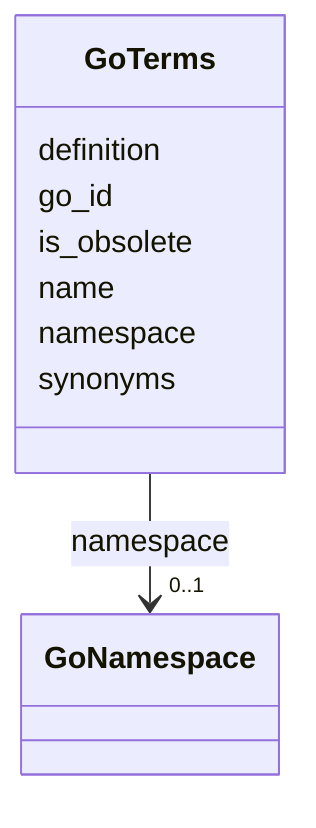

# Class: GoTerms 


_Gene Ontology terms with full metadata. GO provides structured vocabulary for gene products across biological process, molecular function, and cellular component namespaces._

_TOTAL TERMS: 48,196 (39,354 non-obsolete)_

_NAMESPACE BREAKDOWN: - biological_process: 30,817 terms (64%) - molecular_function: 12,805 terms (27%) - cellular_component: 4,573 terms (9%)_

_USAGE: Use for looking up GO term details. For ancestor/descendant queries, use go_hierarchy_flat which has pre-computed transitive closure._

_EXAMPLE QUERIES: - Find non-obsolete terms: WHERE is_obsolete = false - Terms by namespace: WHERE namespace = 'biological_process' - Search by name: WHERE name LIKE '%kinase%'_


URI: [https://w3id.org/kbase/nmdc_core/GoTerms](https://w3id.org/kbase/nmdc_core/GoTerms)





<!-- no inheritance hierarchy -->


## Slots

| Name | Cardinality and Range | Description | Inheritance |
| ---  | --- | --- | --- |
| [go_id](go_id.md) | 1 <br/> [String](String.md) | GO term ID in GO:NNNNNNN format | direct |
| [name](name.md) | 0..1 <br/> [String](String.md) | Primary term name (may include "obsolete" prefix for deprecated terms) | direct |
| [namespace](namespace.md) | 0..1 <br/> [GoNamespace](GoNamespace.md) | GO namespace (aspect) | direct |
| [definition](definition.md) | 0..1 <br/> [String](String.md) | Full term definition with citations in double quotes | direct |
| [synonyms](synonyms.md) | 0..1 <br/> [String](String.md) | Semicolon-separated list of term synonyms | direct |
| [is_obsolete](is_obsolete.md) | 0..1 <br/> [Boolean](Boolean.md) | Whether term is deprecated | direct |


## Identifier and Mapping Information


### Annotations

| property | value |
| --- | --- |
| source_table | go_terms |


### Schema Source


* from schema: https://w3id.org/kbase/nmdc_core


## Mappings

| Mapping Type | Mapped Value |
| ---  | ---  |
| self | https://w3id.org/kbase/nmdc_core/GoTerms |
| native | https://w3id.org/kbase/nmdc_core/GoTerms |


## LinkML Source

<!-- TODO: investigate https://stackoverflow.com/questions/37606292/how-to-create-tabbed-code-blocks-in-mkdocs-or-sphinx -->

### Direct

<details>
```yaml
name: GoTerms
annotations:
  source_table:
    tag: source_table
    value: go_terms
description: 'Gene Ontology terms with full metadata. GO provides structured vocabulary
  for gene products across biological process, molecular function, and cellular component
  namespaces.

  TOTAL TERMS: 48,196 (39,354 non-obsolete)

  NAMESPACE BREAKDOWN: - biological_process: 30,817 terms (64%) - molecular_function:
  12,805 terms (27%) - cellular_component: 4,573 terms (9%)

  USAGE: Use for looking up GO term details. For ancestor/descendant queries, use
  go_hierarchy_flat which has pre-computed transitive closure.

  EXAMPLE QUERIES: - Find non-obsolete terms: WHERE is_obsolete = false - Terms by
  namespace: WHERE namespace = ''biological_process'' - Search by name: WHERE name
  LIKE ''%kinase%'''
from_schema: https://w3id.org/kbase/nmdc_core
attributes:
  go_id:
    name: go_id
    description: GO term ID in GO:NNNNNNN format. Seven-digit numeric identifier prefixed
      with "GO:".
    examples:
    - value: GO:0000001
      description: mitochondrion inheritance (biological_process)
    - value: GO:0000006
      description: high-affinity zinc transmembrane transporter activity (MF)
    - value: GO:0008150
      description: biological_process - root term
    - value: GO:0003674
      description: molecular_function - root term
    - value: GO:0005575
      description: cellular_component - root term
    from_schema: https://w3id.org/kbase/nmdc_core
    rank: 1000
    identifier: true
    domain_of:
    - GoTerms
    - GoHierarchyFlat
    range: string
    required: true
    pattern: GO:\d{7}
  name:
    name: name
    description: Primary term name (may include "obsolete" prefix for deprecated terms)
    examples:
    - value: mitochondrion inheritance
      description: Active biological process term
    - value: high-affinity zinc transmembrane transporter activity
      description: Molecular function with specific substrate
    - value: obsolete mitochondrial genome maintenance
      description: Obsolete term - check is_obsolete flag
    from_schema: https://w3id.org/kbase/nmdc_core
    domain_of:
    - AnnotationTermsUnified
    - GoTerms
    - EcTerms
    - KeggKoTerms
    - KeggPathwayTerms
    - StudyTable
    - MetabolomicsGold
    - MetacycPathways
    range: string
  namespace:
    name: namespace
    description: GO namespace (aspect). Determines the type of information the term
      represents.
    examples:
    - value: biological_process
      description: 64% of terms - describes biological goals
    - value: molecular_function
      description: 27% of terms - molecular activities
    - value: cellular_component
      description: 9% of terms - cellular locations
    from_schema: https://w3id.org/kbase/nmdc_core
    domain_of:
    - AnnotationTermsUnified
    - GoTerms
    - GoHierarchyFlat
    range: GoNamespace
  definition:
    name: definition
    description: Full term definition with citations in double quotes. Provides precise
      meaning of the term with source references.
    examples:
    - value: '"The distribution of mitochondria, including the mitochondrial genome,
        into daughter cells after mitosis or meiosis, mediated by interactions between
        mitochondria and the cytoskeleton."'
      description: Definition for GO:0000001
    - value: '"OBSOLETE. Assists in the correct assembly of ribosomes..."'
      description: Obsolete terms have OBSOLETE prefix
    from_schema: https://w3id.org/kbase/nmdc_core
    rank: 1000
    domain_of:
    - GoTerms
    - KeggKoTerms
    - TraitUnified
    range: string
  synonyms:
    name: synonyms
    description: Semicolon-separated list of term synonyms. Includes exact, related,
      and narrow synonyms.
    examples:
    - value: mitochondrial inheritance
      description: Single synonym
    - value: high affinity zinc uptake transmembrane transporter activity; high-affinity
        zinc uptake transmembrane transporter activity
      description: Multiple synonyms separated by semicolon
    from_schema: https://w3id.org/kbase/nmdc_core
    rank: 1000
    domain_of:
    - GoTerms
    - EcTerms
    - TraitUnified
    range: string
  is_obsolete:
    name: is_obsolete
    description: Whether term is deprecated. About 18% of terms are obsolete. Check
      replacement terms in definition before using obsolete terms.
    examples:
    - value: 'False'
      description: Active term (82% of terms)
    - value: 'True'
      description: Obsolete (18%) - find replacement
    from_schema: https://w3id.org/kbase/nmdc_core
    domain_of:
    - AnnotationTermsUnified
    - GoTerms
    - GoHierarchyFlat
    - EcTerms
    range: boolean

```
</details>

### Induced

<details>
```yaml
name: GoTerms
annotations:
  source_table:
    tag: source_table
    value: go_terms
description: 'Gene Ontology terms with full metadata. GO provides structured vocabulary
  for gene products across biological process, molecular function, and cellular component
  namespaces.

  TOTAL TERMS: 48,196 (39,354 non-obsolete)

  NAMESPACE BREAKDOWN: - biological_process: 30,817 terms (64%) - molecular_function:
  12,805 terms (27%) - cellular_component: 4,573 terms (9%)

  USAGE: Use for looking up GO term details. For ancestor/descendant queries, use
  go_hierarchy_flat which has pre-computed transitive closure.

  EXAMPLE QUERIES: - Find non-obsolete terms: WHERE is_obsolete = false - Terms by
  namespace: WHERE namespace = ''biological_process'' - Search by name: WHERE name
  LIKE ''%kinase%'''
from_schema: https://w3id.org/kbase/nmdc_core
attributes:
  go_id:
    name: go_id
    description: GO term ID in GO:NNNNNNN format. Seven-digit numeric identifier prefixed
      with "GO:".
    examples:
    - value: GO:0000001
      description: mitochondrion inheritance (biological_process)
    - value: GO:0000006
      description: high-affinity zinc transmembrane transporter activity (MF)
    - value: GO:0008150
      description: biological_process - root term
    - value: GO:0003674
      description: molecular_function - root term
    - value: GO:0005575
      description: cellular_component - root term
    from_schema: https://w3id.org/kbase/nmdc_core
    rank: 1000
    identifier: true
    alias: go_id
    owner: GoTerms
    domain_of:
    - GoTerms
    - GoHierarchyFlat
    range: string
    required: true
    pattern: GO:\d{7}
  name:
    name: name
    description: Primary term name (may include "obsolete" prefix for deprecated terms)
    examples:
    - value: mitochondrion inheritance
      description: Active biological process term
    - value: high-affinity zinc transmembrane transporter activity
      description: Molecular function with specific substrate
    - value: obsolete mitochondrial genome maintenance
      description: Obsolete term - check is_obsolete flag
    from_schema: https://w3id.org/kbase/nmdc_core
    alias: name
    owner: GoTerms
    domain_of:
    - AnnotationTermsUnified
    - GoTerms
    - EcTerms
    - KeggKoTerms
    - KeggPathwayTerms
    - StudyTable
    - MetabolomicsGold
    - MetacycPathways
    range: string
  namespace:
    name: namespace
    description: GO namespace (aspect). Determines the type of information the term
      represents.
    examples:
    - value: biological_process
      description: 64% of terms - describes biological goals
    - value: molecular_function
      description: 27% of terms - molecular activities
    - value: cellular_component
      description: 9% of terms - cellular locations
    from_schema: https://w3id.org/kbase/nmdc_core
    alias: namespace
    owner: GoTerms
    domain_of:
    - AnnotationTermsUnified
    - GoTerms
    - GoHierarchyFlat
    range: GoNamespace
  definition:
    name: definition
    description: Full term definition with citations in double quotes. Provides precise
      meaning of the term with source references.
    examples:
    - value: '"The distribution of mitochondria, including the mitochondrial genome,
        into daughter cells after mitosis or meiosis, mediated by interactions between
        mitochondria and the cytoskeleton."'
      description: Definition for GO:0000001
    - value: '"OBSOLETE. Assists in the correct assembly of ribosomes..."'
      description: Obsolete terms have OBSOLETE prefix
    from_schema: https://w3id.org/kbase/nmdc_core
    rank: 1000
    alias: definition
    owner: GoTerms
    domain_of:
    - GoTerms
    - KeggKoTerms
    - TraitUnified
    range: string
  synonyms:
    name: synonyms
    description: Semicolon-separated list of term synonyms. Includes exact, related,
      and narrow synonyms.
    examples:
    - value: mitochondrial inheritance
      description: Single synonym
    - value: high affinity zinc uptake transmembrane transporter activity; high-affinity
        zinc uptake transmembrane transporter activity
      description: Multiple synonyms separated by semicolon
    from_schema: https://w3id.org/kbase/nmdc_core
    rank: 1000
    alias: synonyms
    owner: GoTerms
    domain_of:
    - GoTerms
    - EcTerms
    - TraitUnified
    range: string
  is_obsolete:
    name: is_obsolete
    description: Whether term is deprecated. About 18% of terms are obsolete. Check
      replacement terms in definition before using obsolete terms.
    examples:
    - value: 'False'
      description: Active term (82% of terms)
    - value: 'True'
      description: Obsolete (18%) - find replacement
    from_schema: https://w3id.org/kbase/nmdc_core
    alias: is_obsolete
    owner: GoTerms
    domain_of:
    - AnnotationTermsUnified
    - GoTerms
    - GoHierarchyFlat
    - EcTerms
    range: boolean

```
</details>