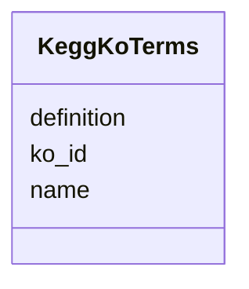

# Class: KeggKoTerms 


_KEGG Orthology (KO) terms_


URI: [https://w3id.org/kbase/nmdc_core/KeggKoTerms](https://w3id.org/kbase/nmdc_core/KeggKoTerms)





<!-- no inheritance hierarchy -->


## Slots

| Name | Cardinality and Range | Description | Inheritance |
| ---  | --- | --- | --- |
| [ko_id](ko_id.md) | 1 <br/> [String](String.md) |  | direct |
| [name](name.md) | 0..1 <br/> [String](String.md) |  | direct |
| [definition](definition.md) | 0..1 <br/> [String](String.md) |  | direct |


## Identifier and Mapping Information


### Annotations

| property | value |
| --- | --- |
| source_table | kegg_ko_terms |


### Schema Source


* from schema: https://w3id.org/kbase/nmdc_core


## Mappings

| Mapping Type | Mapped Value |
| ---  | ---  |
| self | https://w3id.org/kbase/nmdc_core/KeggKoTerms |
| native | https://w3id.org/kbase/nmdc_core/KeggKoTerms |


## LinkML Source

<!-- TODO: investigate https://stackoverflow.com/questions/37606292/how-to-create-tabbed-code-blocks-in-mkdocs-or-sphinx -->

### Direct

<details>
```yaml
name: KeggKoTerms
annotations:
  source_table:
    tag: source_table
    value: kegg_ko_terms
description: KEGG Orthology (KO) terms
from_schema: https://w3id.org/kbase/nmdc_core
attributes:
  ko_id:
    name: ko_id
    from_schema: https://w3id.org/kbase/nmdc_core
    rank: 1000
    identifier: true
    domain_of:
    - KeggKoTerms
    required: true
  name:
    name: name
    from_schema: https://w3id.org/kbase/nmdc_core
    domain_of:
    - AnnotationTermsUnified
    - GoTerms
    - EcTerms
    - KeggKoTerms
    - KeggPathwayTerms
    - CogCategories
    - StudyTable
    - MetabolomicsGold
  definition:
    name: definition
    from_schema: https://w3id.org/kbase/nmdc_core
    domain_of:
    - GoTerms
    - KeggKoTerms

```
</details>

### Induced

<details>
```yaml
name: KeggKoTerms
annotations:
  source_table:
    tag: source_table
    value: kegg_ko_terms
description: KEGG Orthology (KO) terms
from_schema: https://w3id.org/kbase/nmdc_core
attributes:
  ko_id:
    name: ko_id
    from_schema: https://w3id.org/kbase/nmdc_core
    rank: 1000
    identifier: true
    alias: ko_id
    owner: KeggKoTerms
    domain_of:
    - KeggKoTerms
    range: string
    required: true
  name:
    name: name
    from_schema: https://w3id.org/kbase/nmdc_core
    alias: name
    owner: KeggKoTerms
    domain_of:
    - AnnotationTermsUnified
    - GoTerms
    - EcTerms
    - KeggKoTerms
    - KeggPathwayTerms
    - CogCategories
    - StudyTable
    - MetabolomicsGold
    range: string
  definition:
    name: definition
    from_schema: https://w3id.org/kbase/nmdc_core
    alias: definition
    owner: KeggKoTerms
    domain_of:
    - GoTerms
    - KeggKoTerms
    range: string

```
</details>