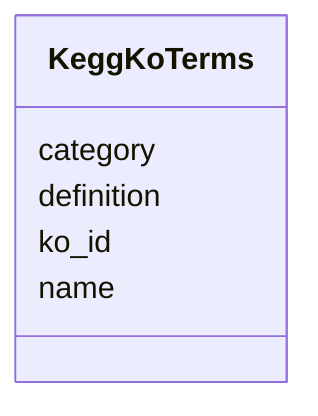

# Class: KeggKoTerms 


_KEGG Orthology (KO) terms. KO provides functional orthologs across species for pathway and module membership._

_TOTAL TERMS: 8,104_

_KO IDENTIFIER FORMAT: KXXXXX (K followed by 5 digits)_

_USAGE: Link genes to pathways via KO assignments. Each KO represents a functional ortholog group - genes with the same KO likely have similar function across species._

_NOTE: Names and definitions may be sparse in this table. For full KO information, query KEGG API or use kegg_ko_pathway/kegg_ko_module for pathway associations._


URI: [https://w3id.org/kbase/nmdc_core/KeggKoTerms](https://w3id.org/kbase/nmdc_core/KeggKoTerms)





<!-- no inheritance hierarchy -->


## Slots

| Name | Cardinality and Range | Description | Inheritance |
| ---  | --- | --- | --- |
| [ko_id](ko_id.md) | 1 <br/> [String](String.md) | KEGG Orthology ID in KXXXXX format | direct |
| [name](name.md) | 0..1 <br/> [String](String.md) | KO name/symbol (may be empty - use KEGG API for full data) | direct |
| [definition](definition.md) | 0..1 <br/> [String](String.md) | KO functional definition | direct |
| [category](category.md) | 0..1 <br/> [String](String.md) | KEGG functional category | direct |


## Identifier and Mapping Information


### Annotations

| property | value |
| --- | --- |
| source_table | kegg_ko_terms |


### Schema Source


* from schema: https://w3id.org/kbase/nmdc_core


## Mappings

| Mapping Type | Mapped Value |
| ---  | ---  |
| self | https://w3id.org/kbase/nmdc_core/KeggKoTerms |
| native | https://w3id.org/kbase/nmdc_core/KeggKoTerms |


## LinkML Source

<!-- TODO: investigate https://stackoverflow.com/questions/37606292/how-to-create-tabbed-code-blocks-in-mkdocs-or-sphinx -->

### Direct

<details>
```yaml
name: KeggKoTerms
annotations:
  source_table:
    tag: source_table
    value: kegg_ko_terms
description: 'KEGG Orthology (KO) terms. KO provides functional orthologs across species
  for pathway and module membership.

  TOTAL TERMS: 8,104

  KO IDENTIFIER FORMAT: KXXXXX (K followed by 5 digits)

  USAGE: Link genes to pathways via KO assignments. Each KO represents a functional
  ortholog group - genes with the same KO likely have similar function across species.

  NOTE: Names and definitions may be sparse in this table. For full KO information,
  query KEGG API or use kegg_ko_pathway/kegg_ko_module for pathway associations.'
from_schema: https://w3id.org/kbase/nmdc_core
attributes:
  ko_id:
    name: ko_id
    description: KEGG Orthology ID in KXXXXX format
    examples:
    - value: K00001
      description: First KO (alcohol dehydrogenase related)
    - value: K00002
      description: Second KO
    - value: K00003
      description: Third KO
    from_schema: https://w3id.org/kbase/nmdc_core
    rank: 1000
    identifier: true
    domain_of:
    - KeggKoTerms
    range: string
    required: true
    pattern: K\d{5}
  name:
    name: name
    description: KO name/symbol (may be empty - use KEGG API for full data)
    from_schema: https://w3id.org/kbase/nmdc_core
    domain_of:
    - AnnotationTermsUnified
    - GoTerms
    - EcTerms
    - KeggKoTerms
    - KeggPathwayTerms
    - StudyTable
    - MetabolomicsGold
    - MetacycPathways
    range: string
  definition:
    name: definition
    description: KO functional definition
    from_schema: https://w3id.org/kbase/nmdc_core
    domain_of:
    - GoTerms
    - KeggKoTerms
    - TraitUnified
    range: string
  category:
    name: category
    description: KEGG functional category
    from_schema: https://w3id.org/kbase/nmdc_core
    rank: 1000
    domain_of:
    - KeggKoTerms
    - KeggPathwayTerms
    range: string

```
</details>

### Induced

<details>
```yaml
name: KeggKoTerms
annotations:
  source_table:
    tag: source_table
    value: kegg_ko_terms
description: 'KEGG Orthology (KO) terms. KO provides functional orthologs across species
  for pathway and module membership.

  TOTAL TERMS: 8,104

  KO IDENTIFIER FORMAT: KXXXXX (K followed by 5 digits)

  USAGE: Link genes to pathways via KO assignments. Each KO represents a functional
  ortholog group - genes with the same KO likely have similar function across species.

  NOTE: Names and definitions may be sparse in this table. For full KO information,
  query KEGG API or use kegg_ko_pathway/kegg_ko_module for pathway associations.'
from_schema: https://w3id.org/kbase/nmdc_core
attributes:
  ko_id:
    name: ko_id
    description: KEGG Orthology ID in KXXXXX format
    examples:
    - value: K00001
      description: First KO (alcohol dehydrogenase related)
    - value: K00002
      description: Second KO
    - value: K00003
      description: Third KO
    from_schema: https://w3id.org/kbase/nmdc_core
    rank: 1000
    identifier: true
    alias: ko_id
    owner: KeggKoTerms
    domain_of:
    - KeggKoTerms
    range: string
    required: true
    pattern: K\d{5}
  name:
    name: name
    description: KO name/symbol (may be empty - use KEGG API for full data)
    from_schema: https://w3id.org/kbase/nmdc_core
    alias: name
    owner: KeggKoTerms
    domain_of:
    - AnnotationTermsUnified
    - GoTerms
    - EcTerms
    - KeggKoTerms
    - KeggPathwayTerms
    - StudyTable
    - MetabolomicsGold
    - MetacycPathways
    range: string
  definition:
    name: definition
    description: KO functional definition
    from_schema: https://w3id.org/kbase/nmdc_core
    alias: definition
    owner: KeggKoTerms
    domain_of:
    - GoTerms
    - KeggKoTerms
    - TraitUnified
    range: string
  category:
    name: category
    description: KEGG functional category
    from_schema: https://w3id.org/kbase/nmdc_core
    rank: 1000
    alias: category
    owner: KeggKoTerms
    domain_of:
    - KeggKoTerms
    - KeggPathwayTerms
    range: string

```
</details>