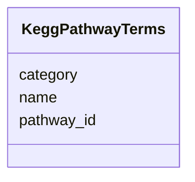

# Class: KeggPathwayTerms 


_KEGG pathway definitions_


URI: [https://w3id.org/kbase/nmdc_core/KeggPathwayTerms](https://w3id.org/kbase/nmdc_core/KeggPathwayTerms)





<!-- no inheritance hierarchy -->


## Slots

| Name | Cardinality and Range | Description | Inheritance |
| ---  | --- | --- | --- |
| [pathway_id](pathway_id.md) | 1 <br/> [String](String.md) |  | direct |
| [name](name.md) | 0..1 <br/> [String](String.md) |  | direct |
| [category](category.md) | 0..1 <br/> [String](String.md) |  | direct |


## Identifier and Mapping Information


### Annotations

| property | value |
| --- | --- |
| source_table | kegg_pathway_terms |


### Schema Source


* from schema: https://w3id.org/kbase/nmdc_core


## Mappings

| Mapping Type | Mapped Value |
| ---  | ---  |
| self | https://w3id.org/kbase/nmdc_core/KeggPathwayTerms |
| native | https://w3id.org/kbase/nmdc_core/KeggPathwayTerms |


## LinkML Source

<!-- TODO: investigate https://stackoverflow.com/questions/37606292/how-to-create-tabbed-code-blocks-in-mkdocs-or-sphinx -->

### Direct

<details>
```yaml
name: KeggPathwayTerms
annotations:
  source_table:
    tag: source_table
    value: kegg_pathway_terms
description: KEGG pathway definitions
from_schema: https://w3id.org/kbase/nmdc_core
attributes:
  pathway_id:
    name: pathway_id
    from_schema: https://w3id.org/kbase/nmdc_core
    rank: 1000
    identifier: true
    domain_of:
    - KeggPathwayTerms
    required: true
  name:
    name: name
    from_schema: https://w3id.org/kbase/nmdc_core
    domain_of:
    - AnnotationTermsUnified
    - GoTerms
    - EcTerms
    - KeggKoTerms
    - KeggPathwayTerms
    - CogCategories
    - StudyTable
    - MetabolomicsGold
  category:
    name: category
    from_schema: https://w3id.org/kbase/nmdc_core
    rank: 1000
    domain_of:
    - KeggPathwayTerms

```
</details>

### Induced

<details>
```yaml
name: KeggPathwayTerms
annotations:
  source_table:
    tag: source_table
    value: kegg_pathway_terms
description: KEGG pathway definitions
from_schema: https://w3id.org/kbase/nmdc_core
attributes:
  pathway_id:
    name: pathway_id
    from_schema: https://w3id.org/kbase/nmdc_core
    rank: 1000
    identifier: true
    alias: pathway_id
    owner: KeggPathwayTerms
    domain_of:
    - KeggPathwayTerms
    range: string
    required: true
  name:
    name: name
    from_schema: https://w3id.org/kbase/nmdc_core
    alias: name
    owner: KeggPathwayTerms
    domain_of:
    - AnnotationTermsUnified
    - GoTerms
    - EcTerms
    - KeggKoTerms
    - KeggPathwayTerms
    - CogCategories
    - StudyTable
    - MetabolomicsGold
    range: string
  category:
    name: category
    from_schema: https://w3id.org/kbase/nmdc_core
    rank: 1000
    alias: category
    owner: KeggPathwayTerms
    domain_of:
    - KeggPathwayTerms
    range: string

```
</details>