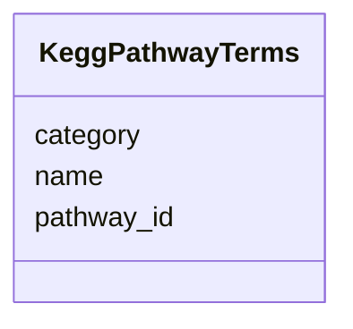

# Class: KeggPathwayTerms 


_KEGG pathway definitions with category classification._

_TOTAL PATHWAYS: 306_

_PATHWAY ID FORMATS: - ko##### - Reference pathway (organism-independent) - map##### - Map/reference pathway_

_MAJOR PATHWAY CATEGORIES: - Metabolism (carbohydrate, energy, lipid, nucleotide, amino acid) - Genetic Information Processing - Environmental Information Processing - Cellular Processes - Human Diseases (reference only)_


URI: [https://w3id.org/kbase/nmdc_core/KeggPathwayTerms](https://w3id.org/kbase/nmdc_core/KeggPathwayTerms)





<!-- no inheritance hierarchy -->


## Slots

| Name | Cardinality and Range | Description | Inheritance |
| ---  | --- | --- | --- |
| [pathway_id](pathway_id.md) | 1 <br/> [String](String.md) | KEGG pathway ID (ko or map prefix) | direct |
| [name](name.md) | 0..1 <br/> [String](String.md) | Pathway name (may be empty - use category) | direct |
| [category](category.md) | 0..1 <br/> [String](String.md) | Pathway category (e | direct |


## Identifier and Mapping Information


### Annotations

| property | value |
| --- | --- |
| source_table | kegg_pathway_terms |


### Schema Source


* from schema: https://w3id.org/kbase/nmdc_core


## Mappings

| Mapping Type | Mapped Value |
| ---  | ---  |
| self | https://w3id.org/kbase/nmdc_core/KeggPathwayTerms |
| native | https://w3id.org/kbase/nmdc_core/KeggPathwayTerms |


## LinkML Source

<!-- TODO: investigate https://stackoverflow.com/questions/37606292/how-to-create-tabbed-code-blocks-in-mkdocs-or-sphinx -->

### Direct

<details>
```yaml
name: KeggPathwayTerms
annotations:
  source_table:
    tag: source_table
    value: kegg_pathway_terms
description: 'KEGG pathway definitions with category classification.

  TOTAL PATHWAYS: 306

  PATHWAY ID FORMATS: - ko##### - Reference pathway (organism-independent) - map#####
  - Map/reference pathway

  MAJOR PATHWAY CATEGORIES: - Metabolism (carbohydrate, energy, lipid, nucleotide,
  amino acid) - Genetic Information Processing - Environmental Information Processing
  - Cellular Processes - Human Diseases (reference only)'
from_schema: https://w3id.org/kbase/nmdc_core
attributes:
  pathway_id:
    name: pathway_id
    description: KEGG pathway ID (ko or map prefix)
    examples:
    - value: ko00010
      description: Glycolysis / Gluconeogenesis
    - value: ko00020
      description: Citrate cycle (TCA cycle)
    - value: ko00030
      description: Pentose phosphate pathway
    - value: map00010
      description: Map version of Glycolysis
    from_schema: https://w3id.org/kbase/nmdc_core
    rank: 1000
    identifier: true
    domain_of:
    - KeggPathwayTerms
    - MetacycPathways
    range: string
    required: true
    pattern: (map|ko)\d{5}
  name:
    name: name
    description: Pathway name (may be empty - use category)
    examples:
    - value: Glycolysis / Gluconeogenesis
    - value: Citrate cycle (TCA cycle)
    from_schema: https://w3id.org/kbase/nmdc_core
    domain_of:
    - AnnotationTermsUnified
    - GoTerms
    - EcTerms
    - KeggKoTerms
    - KeggPathwayTerms
    - StudyTable
    - MetabolomicsGold
    - MetacycPathways
    range: string
  category:
    name: category
    description: Pathway category (e.g., Carbohydrate metabolism)
    examples:
    - value: Carbohydrate metabolism
    - value: Energy metabolism
    - value: Lipid metabolism
    from_schema: https://w3id.org/kbase/nmdc_core
    domain_of:
    - KeggKoTerms
    - KeggPathwayTerms
    range: string

```
</details>

### Induced

<details>
```yaml
name: KeggPathwayTerms
annotations:
  source_table:
    tag: source_table
    value: kegg_pathway_terms
description: 'KEGG pathway definitions with category classification.

  TOTAL PATHWAYS: 306

  PATHWAY ID FORMATS: - ko##### - Reference pathway (organism-independent) - map#####
  - Map/reference pathway

  MAJOR PATHWAY CATEGORIES: - Metabolism (carbohydrate, energy, lipid, nucleotide,
  amino acid) - Genetic Information Processing - Environmental Information Processing
  - Cellular Processes - Human Diseases (reference only)'
from_schema: https://w3id.org/kbase/nmdc_core
attributes:
  pathway_id:
    name: pathway_id
    description: KEGG pathway ID (ko or map prefix)
    examples:
    - value: ko00010
      description: Glycolysis / Gluconeogenesis
    - value: ko00020
      description: Citrate cycle (TCA cycle)
    - value: ko00030
      description: Pentose phosphate pathway
    - value: map00010
      description: Map version of Glycolysis
    from_schema: https://w3id.org/kbase/nmdc_core
    rank: 1000
    identifier: true
    alias: pathway_id
    owner: KeggPathwayTerms
    domain_of:
    - KeggPathwayTerms
    - MetacycPathways
    range: string
    required: true
    pattern: (map|ko)\d{5}
  name:
    name: name
    description: Pathway name (may be empty - use category)
    examples:
    - value: Glycolysis / Gluconeogenesis
    - value: Citrate cycle (TCA cycle)
    from_schema: https://w3id.org/kbase/nmdc_core
    alias: name
    owner: KeggPathwayTerms
    domain_of:
    - AnnotationTermsUnified
    - GoTerms
    - EcTerms
    - KeggKoTerms
    - KeggPathwayTerms
    - StudyTable
    - MetabolomicsGold
    - MetacycPathways
    range: string
  category:
    name: category
    description: Pathway category (e.g., Carbohydrate metabolism)
    examples:
    - value: Carbohydrate metabolism
    - value: Energy metabolism
    - value: Lipid metabolism
    from_schema: https://w3id.org/kbase/nmdc_core
    alias: category
    owner: KeggPathwayTerms
    domain_of:
    - KeggKoTerms
    - KeggPathwayTerms
    range: string

```
</details>