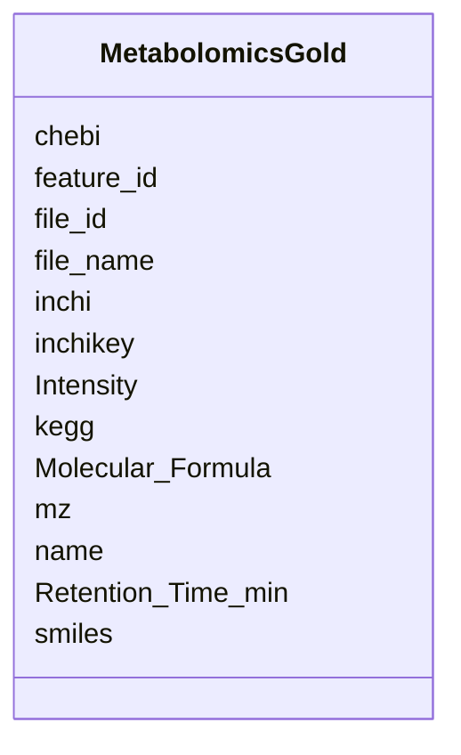

# Class: MetabolomicsGold 


_Metabolomics data linked to GOLD samples. Contains compound identifications with mass spec features and chemical identifiers._

_TOTAL RECORDS: 3,129,061+ mass spec features_

_DATA INCLUDES: - Mass-to-charge ratios (m/z) for detected features - Retention times from chromatography - Peak intensities and areas - Molecular formulas (when determined) - Chemical identifiers (SMILES, InChI, InChIKey when known) - Links to KEGG and ChEBI compound databases_

_USAGE: For metabolomics analysis, join with study_table via file_id. Many features are unidentified (name is null). Use mz and retention time for feature matching across samples._


URI: [https://w3id.org/kbase/nmdc_core/MetabolomicsGold](https://w3id.org/kbase/nmdc_core/MetabolomicsGold)





<!-- no inheritance hierarchy -->


## Slots

| Name | Cardinality and Range | Description | Inheritance |
| ---  | --- | --- | --- |
| [file_id](file_id.md) | 0..1 <br/> [String](String.md) | NMDC data object ID for source file | direct |
| [file_name](file_name.md) | 0..1 <br/> [String](String.md) | Original CSV file name | direct |
| [feature_id](feature_id.md) | 0..1 <br/> [String](String.md) | Metabolite feature ID (unique within file) | direct |
| [name](name.md) | 0..1 <br/> [String](String.md) | Compound name when identified | direct |
| [mz](mz.md) | 0..1 <br/> [Float](Float.md) | Mass-to-charge ratio (m/z) | direct |
| [Retention_Time_min](Retention_Time_min.md) | 0..1 <br/> [Float](Float.md) | Chromatographic retention time in minutes | direct |
| [Intensity](Intensity.md) | 0..1 <br/> [Float](Float.md) | Signal intensity (peak height) | direct |
| [Molecular_Formula](Molecular_Formula.md) | 0..1 <br/> [String](String.md) | Chemical formula when determined from isotope patterns | direct |
| [inchi](inchi.md) | 0..1 <br/> [String](String.md) | InChI (International Chemical Identifier) string | direct |
| [inchikey](inchikey.md) | 0..1 <br/> [String](String.md) | InChIKey - 27-character hash of InChI for database searching | direct |
| [smiles](smiles.md) | 0..1 <br/> [String](String.md) | SMILES notation for chemical structure | direct |
| [kegg](kegg.md) | 0..1 <br/> [String](String.md) | KEGG compound ID (C##### format) | direct |
| [chebi](chebi.md) | 0..1 <br/> [String](String.md) | ChEBI compound ID | direct |


## Identifier and Mapping Information


### Annotations

| property | value |
| --- | --- |
| source_table | metabolomics_gold |


### Schema Source


* from schema: https://w3id.org/kbase/nmdc_core


## Mappings

| Mapping Type | Mapped Value |
| ---  | ---  |
| self | https://w3id.org/kbase/nmdc_core/MetabolomicsGold |
| native | https://w3id.org/kbase/nmdc_core/MetabolomicsGold |


## LinkML Source

<!-- TODO: investigate https://stackoverflow.com/questions/37606292/how-to-create-tabbed-code-blocks-in-mkdocs-or-sphinx -->

### Direct

<details>
```yaml
name: MetabolomicsGold
annotations:
  source_table:
    tag: source_table
    value: metabolomics_gold
description: 'Metabolomics data linked to GOLD samples. Contains compound identifications
  with mass spec features and chemical identifiers.

  TOTAL RECORDS: 3,129,061+ mass spec features

  DATA INCLUDES: - Mass-to-charge ratios (m/z) for detected features - Retention times
  from chromatography - Peak intensities and areas - Molecular formulas (when determined)
  - Chemical identifiers (SMILES, InChI, InChIKey when known) - Links to KEGG and
  ChEBI compound databases

  USAGE: For metabolomics analysis, join with study_table via file_id. Many features
  are unidentified (name is null). Use mz and retention time for feature matching
  across samples.'
from_schema: https://w3id.org/kbase/nmdc_core
attributes:
  file_id:
    name: file_id
    description: NMDC data object ID for source file
    examples:
    - value: nmdc:dobj-12-3j09wy18
      description: Metabolomics data object ID
    from_schema: https://w3id.org/kbase/nmdc_core
    rank: 1000
    domain_of:
    - MetabolomicsGold
    range: string
  file_name:
    name: file_name
    description: Original CSV file name
    examples:
    - value: 4A8_2_41_pinto-63-s028-a03.csv
      description: Sample name encoded in filename
    from_schema: https://w3id.org/kbase/nmdc_core
    rank: 1000
    domain_of:
    - MetabolomicsGold
    range: string
  feature_id:
    name: feature_id
    description: Metabolite feature ID (unique within file)
    examples:
    - value: '16348'
    - value: '1653'
    - value: '19466'
    from_schema: https://w3id.org/kbase/nmdc_core
    rank: 1000
    domain_of:
    - MetabolomicsGold
    range: string
  name:
    name: name
    description: Compound name when identified. NULL for unidentified features (most
      features are unidentified initially).
    from_schema: https://w3id.org/kbase/nmdc_core
    domain_of:
    - AnnotationTermsUnified
    - GoTerms
    - EcTerms
    - KeggKoTerms
    - KeggPathwayTerms
    - StudyTable
    - MetabolomicsGold
    - MetacycPathways
    range: string
  mz:
    name: mz
    description: Mass-to-charge ratio (m/z). Primary identifier for mass spec features.
      Precision typically to 4-6 decimal places.
    examples:
    - value: '493.3288007596016'
      description: Higher mass feature
    - value: '447.25243219640714'
      description: Medium mass feature
    - value: '322.23733159062687'
      description: Lower mass feature
    from_schema: https://w3id.org/kbase/nmdc_core
    rank: 1000
    slot_uri: nmdc:mz
    domain_of:
    - MetabolomicsGold
    range: float
    minimum_value: 0.0
  Retention_Time_min:
    name: Retention_Time_min
    description: Chromatographic retention time in minutes. Second dimension for feature
      identification after m/z.
    examples:
    - value: '6.8750589'
    - value: '7.5899288'
    - value: '5.0135949'
    from_schema: https://w3id.org/kbase/nmdc_core
    rank: 1000
    slot_uri: nmdc:retention_time
    domain_of:
    - MetabolomicsGold
    range: float
    minimum_value: 0.0
  Intensity:
    name: Intensity
    description: Signal intensity (peak height). Proportional to compound abundance
      but not directly comparable across samples.
    examples:
    - value: '7355465.5'
      description: Moderate intensity
    - value: '51934152.0'
      description: High intensity feature
    - value: '6229143.0'
    from_schema: https://w3id.org/kbase/nmdc_core
    rank: 1000
    domain_of:
    - MetabolomicsGold
    range: float
    minimum_value: 0.0
  Molecular_Formula:
    name: Molecular_Formula
    description: 'Chemical formula when determined from isotope patterns. Format:
      Elements with counts and charges.'
    examples:
    - value: C23 H36 O3 N4 P1
      description: Larger molecule with phosphorus
    - value: C19 H32 O3 N1
      description: Medium-sized molecule
    from_schema: https://w3id.org/kbase/nmdc_core
    rank: 1000
    domain_of:
    - MetabolomicsGold
    range: string
  inchi:
    name: inchi
    description: InChI (International Chemical Identifier) string
    from_schema: https://w3id.org/kbase/nmdc_core
    rank: 1000
    domain_of:
    - MetabolomicsGold
    range: string
  inchikey:
    name: inchikey
    description: 'InChIKey - 27-character hash of InChI for database searching. Format:
      14 chars - 10 chars - 1 char checksum.'
    from_schema: https://w3id.org/kbase/nmdc_core
    rank: 1000
    domain_of:
    - MetabolomicsGold
    range: string
    pattern: '[A-Z]{14}-[A-Z]{10}-[A-Z]'
  smiles:
    name: smiles
    description: SMILES notation for chemical structure
    from_schema: https://w3id.org/kbase/nmdc_core
    rank: 1000
    domain_of:
    - MetabolomicsGold
    range: string
  kegg:
    name: kegg
    description: KEGG compound ID (C##### format)
    from_schema: https://w3id.org/kbase/nmdc_core
    rank: 1000
    domain_of:
    - MetabolomicsGold
    range: string
  chebi:
    name: chebi
    description: ChEBI compound ID
    from_schema: https://w3id.org/kbase/nmdc_core
    rank: 1000
    domain_of:
    - MetabolomicsGold
    range: string

```
</details>

### Induced

<details>
```yaml
name: MetabolomicsGold
annotations:
  source_table:
    tag: source_table
    value: metabolomics_gold
description: 'Metabolomics data linked to GOLD samples. Contains compound identifications
  with mass spec features and chemical identifiers.

  TOTAL RECORDS: 3,129,061+ mass spec features

  DATA INCLUDES: - Mass-to-charge ratios (m/z) for detected features - Retention times
  from chromatography - Peak intensities and areas - Molecular formulas (when determined)
  - Chemical identifiers (SMILES, InChI, InChIKey when known) - Links to KEGG and
  ChEBI compound databases

  USAGE: For metabolomics analysis, join with study_table via file_id. Many features
  are unidentified (name is null). Use mz and retention time for feature matching
  across samples.'
from_schema: https://w3id.org/kbase/nmdc_core
attributes:
  file_id:
    name: file_id
    description: NMDC data object ID for source file
    examples:
    - value: nmdc:dobj-12-3j09wy18
      description: Metabolomics data object ID
    from_schema: https://w3id.org/kbase/nmdc_core
    rank: 1000
    alias: file_id
    owner: MetabolomicsGold
    domain_of:
    - MetabolomicsGold
    range: string
  file_name:
    name: file_name
    description: Original CSV file name
    examples:
    - value: 4A8_2_41_pinto-63-s028-a03.csv
      description: Sample name encoded in filename
    from_schema: https://w3id.org/kbase/nmdc_core
    rank: 1000
    alias: file_name
    owner: MetabolomicsGold
    domain_of:
    - MetabolomicsGold
    range: string
  feature_id:
    name: feature_id
    description: Metabolite feature ID (unique within file)
    examples:
    - value: '16348'
    - value: '1653'
    - value: '19466'
    from_schema: https://w3id.org/kbase/nmdc_core
    rank: 1000
    alias: feature_id
    owner: MetabolomicsGold
    domain_of:
    - MetabolomicsGold
    range: string
  name:
    name: name
    description: Compound name when identified. NULL for unidentified features (most
      features are unidentified initially).
    from_schema: https://w3id.org/kbase/nmdc_core
    alias: name
    owner: MetabolomicsGold
    domain_of:
    - AnnotationTermsUnified
    - GoTerms
    - EcTerms
    - KeggKoTerms
    - KeggPathwayTerms
    - StudyTable
    - MetabolomicsGold
    - MetacycPathways
    range: string
  mz:
    name: mz
    description: Mass-to-charge ratio (m/z). Primary identifier for mass spec features.
      Precision typically to 4-6 decimal places.
    examples:
    - value: '493.3288007596016'
      description: Higher mass feature
    - value: '447.25243219640714'
      description: Medium mass feature
    - value: '322.23733159062687'
      description: Lower mass feature
    from_schema: https://w3id.org/kbase/nmdc_core
    rank: 1000
    slot_uri: nmdc:mz
    alias: mz
    owner: MetabolomicsGold
    domain_of:
    - MetabolomicsGold
    range: float
    minimum_value: 0.0
  Retention_Time_min:
    name: Retention_Time_min
    description: Chromatographic retention time in minutes. Second dimension for feature
      identification after m/z.
    examples:
    - value: '6.8750589'
    - value: '7.5899288'
    - value: '5.0135949'
    from_schema: https://w3id.org/kbase/nmdc_core
    rank: 1000
    slot_uri: nmdc:retention_time
    alias: Retention_Time_min
    owner: MetabolomicsGold
    domain_of:
    - MetabolomicsGold
    range: float
    minimum_value: 0.0
  Intensity:
    name: Intensity
    description: Signal intensity (peak height). Proportional to compound abundance
      but not directly comparable across samples.
    examples:
    - value: '7355465.5'
      description: Moderate intensity
    - value: '51934152.0'
      description: High intensity feature
    - value: '6229143.0'
    from_schema: https://w3id.org/kbase/nmdc_core
    rank: 1000
    alias: Intensity
    owner: MetabolomicsGold
    domain_of:
    - MetabolomicsGold
    range: float
    minimum_value: 0.0
  Molecular_Formula:
    name: Molecular_Formula
    description: 'Chemical formula when determined from isotope patterns. Format:
      Elements with counts and charges.'
    examples:
    - value: C23 H36 O3 N4 P1
      description: Larger molecule with phosphorus
    - value: C19 H32 O3 N1
      description: Medium-sized molecule
    from_schema: https://w3id.org/kbase/nmdc_core
    rank: 1000
    alias: Molecular_Formula
    owner: MetabolomicsGold
    domain_of:
    - MetabolomicsGold
    range: string
  inchi:
    name: inchi
    description: InChI (International Chemical Identifier) string
    from_schema: https://w3id.org/kbase/nmdc_core
    rank: 1000
    alias: inchi
    owner: MetabolomicsGold
    domain_of:
    - MetabolomicsGold
    range: string
  inchikey:
    name: inchikey
    description: 'InChIKey - 27-character hash of InChI for database searching. Format:
      14 chars - 10 chars - 1 char checksum.'
    from_schema: https://w3id.org/kbase/nmdc_core
    rank: 1000
    alias: inchikey
    owner: MetabolomicsGold
    domain_of:
    - MetabolomicsGold
    range: string
    pattern: '[A-Z]{14}-[A-Z]{10}-[A-Z]'
  smiles:
    name: smiles
    description: SMILES notation for chemical structure
    from_schema: https://w3id.org/kbase/nmdc_core
    rank: 1000
    alias: smiles
    owner: MetabolomicsGold
    domain_of:
    - MetabolomicsGold
    range: string
  kegg:
    name: kegg
    description: KEGG compound ID (C##### format)
    from_schema: https://w3id.org/kbase/nmdc_core
    rank: 1000
    alias: kegg
    owner: MetabolomicsGold
    domain_of:
    - MetabolomicsGold
    range: string
  chebi:
    name: chebi
    description: ChEBI compound ID
    from_schema: https://w3id.org/kbase/nmdc_core
    rank: 1000
    alias: chebi
    owner: MetabolomicsGold
    domain_of:
    - MetabolomicsGold
    range: string

```
</details>