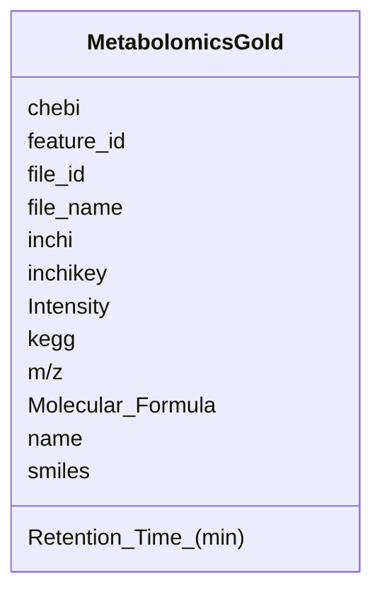

# Class: MetabolomicsGold 


_Metabolomics data linked to GOLD_


URI: [https://w3id.org/kbase/nmdc_core/MetabolomicsGold](https://w3id.org/kbase/nmdc_core/MetabolomicsGold)





<!-- no inheritance hierarchy -->


## Slots

| Name | Cardinality and Range | Description | Inheritance |
| ---  | --- | --- | --- |
| [file_id](file_id.md) | 0..1 <br/> [String](String.md) | Source file ID | direct |
| [file_name](file_name.md) | 0..1 <br/> [String](String.md) |  | direct |
| [feature_id](feature_id.md) | 0..1 <br/> [String](String.md) | Metabolite feature ID | direct |
| [name](name.md) | 0..1 <br/> [String](String.md) | Compound name | direct |
| [m/z](m/z.md) | 0..1 <br/> [Float](Float.md) | Mass-to-charge ratio | direct |
| [Retention_Time_(min)](Retention_Time_(min).md) | 0..1 <br/> [Float](Float.md) |  | direct |
| [Intensity](Intensity.md) | 0..1 <br/> [Float](Float.md) |  | direct |
| [Molecular_Formula](Molecular_Formula.md) | 0..1 <br/> [String](String.md) |  | direct |
| [inchi](inchi.md) | 0..1 <br/> [String](String.md) |  | direct |
| [inchikey](inchikey.md) | 0..1 <br/> [String](String.md) |  | direct |
| [smiles](smiles.md) | 0..1 <br/> [String](String.md) |  | direct |
| [kegg](kegg.md) | 0..1 <br/> [String](String.md) | KEGG compound ID | direct |
| [chebi](chebi.md) | 0..1 <br/> [String](String.md) | ChEBI compound ID | direct |


## Identifier and Mapping Information


### Annotations

| property | value |
| --- | --- |
| source_table | metabolomics_gold |


### Schema Source


* from schema: https://w3id.org/kbase/nmdc_core


## Mappings

| Mapping Type | Mapped Value |
| ---  | ---  |
| self | https://w3id.org/kbase/nmdc_core/MetabolomicsGold |
| native | https://w3id.org/kbase/nmdc_core/MetabolomicsGold |


## LinkML Source

<!-- TODO: investigate https://stackoverflow.com/questions/37606292/how-to-create-tabbed-code-blocks-in-mkdocs-or-sphinx -->

### Direct

<details>
```yaml
name: MetabolomicsGold
annotations:
  source_table:
    tag: source_table
    value: metabolomics_gold
description: Metabolomics data linked to GOLD
from_schema: https://w3id.org/kbase/nmdc_core
attributes:
  file_id:
    name: file_id
    description: Source file ID
    from_schema: https://w3id.org/kbase/nmdc_core
    rank: 1000
    domain_of:
    - MetabolomicsGold
  file_name:
    name: file_name
    from_schema: https://w3id.org/kbase/nmdc_core
    rank: 1000
    domain_of:
    - MetabolomicsGold
  feature_id:
    name: feature_id
    description: Metabolite feature ID
    from_schema: https://w3id.org/kbase/nmdc_core
    rank: 1000
    domain_of:
    - MetabolomicsGold
  name:
    name: name
    description: Compound name
    from_schema: https://w3id.org/kbase/nmdc_core
    domain_of:
    - AnnotationTermsUnified
    - GoTerms
    - EcTerms
    - KeggKoTerms
    - KeggPathwayTerms
    - CogCategories
    - StudyTable
    - MetabolomicsGold
  m/z:
    name: m/z
    description: Mass-to-charge ratio
    from_schema: https://w3id.org/kbase/nmdc_core
    rank: 1000
    domain_of:
    - MetabolomicsGold
    range: float
  Retention Time (min):
    name: Retention Time (min)
    from_schema: https://w3id.org/kbase/nmdc_core
    rank: 1000
    domain_of:
    - MetabolomicsGold
    range: float
  Intensity:
    name: Intensity
    from_schema: https://w3id.org/kbase/nmdc_core
    rank: 1000
    domain_of:
    - MetabolomicsGold
    range: float
  Molecular Formula:
    name: Molecular Formula
    from_schema: https://w3id.org/kbase/nmdc_core
    rank: 1000
    domain_of:
    - MetabolomicsGold
  inchi:
    name: inchi
    from_schema: https://w3id.org/kbase/nmdc_core
    rank: 1000
    domain_of:
    - MetabolomicsGold
  inchikey:
    name: inchikey
    from_schema: https://w3id.org/kbase/nmdc_core
    rank: 1000
    domain_of:
    - MetabolomicsGold
  smiles:
    name: smiles
    from_schema: https://w3id.org/kbase/nmdc_core
    rank: 1000
    domain_of:
    - MetabolomicsGold
  kegg:
    name: kegg
    description: KEGG compound ID
    from_schema: https://w3id.org/kbase/nmdc_core
    rank: 1000
    domain_of:
    - MetabolomicsGold
  chebi:
    name: chebi
    description: ChEBI compound ID
    from_schema: https://w3id.org/kbase/nmdc_core
    rank: 1000
    domain_of:
    - MetabolomicsGold

```
</details>

### Induced

<details>
```yaml
name: MetabolomicsGold
annotations:
  source_table:
    tag: source_table
    value: metabolomics_gold
description: Metabolomics data linked to GOLD
from_schema: https://w3id.org/kbase/nmdc_core
attributes:
  file_id:
    name: file_id
    description: Source file ID
    from_schema: https://w3id.org/kbase/nmdc_core
    rank: 1000
    alias: file_id
    owner: MetabolomicsGold
    domain_of:
    - MetabolomicsGold
    range: string
  file_name:
    name: file_name
    from_schema: https://w3id.org/kbase/nmdc_core
    rank: 1000
    alias: file_name
    owner: MetabolomicsGold
    domain_of:
    - MetabolomicsGold
    range: string
  feature_id:
    name: feature_id
    description: Metabolite feature ID
    from_schema: https://w3id.org/kbase/nmdc_core
    rank: 1000
    alias: feature_id
    owner: MetabolomicsGold
    domain_of:
    - MetabolomicsGold
    range: string
  name:
    name: name
    description: Compound name
    from_schema: https://w3id.org/kbase/nmdc_core
    alias: name
    owner: MetabolomicsGold
    domain_of:
    - AnnotationTermsUnified
    - GoTerms
    - EcTerms
    - KeggKoTerms
    - KeggPathwayTerms
    - CogCategories
    - StudyTable
    - MetabolomicsGold
    range: string
  m/z:
    name: m/z
    description: Mass-to-charge ratio
    from_schema: https://w3id.org/kbase/nmdc_core
    rank: 1000
    alias: m/z
    owner: MetabolomicsGold
    domain_of:
    - MetabolomicsGold
    range: float
  Retention Time (min):
    name: Retention Time (min)
    from_schema: https://w3id.org/kbase/nmdc_core
    rank: 1000
    alias: Retention_Time_(min)
    owner: MetabolomicsGold
    domain_of:
    - MetabolomicsGold
    range: float
  Intensity:
    name: Intensity
    from_schema: https://w3id.org/kbase/nmdc_core
    rank: 1000
    alias: Intensity
    owner: MetabolomicsGold
    domain_of:
    - MetabolomicsGold
    range: float
  Molecular Formula:
    name: Molecular Formula
    from_schema: https://w3id.org/kbase/nmdc_core
    rank: 1000
    alias: Molecular_Formula
    owner: MetabolomicsGold
    domain_of:
    - MetabolomicsGold
    range: string
  inchi:
    name: inchi
    from_schema: https://w3id.org/kbase/nmdc_core
    rank: 1000
    alias: inchi
    owner: MetabolomicsGold
    domain_of:
    - MetabolomicsGold
    range: string
  inchikey:
    name: inchikey
    from_schema: https://w3id.org/kbase/nmdc_core
    rank: 1000
    alias: inchikey
    owner: MetabolomicsGold
    domain_of:
    - MetabolomicsGold
    range: string
  smiles:
    name: smiles
    from_schema: https://w3id.org/kbase/nmdc_core
    rank: 1000
    alias: smiles
    owner: MetabolomicsGold
    domain_of:
    - MetabolomicsGold
    range: string
  kegg:
    name: kegg
    description: KEGG compound ID
    from_schema: https://w3id.org/kbase/nmdc_core
    rank: 1000
    alias: kegg
    owner: MetabolomicsGold
    domain_of:
    - MetabolomicsGold
    range: string
  chebi:
    name: chebi
    description: ChEBI compound ID
    from_schema: https://w3id.org/kbase/nmdc_core
    rank: 1000
    alias: chebi
    owner: MetabolomicsGold
    domain_of:
    - MetabolomicsGold
    range: string

```
</details>