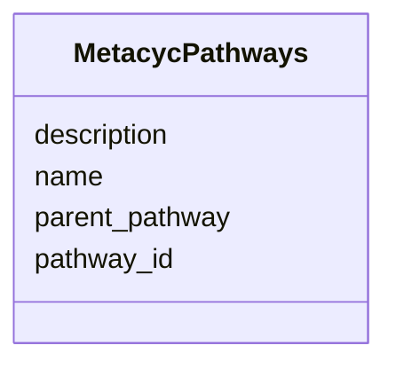

# Class: MetacycPathways 


_MetaCyc metabolic pathways with hierarchical classification._

_TOTAL PATHWAYS: 1,538_

_HIERARCHY: - PATHWAYS (root) - Categories (e.g., BIOLUMINESCENCE with 7 instances) - Specific pathways (BACTERIAL, CORAL, DINOFLAGELLATE, etc.)_

_USAGE: For detailed pathway analysis with reaction-level information. Use pathway_id to join with metacyc_pathway_reactions._


URI: [https://w3id.org/kbase/nmdc_core/MetacycPathways](https://w3id.org/kbase/nmdc_core/MetacycPathways)





<!-- no inheritance hierarchy -->


## Slots

| Name | Cardinality and Range | Description | Inheritance |
| ---  | --- | --- | --- |
| [pathway_id](pathway_id.md) | 1 <br/> [String](String.md) | MetaCyc pathway identifier | direct |
| [name](name.md) | 0..1 <br/> [String](String.md) | Pathway name | direct |
| [description](description.md) | 0..1 <br/> [String](String.md) | Pathway description | direct |
| [parent_pathway](parent_pathway.md) | 0..1 <br/> [String](String.md) | Parent pathway in hierarchy | direct |


## Identifier and Mapping Information


### Annotations

| property | value |
| --- | --- |
| source_table | metacyc_pathways |


### Schema Source


* from schema: https://w3id.org/kbase/nmdc_core


## Mappings

| Mapping Type | Mapped Value |
| ---  | ---  |
| self | https://w3id.org/kbase/nmdc_core/MetacycPathways |
| native | https://w3id.org/kbase/nmdc_core/MetacycPathways |


## LinkML Source

<!-- TODO: investigate https://stackoverflow.com/questions/37606292/how-to-create-tabbed-code-blocks-in-mkdocs-or-sphinx -->

### Direct

<details>
```yaml
name: MetacycPathways
annotations:
  source_table:
    tag: source_table
    value: metacyc_pathways
description: 'MetaCyc metabolic pathways with hierarchical classification.

  TOTAL PATHWAYS: 1,538

  HIERARCHY: - PATHWAYS (root) - Categories (e.g., BIOLUMINESCENCE with 7 instances)
  - Specific pathways (BACTERIAL, CORAL, DINOFLAGELLATE, etc.)

  USAGE: For detailed pathway analysis with reaction-level information. Use pathway_id
  to join with metacyc_pathway_reactions.'
from_schema: https://w3id.org/kbase/nmdc_core
attributes:
  pathway_id:
    name: pathway_id
    description: MetaCyc pathway identifier
    examples:
    - value: PATHWAYS
      description: Root of pathway hierarchy
    - value: BIOLUMINESCENCE
      description: Category with 7 pathway instances
    - value: BACTERIAL
      description: Bacterial bioluminescence pathway
    - value: CORAL
      description: Coral bioluminescence
    from_schema: https://w3id.org/kbase/nmdc_core
    identifier: true
    domain_of:
    - KeggPathwayTerms
    - MetacycPathways
    range: string
    required: true
  name:
    name: name
    description: Pathway name
    examples:
    - value: Pathways
      description: Root name
    - value: (7 instances)
      description: Category with count
    - value: bioluminescence
      description: Specific pathway type
    from_schema: https://w3id.org/kbase/nmdc_core
    domain_of:
    - AnnotationTermsUnified
    - GoTerms
    - EcTerms
    - KeggKoTerms
    - KeggPathwayTerms
    - StudyTable
    - MetabolomicsGold
    - MetacycPathways
    range: string
  description:
    name: description
    description: Pathway description
    from_schema: https://w3id.org/kbase/nmdc_core
    domain_of:
    - AnnotationTermsUnified
    - EcTerms
    - CogCategories
    - StudyTable
    - MetacycPathways
    range: string
  parent_pathway:
    name: parent_pathway
    description: Parent pathway in hierarchy
    comments:
    - Self-referential foreign key to MetacycPathways.pathway_id
    examples:
    - value: PATHWAYS
      description: Direct child of root
    from_schema: https://w3id.org/kbase/nmdc_core
    rank: 1000
    domain_of:
    - MetacycPathways
    range: string

```
</details>

### Induced

<details>
```yaml
name: MetacycPathways
annotations:
  source_table:
    tag: source_table
    value: metacyc_pathways
description: 'MetaCyc metabolic pathways with hierarchical classification.

  TOTAL PATHWAYS: 1,538

  HIERARCHY: - PATHWAYS (root) - Categories (e.g., BIOLUMINESCENCE with 7 instances)
  - Specific pathways (BACTERIAL, CORAL, DINOFLAGELLATE, etc.)

  USAGE: For detailed pathway analysis with reaction-level information. Use pathway_id
  to join with metacyc_pathway_reactions.'
from_schema: https://w3id.org/kbase/nmdc_core
attributes:
  pathway_id:
    name: pathway_id
    description: MetaCyc pathway identifier
    examples:
    - value: PATHWAYS
      description: Root of pathway hierarchy
    - value: BIOLUMINESCENCE
      description: Category with 7 pathway instances
    - value: BACTERIAL
      description: Bacterial bioluminescence pathway
    - value: CORAL
      description: Coral bioluminescence
    from_schema: https://w3id.org/kbase/nmdc_core
    identifier: true
    alias: pathway_id
    owner: MetacycPathways
    domain_of:
    - KeggPathwayTerms
    - MetacycPathways
    range: string
    required: true
  name:
    name: name
    description: Pathway name
    examples:
    - value: Pathways
      description: Root name
    - value: (7 instances)
      description: Category with count
    - value: bioluminescence
      description: Specific pathway type
    from_schema: https://w3id.org/kbase/nmdc_core
    alias: name
    owner: MetacycPathways
    domain_of:
    - AnnotationTermsUnified
    - GoTerms
    - EcTerms
    - KeggKoTerms
    - KeggPathwayTerms
    - StudyTable
    - MetabolomicsGold
    - MetacycPathways
    range: string
  description:
    name: description
    description: Pathway description
    from_schema: https://w3id.org/kbase/nmdc_core
    alias: description
    owner: MetacycPathways
    domain_of:
    - AnnotationTermsUnified
    - EcTerms
    - CogCategories
    - StudyTable
    - MetacycPathways
    range: string
  parent_pathway:
    name: parent_pathway
    description: Parent pathway in hierarchy
    comments:
    - Self-referential foreign key to MetacycPathways.pathway_id
    examples:
    - value: PATHWAYS
      description: Direct child of root
    from_schema: https://w3id.org/kbase/nmdc_core
    rank: 1000
    alias: parent_pathway
    owner: MetacycPathways
    domain_of:
    - MetacycPathways
    range: string

```
</details>