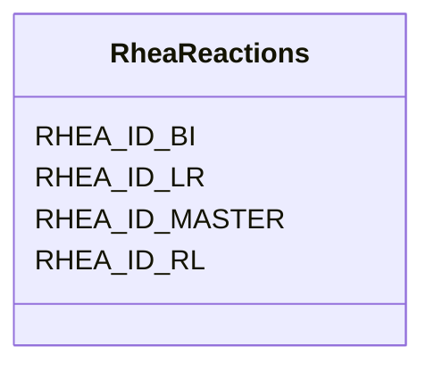

# Class: RheaReactions 


_Rhea biochemical reactions database. Provides detailed reaction information with balanced equations and enzyme links._

_RHEA ID STRUCTURE: - RHEA_ID_MASTER: Main reaction ID - RHEA_ID_LR: Left-to-right direction - RHEA_ID_RL: Right-to-left direction - RHEA_ID_BI: Bidirectional_

_EXAMPLE: Reaction 10000 has IDs 10001 (L->R), 10002 (R->L), 10003 (bi)_


URI: [https://w3id.org/kbase/nmdc_core/RheaReactions](https://w3id.org/kbase/nmdc_core/RheaReactions)





<!-- no inheritance hierarchy -->


## Slots

| Name | Cardinality and Range | Description | Inheritance |
| ---  | --- | --- | --- |
| [RHEA_ID_MASTER](RHEA_ID_MASTER.md) | 1 <br/> [Integer](Integer.md) | Master reaction ID | direct |
| [RHEA_ID_LR](RHEA_ID_LR.md) | 0..1 <br/> [Integer](Integer.md) | Left-to-right reaction ID | direct |
| [RHEA_ID_RL](RHEA_ID_RL.md) | 0..1 <br/> [Integer](Integer.md) | Right-to-left reaction ID | direct |
| [RHEA_ID_BI](RHEA_ID_BI.md) | 0..1 <br/> [Integer](Integer.md) | Bidirectional reaction ID | direct |


## Identifier and Mapping Information


### Annotations

| property | value |
| --- | --- |
| source_table | rhea_reactions |


### Schema Source


* from schema: https://w3id.org/kbase/nmdc_core


## Mappings

| Mapping Type | Mapped Value |
| ---  | ---  |
| self | https://w3id.org/kbase/nmdc_core/RheaReactions |
| native | https://w3id.org/kbase/nmdc_core/RheaReactions |


## LinkML Source

<!-- TODO: investigate https://stackoverflow.com/questions/37606292/how-to-create-tabbed-code-blocks-in-mkdocs-or-sphinx -->

### Direct

<details>
```yaml
name: RheaReactions
annotations:
  source_table:
    tag: source_table
    value: rhea_reactions
description: 'Rhea biochemical reactions database. Provides detailed reaction information
  with balanced equations and enzyme links.

  RHEA ID STRUCTURE: - RHEA_ID_MASTER: Main reaction ID - RHEA_ID_LR: Left-to-right
  direction - RHEA_ID_RL: Right-to-left direction - RHEA_ID_BI: Bidirectional

  EXAMPLE: Reaction 10000 has IDs 10001 (L->R), 10002 (R->L), 10003 (bi)'
from_schema: https://w3id.org/kbase/nmdc_core
attributes:
  RHEA_ID_MASTER:
    name: RHEA_ID_MASTER
    description: Master reaction ID
    examples:
    - value: '10000'
    - value: '10004'
    - value: '10008'
    from_schema: https://w3id.org/kbase/nmdc_core
    rank: 1000
    identifier: true
    domain_of:
    - RheaReactions
    range: integer
    required: true
  RHEA_ID_LR:
    name: RHEA_ID_LR
    description: Left-to-right reaction ID
    examples:
    - value: '10001'
    from_schema: https://w3id.org/kbase/nmdc_core
    rank: 1000
    domain_of:
    - RheaReactions
    range: integer
  RHEA_ID_RL:
    name: RHEA_ID_RL
    description: Right-to-left reaction ID
    examples:
    - value: '10002'
    from_schema: https://w3id.org/kbase/nmdc_core
    rank: 1000
    domain_of:
    - RheaReactions
    range: integer
  RHEA_ID_BI:
    name: RHEA_ID_BI
    description: Bidirectional reaction ID
    examples:
    - value: '10003'
    from_schema: https://w3id.org/kbase/nmdc_core
    rank: 1000
    domain_of:
    - RheaReactions
    range: integer

```
</details>

### Induced

<details>
```yaml
name: RheaReactions
annotations:
  source_table:
    tag: source_table
    value: rhea_reactions
description: 'Rhea biochemical reactions database. Provides detailed reaction information
  with balanced equations and enzyme links.

  RHEA ID STRUCTURE: - RHEA_ID_MASTER: Main reaction ID - RHEA_ID_LR: Left-to-right
  direction - RHEA_ID_RL: Right-to-left direction - RHEA_ID_BI: Bidirectional

  EXAMPLE: Reaction 10000 has IDs 10001 (L->R), 10002 (R->L), 10003 (bi)'
from_schema: https://w3id.org/kbase/nmdc_core
attributes:
  RHEA_ID_MASTER:
    name: RHEA_ID_MASTER
    description: Master reaction ID
    examples:
    - value: '10000'
    - value: '10004'
    - value: '10008'
    from_schema: https://w3id.org/kbase/nmdc_core
    rank: 1000
    identifier: true
    alias: RHEA_ID_MASTER
    owner: RheaReactions
    domain_of:
    - RheaReactions
    range: integer
    required: true
  RHEA_ID_LR:
    name: RHEA_ID_LR
    description: Left-to-right reaction ID
    examples:
    - value: '10001'
    from_schema: https://w3id.org/kbase/nmdc_core
    rank: 1000
    alias: RHEA_ID_LR
    owner: RheaReactions
    domain_of:
    - RheaReactions
    range: integer
  RHEA_ID_RL:
    name: RHEA_ID_RL
    description: Right-to-left reaction ID
    examples:
    - value: '10002'
    from_schema: https://w3id.org/kbase/nmdc_core
    rank: 1000
    alias: RHEA_ID_RL
    owner: RheaReactions
    domain_of:
    - RheaReactions
    range: integer
  RHEA_ID_BI:
    name: RHEA_ID_BI
    description: Bidirectional reaction ID
    examples:
    - value: '10003'
    from_schema: https://w3id.org/kbase/nmdc_core
    rank: 1000
    alias: RHEA_ID_BI
    owner: RheaReactions
    domain_of:
    - RheaReactions
    range: integer

```
</details>