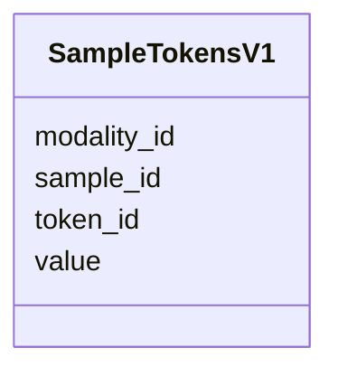

# Class: SampleTokensV1 


_Sample-level token assignments_


URI: [https://w3id.org/kbase/nmdc_core/SampleTokensV1](https://w3id.org/kbase/nmdc_core/SampleTokensV1)





<!-- no inheritance hierarchy -->


## Slots

| Name | Cardinality and Range | Description | Inheritance |
| ---  | --- | --- | --- |
| [sample_id](sample_id.md) | 0..1 <br/> [String](String.md) | Sample identifier | direct |
| [token_id](token_id.md) | 0..1 <br/> [Integer](Integer.md) | Vocabulary token ID | direct |
| [modality_id](modality_id.md) | 0..1 <br/> [String](String.md) | Data modality | direct |
| [value](value.md) | 0..1 <br/> [Float](Float.md) |  | direct |


## Identifier and Mapping Information


### Annotations

| property | value |
| --- | --- |
| source_table | sample_tokens_v1 |


### Schema Source


* from schema: https://w3id.org/kbase/nmdc_core


## Mappings

| Mapping Type | Mapped Value |
| ---  | ---  |
| self | https://w3id.org/kbase/nmdc_core/SampleTokensV1 |
| native | https://w3id.org/kbase/nmdc_core/SampleTokensV1 |


## LinkML Source

<!-- TODO: investigate https://stackoverflow.com/questions/37606292/how-to-create-tabbed-code-blocks-in-mkdocs-or-sphinx -->

### Direct

<details>
```yaml
name: SampleTokensV1
annotations:
  source_table:
    tag: source_table
    value: sample_tokens_v1
description: Sample-level token assignments
from_schema: https://w3id.org/kbase/nmdc_core
attributes:
  sample_id:
    name: sample_id
    description: Sample identifier
    from_schema: https://w3id.org/kbase/nmdc_core
    rank: 1000
    domain_of:
    - SampleTokensV1
  token_id:
    name: token_id
    description: Vocabulary token ID
    from_schema: https://w3id.org/kbase/nmdc_core
    rank: 1000
    domain_of:
    - SampleTokensV1
    range: integer
  modality_id:
    name: modality_id
    description: Data modality
    from_schema: https://w3id.org/kbase/nmdc_core
    rank: 1000
    domain_of:
    - SampleTokensV1
  value:
    name: value
    from_schema: https://w3id.org/kbase/nmdc_core
    rank: 1000
    domain_of:
    - SampleTokensV1
    range: float

```
</details>

### Induced

<details>
```yaml
name: SampleTokensV1
annotations:
  source_table:
    tag: source_table
    value: sample_tokens_v1
description: Sample-level token assignments
from_schema: https://w3id.org/kbase/nmdc_core
attributes:
  sample_id:
    name: sample_id
    description: Sample identifier
    from_schema: https://w3id.org/kbase/nmdc_core
    rank: 1000
    alias: sample_id
    owner: SampleTokensV1
    domain_of:
    - SampleTokensV1
    range: string
  token_id:
    name: token_id
    description: Vocabulary token ID
    from_schema: https://w3id.org/kbase/nmdc_core
    rank: 1000
    alias: token_id
    owner: SampleTokensV1
    domain_of:
    - SampleTokensV1
    range: integer
  modality_id:
    name: modality_id
    description: Data modality
    from_schema: https://w3id.org/kbase/nmdc_core
    rank: 1000
    alias: modality_id
    owner: SampleTokensV1
    domain_of:
    - SampleTokensV1
    range: string
  value:
    name: value
    from_schema: https://w3id.org/kbase/nmdc_core
    rank: 1000
    alias: value
    owner: SampleTokensV1
    domain_of:
    - SampleTokensV1
    range: float

```
</details>