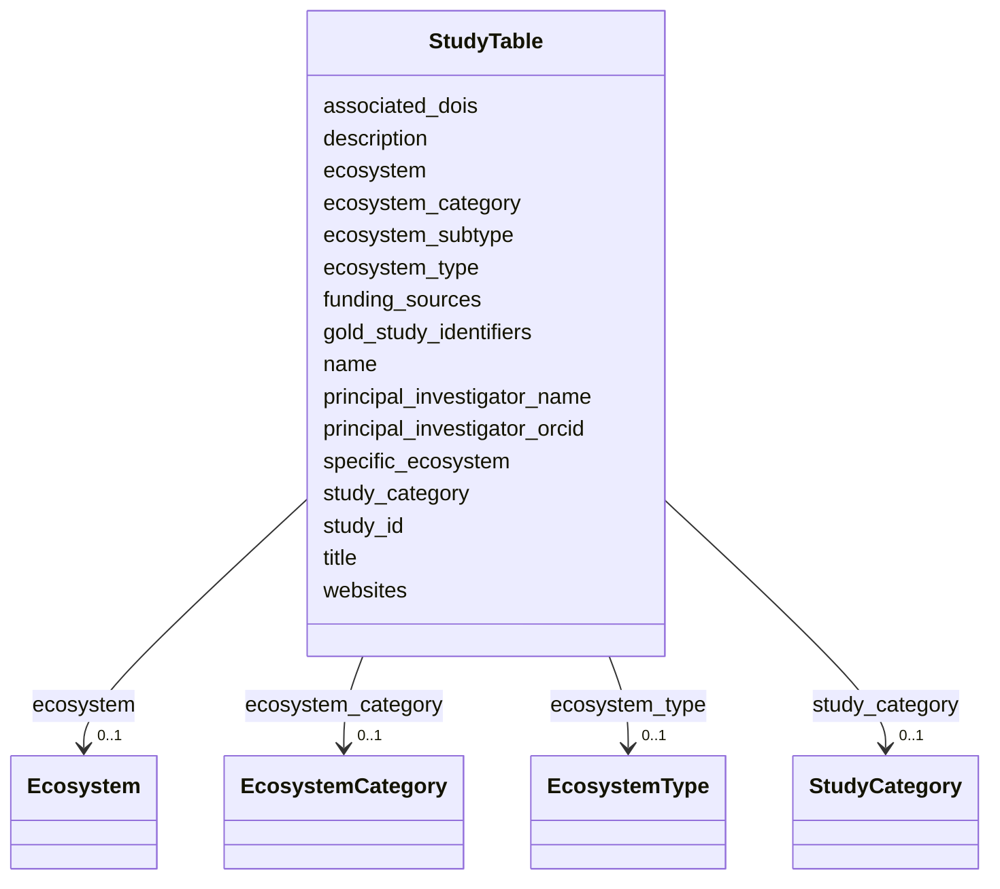

# Class: StudyTable 


_NMDC research studies with ecosystem classification and investigator information. Links to GOLD study identifiers and DOIs._

_TOTAL STUDIES: 48_

_ECOSYSTEM DISTRIBUTION: - Environmental/Terrestrial/Soil: 3 studies - Environmental/Aquatic/Freshwater: 3 studies - Environmental/Terrestrial/Deep subsurface: 1 study - Host-associated/Plants: 1 study - Unclassified: 40 studies_

_STUDY TYPES: - research_study: Individual PI-led studies (most common) - consortium: Multi-institution projects like NEON_

_EXAMPLE STUDIES: - Deep shale microbiomes (Kelly Wrighton, Colorado State) - SPRUCE peatland experiment (Christopher Schadt, ORNL) - Columbia River hyporheic zone (James Stegen, PNNL) - NEON soil metagenomes (Kate Thibault, nationwide)_


URI: [https://w3id.org/kbase/nmdc_core/StudyTable](https://w3id.org/kbase/nmdc_core/StudyTable)





<!-- no inheritance hierarchy -->


## Slots

| Name | Cardinality and Range | Description | Inheritance |
| ---  | --- | --- | --- |
| [study_id](study_id.md) | 1 <br/> [String](String.md) | NMDC study identifier | direct |
| [name](name.md) | 0..1 <br/> [String](String.md) | Study short name | direct |
| [description](description.md) | 0..1 <br/> [String](String.md) | Detailed study description including goals, methods, and context | direct |
| [title](title.md) | 0..1 <br/> [String](String.md) | Formal study title (may differ from name) | direct |
| [ecosystem](ecosystem.md) | 0..1 <br/> [Ecosystem](Ecosystem.md) | Top-level ecosystem classification | direct |
| [ecosystem_category](ecosystem_category.md) | 0..1 <br/> [EcosystemCategory](EcosystemCategory.md) | Ecosystem category (second level) | direct |
| [ecosystem_type](ecosystem_type.md) | 0..1 <br/> [EcosystemType](EcosystemType.md) | Specific ecosystem type (third level) | direct |
| [ecosystem_subtype](ecosystem_subtype.md) | 0..1 <br/> [String](String.md) | Ecosystem subtype for further classification | direct |
| [specific_ecosystem](specific_ecosystem.md) | 0..1 <br/> [String](String.md) | Most specific ecosystem classification | direct |
| [principal_investigator_name](principal_investigator_name.md) | 0..1 <br/> [String](String.md) | PI name | direct |
| [principal_investigator_orcid](principal_investigator_orcid.md) | 0..1 <br/> [String](String.md) | PI ORCID identifier for disambiguation | direct |
| [study_category](study_category.md) | 0..1 <br/> [StudyCategory](StudyCategory.md) | Category of study | direct |
| [funding_sources](funding_sources.md) | 0..1 <br/> [String](String.md) | JSON array of funding sources | direct |
| [gold_study_identifiers](gold_study_identifiers.md) | 0..1 <br/> [String](String.md) | JSON array of GOLD study IDs | direct |
| [associated_dois](associated_dois.md) | 0..1 <br/> [String](String.md) | JSON array of DOI objects with doi_value, doi_category (dataset_doi, award_do... | direct |
| [websites](websites.md) | 0..1 <br/> [String](String.md) | JSON array of associated website URLs | direct |


## Identifier and Mapping Information


### Annotations

| property | value |
| --- | --- |
| source_table | study_table |


### Schema Source


* from schema: https://w3id.org/kbase/nmdc_core


## Mappings

| Mapping Type | Mapped Value |
| ---  | ---  |
| self | https://w3id.org/kbase/nmdc_core/StudyTable |
| native | https://w3id.org/kbase/nmdc_core/StudyTable |


## LinkML Source

<!-- TODO: investigate https://stackoverflow.com/questions/37606292/how-to-create-tabbed-code-blocks-in-mkdocs-or-sphinx -->

### Direct

<details>
```yaml
name: StudyTable
annotations:
  source_table:
    tag: source_table
    value: study_table
description: 'NMDC research studies with ecosystem classification and investigator
  information. Links to GOLD study identifiers and DOIs.

  TOTAL STUDIES: 48

  ECOSYSTEM DISTRIBUTION: - Environmental/Terrestrial/Soil: 3 studies - Environmental/Aquatic/Freshwater:
  3 studies - Environmental/Terrestrial/Deep subsurface: 1 study - Host-associated/Plants:
  1 study - Unclassified: 40 studies

  STUDY TYPES: - research_study: Individual PI-led studies (most common) - consortium:
  Multi-institution projects like NEON

  EXAMPLE STUDIES: - Deep shale microbiomes (Kelly Wrighton, Colorado State) - SPRUCE
  peatland experiment (Christopher Schadt, ORNL) - Columbia River hyporheic zone (James
  Stegen, PNNL) - NEON soil metagenomes (Kate Thibault, nationwide)'
from_schema: https://w3id.org/kbase/nmdc_core
attributes:
  study_id:
    name: study_id
    description: 'NMDC study identifier. Format: nmdc:sty-NN-XXXXXXXX where NN is
      a two-digit code and X is alphanumeric.'
    examples:
    - value: nmdc:sty-11-8fb6t785
      description: Deep subsurface shale study (Kelly Wrighton)
    - value: nmdc:sty-11-33fbta56
      description: SPRUCE peatland study (Christopher Schadt)
    - value: nmdc:sty-11-aygzgv51
      description: Columbia River study (James Stegen)
    - value: nmdc:sty-11-34xj1150
      description: NEON soil metagenomes (Kate Thibault)
    from_schema: https://w3id.org/kbase/nmdc_core
    rank: 1000
    identifier: true
    domain_of:
    - StudyTable
    range: string
    required: true
    pattern: nmdc:sty-\d{2}-[a-z0-9]+
  name:
    name: name
    description: Study short name
    examples:
    - value: Deep subsurface shale carbon reservoir microbial communities from Ohio
        and West Virginia, USA
    - value: Peatland microbial communities from Minnesota, USA, analyzing carbon
        cycling and trace gas fluxes
    - value: 'National Ecological Observatory Network: soil metagenomes (DP1.10107.001)'
    from_schema: https://w3id.org/kbase/nmdc_core
    domain_of:
    - AnnotationTermsUnified
    - GoTerms
    - EcTerms
    - KeggKoTerms
    - KeggPathwayTerms
    - StudyTable
    - MetabolomicsGold
    - MetacycPathways
    range: string
  description:
    name: description
    description: Detailed study description including goals, methods, and context.
      Often includes information about sampling locations and conditions.
    from_schema: https://w3id.org/kbase/nmdc_core
    domain_of:
    - AnnotationTermsUnified
    - EcTerms
    - CogCategories
    - StudyTable
    - MetacycPathways
    range: string
  title:
    name: title
    description: Formal study title (may differ from name)
    examples:
    - value: Fungal, bacterial, and archaeal communities mediating C cycling and trace
        gas flux in peatland ecosystems subject to climate change
    - value: Riverbed sediment microbial communities from the Columbia River, Washington,
        USA
    from_schema: https://w3id.org/kbase/nmdc_core
    rank: 1000
    domain_of:
    - StudyTable
    range: string
  ecosystem:
    name: ecosystem
    description: Top-level ecosystem classification
    examples:
    - value: Environmental
      description: Most NMDC studies are environmental
    - value: Host-associated
      description: Host-associated microbiomes
    from_schema: https://w3id.org/kbase/nmdc_core
    rank: 1000
    domain_of:
    - StudyTable
    range: Ecosystem
  ecosystem_category:
    name: ecosystem_category
    description: Ecosystem category (second level)
    examples:
    - value: Terrestrial
      description: Land-based environments
    - value: Aquatic
      description: Water environments
    - value: Plants
      description: Plant-associated
    from_schema: https://w3id.org/kbase/nmdc_core
    rank: 1000
    domain_of:
    - StudyTable
    range: EcosystemCategory
  ecosystem_type:
    name: ecosystem_type
    description: Specific ecosystem type (third level)
    examples:
    - value: Deep subsurface
      description: Shale formations, aquifers
    - value: Freshwater
      description: Rivers, wetlands, lakes
    - value: Soil
      description: Surface and subsurface soils
    from_schema: https://w3id.org/kbase/nmdc_core
    rank: 1000
    domain_of:
    - StudyTable
    range: EcosystemType
  ecosystem_subtype:
    name: ecosystem_subtype
    description: Ecosystem subtype for further classification
    examples:
    - value: Wetlands
      description: Peatlands, marshes
    - value: River
      description: River sediments
    - value: Unclassified
      description: Not further classified
    from_schema: https://w3id.org/kbase/nmdc_core
    rank: 1000
    domain_of:
    - StudyTable
    range: string
  specific_ecosystem:
    name: specific_ecosystem
    description: Most specific ecosystem classification
    examples:
    - value: Sediment
      description: River or lake sediments
    - value: Forest Soil
      description: Forest soil microbiomes
    - value: Unclassified
    from_schema: https://w3id.org/kbase/nmdc_core
    rank: 1000
    domain_of:
    - StudyTable
    range: string
  principal_investigator_name:
    name: principal_investigator_name
    description: PI name
    examples:
    - value: Kelly Wrighton
      description: Colorado State University
    - value: Christopher Schadt
      description: Oak Ridge National Lab
    - value: James Stegen
      description: Pacific Northwest National Lab
    - value: Kate Thibault
      description: NEON/Battelle Ecology
    from_schema: https://w3id.org/kbase/nmdc_core
    rank: 1000
    domain_of:
    - StudyTable
    range: string
  principal_investigator_orcid:
    name: principal_investigator_orcid
    description: PI ORCID identifier for disambiguation
    examples:
    - value: orcid:0000-0003-0434-4217
      description: Kelly Wrighton
    - value: orcid:0000-0001-8759-2448
      description: Christopher Schadt
    - value: orcid:0000-0001-9135-7424
      description: James Stegen
    from_schema: https://w3id.org/kbase/nmdc_core
    rank: 1000
    domain_of:
    - StudyTable
    range: string
    pattern: orcid:\d{4}-\d{4}-\d{4}-\d{3}[0-9X]
  study_category:
    name: study_category
    description: Category of study
    examples:
    - value: research_study
      description: Most studies are individual research
    - value: consortium
      description: NEON is a consortium
    from_schema: https://w3id.org/kbase/nmdc_core
    rank: 1000
    domain_of:
    - StudyTable
    range: StudyCategory
  funding_sources:
    name: funding_sources
    description: JSON array of funding sources
    examples:
    - value: '["National Sciences Foundation Dimensions of Biodiversity (award no.
        1342701)"]'
    - value: '["U.S. Department of Energy, Office of Science, Office of Biological
        and Environmental Research (BER)"]'
    from_schema: https://w3id.org/kbase/nmdc_core
    rank: 1000
    domain_of:
    - StudyTable
    range: string
  gold_study_identifiers:
    name: gold_study_identifiers
    description: JSON array of GOLD study IDs
    examples:
    - value: '["gold:Gs0114675"]'
      description: Single GOLD ID
    - value: '["gold:Gs0144570", "gold:Gs0161344"]'
      description: Multiple GOLD IDs (NEON)
    from_schema: https://w3id.org/kbase/nmdc_core
    rank: 1000
    domain_of:
    - StudyTable
    range: string
  associated_dois:
    name: associated_dois
    description: JSON array of DOI objects with doi_value, doi_category (dataset_doi,
      award_doi, publication_doi), and doi_provider (jgi, emsl, etc.)
    examples:
    - value: '[{"doi_value": "doi:10.25585/1487763", "doi_category": "dataset_doi",
        "doi_provider": "jgi"}]'
    - value: '[{"doi_value": "doi:10.1371/journal.pone.0228165", "doi_category": "publication_doi"}]'
      description: Publication DOI
    from_schema: https://w3id.org/kbase/nmdc_core
    rank: 1000
    domain_of:
    - StudyTable
    range: string
  websites:
    name: websites
    description: JSON array of associated website URLs
    examples:
    - value: '["https://mnspruce.ornl.gov/project/overview"]'
      description: SPRUCE project website
    - value: '["https://www.pnnl.gov/projects/river-corridor-hydrobiogeochemistry-science-focus-area"]'
      description: PNNL project page
    from_schema: https://w3id.org/kbase/nmdc_core
    rank: 1000
    domain_of:
    - StudyTable
    range: string

```
</details>

### Induced

<details>
```yaml
name: StudyTable
annotations:
  source_table:
    tag: source_table
    value: study_table
description: 'NMDC research studies with ecosystem classification and investigator
  information. Links to GOLD study identifiers and DOIs.

  TOTAL STUDIES: 48

  ECOSYSTEM DISTRIBUTION: - Environmental/Terrestrial/Soil: 3 studies - Environmental/Aquatic/Freshwater:
  3 studies - Environmental/Terrestrial/Deep subsurface: 1 study - Host-associated/Plants:
  1 study - Unclassified: 40 studies

  STUDY TYPES: - research_study: Individual PI-led studies (most common) - consortium:
  Multi-institution projects like NEON

  EXAMPLE STUDIES: - Deep shale microbiomes (Kelly Wrighton, Colorado State) - SPRUCE
  peatland experiment (Christopher Schadt, ORNL) - Columbia River hyporheic zone (James
  Stegen, PNNL) - NEON soil metagenomes (Kate Thibault, nationwide)'
from_schema: https://w3id.org/kbase/nmdc_core
attributes:
  study_id:
    name: study_id
    description: 'NMDC study identifier. Format: nmdc:sty-NN-XXXXXXXX where NN is
      a two-digit code and X is alphanumeric.'
    examples:
    - value: nmdc:sty-11-8fb6t785
      description: Deep subsurface shale study (Kelly Wrighton)
    - value: nmdc:sty-11-33fbta56
      description: SPRUCE peatland study (Christopher Schadt)
    - value: nmdc:sty-11-aygzgv51
      description: Columbia River study (James Stegen)
    - value: nmdc:sty-11-34xj1150
      description: NEON soil metagenomes (Kate Thibault)
    from_schema: https://w3id.org/kbase/nmdc_core
    rank: 1000
    identifier: true
    alias: study_id
    owner: StudyTable
    domain_of:
    - StudyTable
    range: string
    required: true
    pattern: nmdc:sty-\d{2}-[a-z0-9]+
  name:
    name: name
    description: Study short name
    examples:
    - value: Deep subsurface shale carbon reservoir microbial communities from Ohio
        and West Virginia, USA
    - value: Peatland microbial communities from Minnesota, USA, analyzing carbon
        cycling and trace gas fluxes
    - value: 'National Ecological Observatory Network: soil metagenomes (DP1.10107.001)'
    from_schema: https://w3id.org/kbase/nmdc_core
    alias: name
    owner: StudyTable
    domain_of:
    - AnnotationTermsUnified
    - GoTerms
    - EcTerms
    - KeggKoTerms
    - KeggPathwayTerms
    - StudyTable
    - MetabolomicsGold
    - MetacycPathways
    range: string
  description:
    name: description
    description: Detailed study description including goals, methods, and context.
      Often includes information about sampling locations and conditions.
    from_schema: https://w3id.org/kbase/nmdc_core
    alias: description
    owner: StudyTable
    domain_of:
    - AnnotationTermsUnified
    - EcTerms
    - CogCategories
    - StudyTable
    - MetacycPathways
    range: string
  title:
    name: title
    description: Formal study title (may differ from name)
    examples:
    - value: Fungal, bacterial, and archaeal communities mediating C cycling and trace
        gas flux in peatland ecosystems subject to climate change
    - value: Riverbed sediment microbial communities from the Columbia River, Washington,
        USA
    from_schema: https://w3id.org/kbase/nmdc_core
    rank: 1000
    alias: title
    owner: StudyTable
    domain_of:
    - StudyTable
    range: string
  ecosystem:
    name: ecosystem
    description: Top-level ecosystem classification
    examples:
    - value: Environmental
      description: Most NMDC studies are environmental
    - value: Host-associated
      description: Host-associated microbiomes
    from_schema: https://w3id.org/kbase/nmdc_core
    rank: 1000
    alias: ecosystem
    owner: StudyTable
    domain_of:
    - StudyTable
    range: Ecosystem
  ecosystem_category:
    name: ecosystem_category
    description: Ecosystem category (second level)
    examples:
    - value: Terrestrial
      description: Land-based environments
    - value: Aquatic
      description: Water environments
    - value: Plants
      description: Plant-associated
    from_schema: https://w3id.org/kbase/nmdc_core
    rank: 1000
    alias: ecosystem_category
    owner: StudyTable
    domain_of:
    - StudyTable
    range: EcosystemCategory
  ecosystem_type:
    name: ecosystem_type
    description: Specific ecosystem type (third level)
    examples:
    - value: Deep subsurface
      description: Shale formations, aquifers
    - value: Freshwater
      description: Rivers, wetlands, lakes
    - value: Soil
      description: Surface and subsurface soils
    from_schema: https://w3id.org/kbase/nmdc_core
    rank: 1000
    alias: ecosystem_type
    owner: StudyTable
    domain_of:
    - StudyTable
    range: EcosystemType
  ecosystem_subtype:
    name: ecosystem_subtype
    description: Ecosystem subtype for further classification
    examples:
    - value: Wetlands
      description: Peatlands, marshes
    - value: River
      description: River sediments
    - value: Unclassified
      description: Not further classified
    from_schema: https://w3id.org/kbase/nmdc_core
    rank: 1000
    alias: ecosystem_subtype
    owner: StudyTable
    domain_of:
    - StudyTable
    range: string
  specific_ecosystem:
    name: specific_ecosystem
    description: Most specific ecosystem classification
    examples:
    - value: Sediment
      description: River or lake sediments
    - value: Forest Soil
      description: Forest soil microbiomes
    - value: Unclassified
    from_schema: https://w3id.org/kbase/nmdc_core
    rank: 1000
    alias: specific_ecosystem
    owner: StudyTable
    domain_of:
    - StudyTable
    range: string
  principal_investigator_name:
    name: principal_investigator_name
    description: PI name
    examples:
    - value: Kelly Wrighton
      description: Colorado State University
    - value: Christopher Schadt
      description: Oak Ridge National Lab
    - value: James Stegen
      description: Pacific Northwest National Lab
    - value: Kate Thibault
      description: NEON/Battelle Ecology
    from_schema: https://w3id.org/kbase/nmdc_core
    rank: 1000
    alias: principal_investigator_name
    owner: StudyTable
    domain_of:
    - StudyTable
    range: string
  principal_investigator_orcid:
    name: principal_investigator_orcid
    description: PI ORCID identifier for disambiguation
    examples:
    - value: orcid:0000-0003-0434-4217
      description: Kelly Wrighton
    - value: orcid:0000-0001-8759-2448
      description: Christopher Schadt
    - value: orcid:0000-0001-9135-7424
      description: James Stegen
    from_schema: https://w3id.org/kbase/nmdc_core
    rank: 1000
    alias: principal_investigator_orcid
    owner: StudyTable
    domain_of:
    - StudyTable
    range: string
    pattern: orcid:\d{4}-\d{4}-\d{4}-\d{3}[0-9X]
  study_category:
    name: study_category
    description: Category of study
    examples:
    - value: research_study
      description: Most studies are individual research
    - value: consortium
      description: NEON is a consortium
    from_schema: https://w3id.org/kbase/nmdc_core
    rank: 1000
    alias: study_category
    owner: StudyTable
    domain_of:
    - StudyTable
    range: StudyCategory
  funding_sources:
    name: funding_sources
    description: JSON array of funding sources
    examples:
    - value: '["National Sciences Foundation Dimensions of Biodiversity (award no.
        1342701)"]'
    - value: '["U.S. Department of Energy, Office of Science, Office of Biological
        and Environmental Research (BER)"]'
    from_schema: https://w3id.org/kbase/nmdc_core
    rank: 1000
    alias: funding_sources
    owner: StudyTable
    domain_of:
    - StudyTable
    range: string
  gold_study_identifiers:
    name: gold_study_identifiers
    description: JSON array of GOLD study IDs
    examples:
    - value: '["gold:Gs0114675"]'
      description: Single GOLD ID
    - value: '["gold:Gs0144570", "gold:Gs0161344"]'
      description: Multiple GOLD IDs (NEON)
    from_schema: https://w3id.org/kbase/nmdc_core
    rank: 1000
    alias: gold_study_identifiers
    owner: StudyTable
    domain_of:
    - StudyTable
    range: string
  associated_dois:
    name: associated_dois
    description: JSON array of DOI objects with doi_value, doi_category (dataset_doi,
      award_doi, publication_doi), and doi_provider (jgi, emsl, etc.)
    examples:
    - value: '[{"doi_value": "doi:10.25585/1487763", "doi_category": "dataset_doi",
        "doi_provider": "jgi"}]'
    - value: '[{"doi_value": "doi:10.1371/journal.pone.0228165", "doi_category": "publication_doi"}]'
      description: Publication DOI
    from_schema: https://w3id.org/kbase/nmdc_core
    rank: 1000
    alias: associated_dois
    owner: StudyTable
    domain_of:
    - StudyTable
    range: string
  websites:
    name: websites
    description: JSON array of associated website URLs
    examples:
    - value: '["https://mnspruce.ornl.gov/project/overview"]'
      description: SPRUCE project website
    - value: '["https://www.pnnl.gov/projects/river-corridor-hydrobiogeochemistry-science-focus-area"]'
      description: PNNL project page
    from_schema: https://w3id.org/kbase/nmdc_core
    rank: 1000
    alias: websites
    owner: StudyTable
    domain_of:
    - StudyTable
    range: string

```
</details>