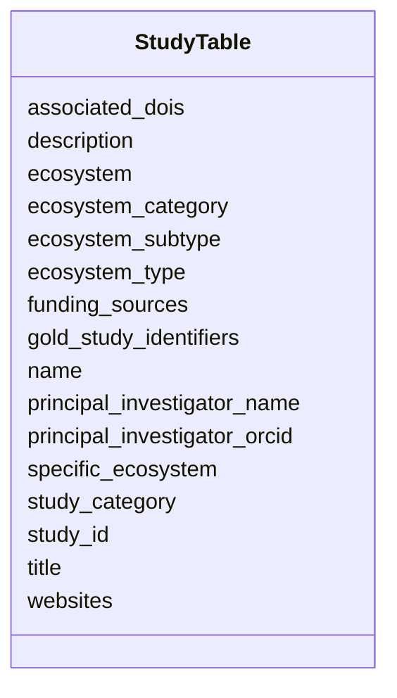

# Class: StudyTable 


_NMDC research studies_


URI: [https://w3id.org/kbase/nmdc_core/StudyTable](https://w3id.org/kbase/nmdc_core/StudyTable)





<!-- no inheritance hierarchy -->


## Slots

| Name | Cardinality and Range | Description | Inheritance |
| ---  | --- | --- | --- |
| [study_id](study_id.md) | 1 <br/> [String](String.md) | NMDC study identifier | direct |
| [name](name.md) | 0..1 <br/> [String](String.md) | Study name | direct |
| [description](description.md) | 0..1 <br/> [String](String.md) | Study description | direct |
| [ecosystem](ecosystem.md) | 0..1 <br/> [String](String.md) | Ecosystem type | direct |
| [ecosystem_category](ecosystem_category.md) | 0..1 <br/> [String](String.md) |  | direct |
| [ecosystem_type](ecosystem_type.md) | 0..1 <br/> [String](String.md) |  | direct |
| [ecosystem_subtype](ecosystem_subtype.md) | 0..1 <br/> [String](String.md) |  | direct |
| [specific_ecosystem](specific_ecosystem.md) | 0..1 <br/> [String](String.md) |  | direct |
| [principal_investigator_name](principal_investigator_name.md) | 0..1 <br/> [String](String.md) |  | direct |
| [principal_investigator_orcid](principal_investigator_orcid.md) | 0..1 <br/> [String](String.md) |  | direct |
| [title](title.md) | 0..1 <br/> [String](String.md) |  | direct |
| [study_category](study_category.md) | 0..1 <br/> [String](String.md) |  | direct |
| [funding_sources](funding_sources.md) | 0..1 <br/> [String](String.md) |  | direct |
| [gold_study_identifiers](gold_study_identifiers.md) | 0..1 <br/> [String](String.md) |  | direct |
| [associated_dois](associated_dois.md) | 0..1 <br/> [String](String.md) |  | direct |
| [websites](websites.md) | 0..1 <br/> [String](String.md) |  | direct |


## Identifier and Mapping Information


### Annotations

| property | value |
| --- | --- |
| source_table | study_table |


### Schema Source


* from schema: https://w3id.org/kbase/nmdc_core


## Mappings

| Mapping Type | Mapped Value |
| ---  | ---  |
| self | https://w3id.org/kbase/nmdc_core/StudyTable |
| native | https://w3id.org/kbase/nmdc_core/StudyTable |


## LinkML Source

<!-- TODO: investigate https://stackoverflow.com/questions/37606292/how-to-create-tabbed-code-blocks-in-mkdocs-or-sphinx -->

### Direct

<details>
```yaml
name: StudyTable
annotations:
  source_table:
    tag: source_table
    value: study_table
description: NMDC research studies
from_schema: https://w3id.org/kbase/nmdc_core
attributes:
  study_id:
    name: study_id
    description: NMDC study identifier
    from_schema: https://w3id.org/kbase/nmdc_core
    rank: 1000
    identifier: true
    domain_of:
    - StudyTable
    required: true
  name:
    name: name
    description: Study name
    from_schema: https://w3id.org/kbase/nmdc_core
    domain_of:
    - AnnotationTermsUnified
    - GoTerms
    - EcTerms
    - KeggKoTerms
    - KeggPathwayTerms
    - CogCategories
    - StudyTable
    - MetabolomicsGold
  description:
    name: description
    description: Study description
    from_schema: https://w3id.org/kbase/nmdc_core
    domain_of:
    - AnnotationTermsUnified
    - EcTerms
    - CogCategories
    - StudyTable
  ecosystem:
    name: ecosystem
    description: Ecosystem type
    from_schema: https://w3id.org/kbase/nmdc_core
    rank: 1000
    domain_of:
    - StudyTable
  ecosystem_category:
    name: ecosystem_category
    from_schema: https://w3id.org/kbase/nmdc_core
    rank: 1000
    domain_of:
    - StudyTable
  ecosystem_type:
    name: ecosystem_type
    from_schema: https://w3id.org/kbase/nmdc_core
    rank: 1000
    domain_of:
    - StudyTable
  ecosystem_subtype:
    name: ecosystem_subtype
    from_schema: https://w3id.org/kbase/nmdc_core
    rank: 1000
    domain_of:
    - StudyTable
  specific_ecosystem:
    name: specific_ecosystem
    from_schema: https://w3id.org/kbase/nmdc_core
    rank: 1000
    domain_of:
    - StudyTable
  principal_investigator_name:
    name: principal_investigator_name
    from_schema: https://w3id.org/kbase/nmdc_core
    rank: 1000
    domain_of:
    - StudyTable
  principal_investigator_orcid:
    name: principal_investigator_orcid
    from_schema: https://w3id.org/kbase/nmdc_core
    rank: 1000
    domain_of:
    - StudyTable
  title:
    name: title
    from_schema: https://w3id.org/kbase/nmdc_core
    rank: 1000
    domain_of:
    - StudyTable
  study_category:
    name: study_category
    from_schema: https://w3id.org/kbase/nmdc_core
    rank: 1000
    domain_of:
    - StudyTable
  funding_sources:
    name: funding_sources
    from_schema: https://w3id.org/kbase/nmdc_core
    rank: 1000
    domain_of:
    - StudyTable
  gold_study_identifiers:
    name: gold_study_identifiers
    from_schema: https://w3id.org/kbase/nmdc_core
    rank: 1000
    domain_of:
    - StudyTable
  associated_dois:
    name: associated_dois
    from_schema: https://w3id.org/kbase/nmdc_core
    rank: 1000
    domain_of:
    - StudyTable
  websites:
    name: websites
    from_schema: https://w3id.org/kbase/nmdc_core
    rank: 1000
    domain_of:
    - StudyTable

```
</details>

### Induced

<details>
```yaml
name: StudyTable
annotations:
  source_table:
    tag: source_table
    value: study_table
description: NMDC research studies
from_schema: https://w3id.org/kbase/nmdc_core
attributes:
  study_id:
    name: study_id
    description: NMDC study identifier
    from_schema: https://w3id.org/kbase/nmdc_core
    rank: 1000
    identifier: true
    alias: study_id
    owner: StudyTable
    domain_of:
    - StudyTable
    range: string
    required: true
  name:
    name: name
    description: Study name
    from_schema: https://w3id.org/kbase/nmdc_core
    alias: name
    owner: StudyTable
    domain_of:
    - AnnotationTermsUnified
    - GoTerms
    - EcTerms
    - KeggKoTerms
    - KeggPathwayTerms
    - CogCategories
    - StudyTable
    - MetabolomicsGold
    range: string
  description:
    name: description
    description: Study description
    from_schema: https://w3id.org/kbase/nmdc_core
    alias: description
    owner: StudyTable
    domain_of:
    - AnnotationTermsUnified
    - EcTerms
    - CogCategories
    - StudyTable
    range: string
  ecosystem:
    name: ecosystem
    description: Ecosystem type
    from_schema: https://w3id.org/kbase/nmdc_core
    rank: 1000
    alias: ecosystem
    owner: StudyTable
    domain_of:
    - StudyTable
    range: string
  ecosystem_category:
    name: ecosystem_category
    from_schema: https://w3id.org/kbase/nmdc_core
    rank: 1000
    alias: ecosystem_category
    owner: StudyTable
    domain_of:
    - StudyTable
    range: string
  ecosystem_type:
    name: ecosystem_type
    from_schema: https://w3id.org/kbase/nmdc_core
    rank: 1000
    alias: ecosystem_type
    owner: StudyTable
    domain_of:
    - StudyTable
    range: string
  ecosystem_subtype:
    name: ecosystem_subtype
    from_schema: https://w3id.org/kbase/nmdc_core
    rank: 1000
    alias: ecosystem_subtype
    owner: StudyTable
    domain_of:
    - StudyTable
    range: string
  specific_ecosystem:
    name: specific_ecosystem
    from_schema: https://w3id.org/kbase/nmdc_core
    rank: 1000
    alias: specific_ecosystem
    owner: StudyTable
    domain_of:
    - StudyTable
    range: string
  principal_investigator_name:
    name: principal_investigator_name
    from_schema: https://w3id.org/kbase/nmdc_core
    rank: 1000
    alias: principal_investigator_name
    owner: StudyTable
    domain_of:
    - StudyTable
    range: string
  principal_investigator_orcid:
    name: principal_investigator_orcid
    from_schema: https://w3id.org/kbase/nmdc_core
    rank: 1000
    alias: principal_investigator_orcid
    owner: StudyTable
    domain_of:
    - StudyTable
    range: string
  title:
    name: title
    from_schema: https://w3id.org/kbase/nmdc_core
    rank: 1000
    alias: title
    owner: StudyTable
    domain_of:
    - StudyTable
    range: string
  study_category:
    name: study_category
    from_schema: https://w3id.org/kbase/nmdc_core
    rank: 1000
    alias: study_category
    owner: StudyTable
    domain_of:
    - StudyTable
    range: string
  funding_sources:
    name: funding_sources
    from_schema: https://w3id.org/kbase/nmdc_core
    rank: 1000
    alias: funding_sources
    owner: StudyTable
    domain_of:
    - StudyTable
    range: string
  gold_study_identifiers:
    name: gold_study_identifiers
    from_schema: https://w3id.org/kbase/nmdc_core
    rank: 1000
    alias: gold_study_identifiers
    owner: StudyTable
    domain_of:
    - StudyTable
    range: string
  associated_dois:
    name: associated_dois
    from_schema: https://w3id.org/kbase/nmdc_core
    rank: 1000
    alias: associated_dois
    owner: StudyTable
    domain_of:
    - StudyTable
    range: string
  websites:
    name: websites
    from_schema: https://w3id.org/kbase/nmdc_core
    rank: 1000
    alias: websites
    owner: StudyTable
    domain_of:
    - StudyTable
    range: string

```
</details>