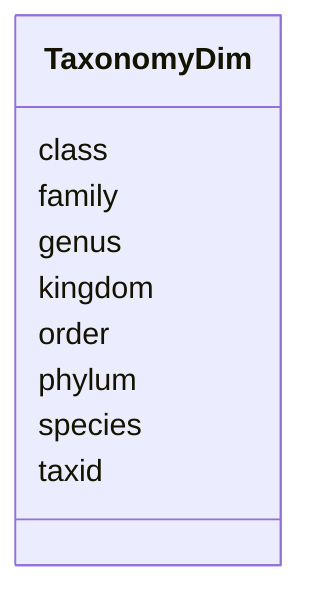

# Class: TaxonomyDim 


_Taxonomic hierarchy dimension table using NCBI taxonomy. Pre-parsed ranks for efficient filtering and aggregation._

_USAGE: Join with taxonomic classification tables (kraken_gold, gottcha_gold, centrifuge_gold) to get full taxonomic lineages._

_TAXONOMIC RANKS: - Kingdom (superkingdom): Bacteria, Archaea, Metazoa, etc. - Phylum: Proteobacteria, Arthropoda, etc. - Class: Insecta, Gammaproteobacteria, etc. - Order: Hymenoptera, Enterobacterales, etc. - Family: Ichneumonidae, Enterobacteriaceae, etc. - Genus: Diplazon, Escherichia, etc. - Species: binomial names with strain identifiers_


URI: [https://w3id.org/kbase/nmdc_core/TaxonomyDim](https://w3id.org/kbase/nmdc_core/TaxonomyDim)





<!-- no inheritance hierarchy -->


## Slots

| Name | Cardinality and Range | Description | Inheritance |
| ---  | --- | --- | --- |
| [taxid](taxid.md) | 1 <br/> [Integer](Integer.md) | NCBI taxonomy ID (integer) | direct |
| [kingdom](kingdom.md) | 0..1 <br/> [String](String.md) | Kingdom/superkingdom name | direct |
| [phylum](phylum.md) | 0..1 <br/> [String](String.md) | Phylum name | direct |
| [class](class.md) | 0..1 <br/> [String](String.md) | Class name | direct |
| [order](order.md) | 0..1 <br/> [String](String.md) | Order name | direct |
| [family](family.md) | 0..1 <br/> [String](String.md) | Family name | direct |
| [genus](genus.md) | 0..1 <br/> [String](String.md) | Genus name | direct |
| [species](species.md) | 0..1 <br/> [String](String.md) | Species name (binomial or with identifier) | direct |


## Identifier and Mapping Information


### Annotations

| property | value |
| --- | --- |
| source_table | taxonomy_dim |


### Schema Source


* from schema: https://w3id.org/kbase/nmdc_core


## Mappings

| Mapping Type | Mapped Value |
| ---  | ---  |
| self | https://w3id.org/kbase/nmdc_core/TaxonomyDim |
| native | https://w3id.org/kbase/nmdc_core/TaxonomyDim |


## LinkML Source

<!-- TODO: investigate https://stackoverflow.com/questions/37606292/how-to-create-tabbed-code-blocks-in-mkdocs-or-sphinx -->

### Direct

<details>
```yaml
name: TaxonomyDim
annotations:
  source_table:
    tag: source_table
    value: taxonomy_dim
description: 'Taxonomic hierarchy dimension table using NCBI taxonomy. Pre-parsed
  ranks for efficient filtering and aggregation.

  USAGE: Join with taxonomic classification tables (kraken_gold, gottcha_gold, centrifuge_gold)
  to get full taxonomic lineages.

  TAXONOMIC RANKS: - Kingdom (superkingdom): Bacteria, Archaea, Metazoa, etc. - Phylum:
  Proteobacteria, Arthropoda, etc. - Class: Insecta, Gammaproteobacteria, etc. - Order:
  Hymenoptera, Enterobacterales, etc. - Family: Ichneumonidae, Enterobacteriaceae,
  etc. - Genus: Diplazon, Escherichia, etc. - Species: binomial names with strain
  identifiers'
from_schema: https://w3id.org/kbase/nmdc_core
attributes:
  taxid:
    name: taxid
    description: NCBI taxonomy ID (integer)
    examples:
    - value: '2327552'
      description: Example NCBI taxid
    - value: '562'
      description: Escherichia coli
    - value: '9606'
      description: Homo sapiens
    from_schema: https://w3id.org/kbase/nmdc_core
    rank: 1000
    identifier: true
    domain_of:
    - TaxonomyDim
    range: integer
    required: true
    minimum_value: 1
  kingdom:
    name: kingdom
    description: Kingdom/superkingdom name
    examples:
    - value: Bacteria
      description: Bacterial domain
    - value: Archaea
      description: Archaeal domain
    - value: Metazoa
      description: Animals
    from_schema: https://w3id.org/kbase/nmdc_core
    rank: 1000
    domain_of:
    - TaxonomyDim
    range: string
  phylum:
    name: phylum
    description: Phylum name
    examples:
    - value: Proteobacteria
      description: Major bacterial phylum
    - value: Arthropoda
      description: Insects, crustaceans, etc.
    - value: Firmicutes
      description: Gram-positive bacteria
    from_schema: https://w3id.org/kbase/nmdc_core
    rank: 1000
    domain_of:
    - TaxonomyDim
    range: string
  class:
    name: class
    description: Class name
    examples:
    - value: Gammaproteobacteria
      description: Bacterial class
    - value: Insecta
      description: Insects
    from_schema: https://w3id.org/kbase/nmdc_core
    rank: 1000
    domain_of:
    - TaxonomyDim
    range: string
  order:
    name: order
    description: Order name
    examples:
    - value: Enterobacterales
      description: Enteric bacteria
    - value: Hymenoptera
      description: Bees, wasps, ants
    from_schema: https://w3id.org/kbase/nmdc_core
    rank: 1000
    domain_of:
    - TaxonomyDim
    range: string
  family:
    name: family
    description: Family name
    examples:
    - value: Enterobacteriaceae
      description: Enteric bacteria family
    - value: Ichneumonidae
      description: Parasitoid wasps
    from_schema: https://w3id.org/kbase/nmdc_core
    rank: 1000
    domain_of:
    - TaxonomyDim
    range: string
  genus:
    name: genus
    description: Genus name
    examples:
    - value: Escherichia
    - value: Diplazon
    from_schema: https://w3id.org/kbase/nmdc_core
    rank: 1000
    domain_of:
    - TaxonomyDim
    range: string
  species:
    name: species
    description: Species name (binomial or with identifier)
    examples:
    - value: Diplazon sp. BBHYJ995-10
      description: Species with isolate ID
    - value: Escherichia coli
      description: Standard binomial
    from_schema: https://w3id.org/kbase/nmdc_core
    rank: 1000
    domain_of:
    - TaxonomyDim
    range: string

```
</details>

### Induced

<details>
```yaml
name: TaxonomyDim
annotations:
  source_table:
    tag: source_table
    value: taxonomy_dim
description: 'Taxonomic hierarchy dimension table using NCBI taxonomy. Pre-parsed
  ranks for efficient filtering and aggregation.

  USAGE: Join with taxonomic classification tables (kraken_gold, gottcha_gold, centrifuge_gold)
  to get full taxonomic lineages.

  TAXONOMIC RANKS: - Kingdom (superkingdom): Bacteria, Archaea, Metazoa, etc. - Phylum:
  Proteobacteria, Arthropoda, etc. - Class: Insecta, Gammaproteobacteria, etc. - Order:
  Hymenoptera, Enterobacterales, etc. - Family: Ichneumonidae, Enterobacteriaceae,
  etc. - Genus: Diplazon, Escherichia, etc. - Species: binomial names with strain
  identifiers'
from_schema: https://w3id.org/kbase/nmdc_core
attributes:
  taxid:
    name: taxid
    description: NCBI taxonomy ID (integer)
    examples:
    - value: '2327552'
      description: Example NCBI taxid
    - value: '562'
      description: Escherichia coli
    - value: '9606'
      description: Homo sapiens
    from_schema: https://w3id.org/kbase/nmdc_core
    rank: 1000
    identifier: true
    alias: taxid
    owner: TaxonomyDim
    domain_of:
    - TaxonomyDim
    range: integer
    required: true
    minimum_value: 1
  kingdom:
    name: kingdom
    description: Kingdom/superkingdom name
    examples:
    - value: Bacteria
      description: Bacterial domain
    - value: Archaea
      description: Archaeal domain
    - value: Metazoa
      description: Animals
    from_schema: https://w3id.org/kbase/nmdc_core
    rank: 1000
    alias: kingdom
    owner: TaxonomyDim
    domain_of:
    - TaxonomyDim
    range: string
  phylum:
    name: phylum
    description: Phylum name
    examples:
    - value: Proteobacteria
      description: Major bacterial phylum
    - value: Arthropoda
      description: Insects, crustaceans, etc.
    - value: Firmicutes
      description: Gram-positive bacteria
    from_schema: https://w3id.org/kbase/nmdc_core
    rank: 1000
    alias: phylum
    owner: TaxonomyDim
    domain_of:
    - TaxonomyDim
    range: string
  class:
    name: class
    description: Class name
    examples:
    - value: Gammaproteobacteria
      description: Bacterial class
    - value: Insecta
      description: Insects
    from_schema: https://w3id.org/kbase/nmdc_core
    rank: 1000
    alias: class
    owner: TaxonomyDim
    domain_of:
    - TaxonomyDim
    range: string
  order:
    name: order
    description: Order name
    examples:
    - value: Enterobacterales
      description: Enteric bacteria
    - value: Hymenoptera
      description: Bees, wasps, ants
    from_schema: https://w3id.org/kbase/nmdc_core
    rank: 1000
    alias: order
    owner: TaxonomyDim
    domain_of:
    - TaxonomyDim
    range: string
  family:
    name: family
    description: Family name
    examples:
    - value: Enterobacteriaceae
      description: Enteric bacteria family
    - value: Ichneumonidae
      description: Parasitoid wasps
    from_schema: https://w3id.org/kbase/nmdc_core
    rank: 1000
    alias: family
    owner: TaxonomyDim
    domain_of:
    - TaxonomyDim
    range: string
  genus:
    name: genus
    description: Genus name
    examples:
    - value: Escherichia
    - value: Diplazon
    from_schema: https://w3id.org/kbase/nmdc_core
    rank: 1000
    alias: genus
    owner: TaxonomyDim
    domain_of:
    - TaxonomyDim
    range: string
  species:
    name: species
    description: Species name (binomial or with identifier)
    examples:
    - value: Diplazon sp. BBHYJ995-10
      description: Species with isolate ID
    - value: Escherichia coli
      description: Standard binomial
    from_schema: https://w3id.org/kbase/nmdc_core
    rank: 1000
    alias: species
    owner: TaxonomyDim
    domain_of:
    - TaxonomyDim
    range: string

```
</details>