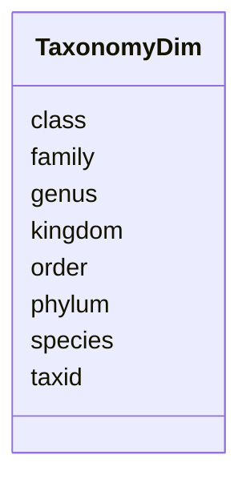

# Class: TaxonomyDim 


_Taxonomic hierarchy dimension table_


URI: [https://w3id.org/kbase/nmdc_core/TaxonomyDim](https://w3id.org/kbase/nmdc_core/TaxonomyDim)





<!-- no inheritance hierarchy -->


## Slots

| Name | Cardinality and Range | Description | Inheritance |
| ---  | --- | --- | --- |
| [taxid](taxid.md) | 1 <br/> [Integer](Integer.md) | NCBI taxonomy ID | direct |
| [kingdom](kingdom.md) | 0..1 <br/> [String](String.md) |  | direct |
| [phylum](phylum.md) | 0..1 <br/> [String](String.md) |  | direct |
| [class](class.md) | 0..1 <br/> [String](String.md) |  | direct |
| [order](order.md) | 0..1 <br/> [String](String.md) |  | direct |
| [family](family.md) | 0..1 <br/> [String](String.md) |  | direct |
| [genus](genus.md) | 0..1 <br/> [String](String.md) |  | direct |
| [species](species.md) | 0..1 <br/> [String](String.md) |  | direct |


## Identifier and Mapping Information


### Annotations

| property | value |
| --- | --- |
| source_table | taxonomy_dim |


### Schema Source


* from schema: https://w3id.org/kbase/nmdc_core


## Mappings

| Mapping Type | Mapped Value |
| ---  | ---  |
| self | https://w3id.org/kbase/nmdc_core/TaxonomyDim |
| native | https://w3id.org/kbase/nmdc_core/TaxonomyDim |


## LinkML Source

<!-- TODO: investigate https://stackoverflow.com/questions/37606292/how-to-create-tabbed-code-blocks-in-mkdocs-or-sphinx -->

### Direct

<details>
```yaml
name: TaxonomyDim
annotations:
  source_table:
    tag: source_table
    value: taxonomy_dim
description: Taxonomic hierarchy dimension table
from_schema: https://w3id.org/kbase/nmdc_core
attributes:
  taxid:
    name: taxid
    description: NCBI taxonomy ID
    from_schema: https://w3id.org/kbase/nmdc_core
    rank: 1000
    identifier: true
    domain_of:
    - TaxonomyDim
    range: integer
    required: true
  kingdom:
    name: kingdom
    from_schema: https://w3id.org/kbase/nmdc_core
    rank: 1000
    domain_of:
    - TaxonomyDim
  phylum:
    name: phylum
    from_schema: https://w3id.org/kbase/nmdc_core
    rank: 1000
    domain_of:
    - TaxonomyDim
  class:
    name: class
    from_schema: https://w3id.org/kbase/nmdc_core
    rank: 1000
    domain_of:
    - TaxonomyDim
  order:
    name: order
    from_schema: https://w3id.org/kbase/nmdc_core
    rank: 1000
    domain_of:
    - TaxonomyDim
  family:
    name: family
    from_schema: https://w3id.org/kbase/nmdc_core
    rank: 1000
    domain_of:
    - TaxonomyDim
  genus:
    name: genus
    from_schema: https://w3id.org/kbase/nmdc_core
    rank: 1000
    domain_of:
    - TaxonomyDim
  species:
    name: species
    from_schema: https://w3id.org/kbase/nmdc_core
    rank: 1000
    domain_of:
    - TaxonomyDim

```
</details>

### Induced

<details>
```yaml
name: TaxonomyDim
annotations:
  source_table:
    tag: source_table
    value: taxonomy_dim
description: Taxonomic hierarchy dimension table
from_schema: https://w3id.org/kbase/nmdc_core
attributes:
  taxid:
    name: taxid
    description: NCBI taxonomy ID
    from_schema: https://w3id.org/kbase/nmdc_core
    rank: 1000
    identifier: true
    alias: taxid
    owner: TaxonomyDim
    domain_of:
    - TaxonomyDim
    range: integer
    required: true
  kingdom:
    name: kingdom
    from_schema: https://w3id.org/kbase/nmdc_core
    rank: 1000
    alias: kingdom
    owner: TaxonomyDim
    domain_of:
    - TaxonomyDim
    range: string
  phylum:
    name: phylum
    from_schema: https://w3id.org/kbase/nmdc_core
    rank: 1000
    alias: phylum
    owner: TaxonomyDim
    domain_of:
    - TaxonomyDim
    range: string
  class:
    name: class
    from_schema: https://w3id.org/kbase/nmdc_core
    rank: 1000
    alias: class
    owner: TaxonomyDim
    domain_of:
    - TaxonomyDim
    range: string
  order:
    name: order
    from_schema: https://w3id.org/kbase/nmdc_core
    rank: 1000
    alias: order
    owner: TaxonomyDim
    domain_of:
    - TaxonomyDim
    range: string
  family:
    name: family
    from_schema: https://w3id.org/kbase/nmdc_core
    rank: 1000
    alias: family
    owner: TaxonomyDim
    domain_of:
    - TaxonomyDim
    range: string
  genus:
    name: genus
    from_schema: https://w3id.org/kbase/nmdc_core
    rank: 1000
    alias: genus
    owner: TaxonomyDim
    domain_of:
    - TaxonomyDim
    range: string
  species:
    name: species
    from_schema: https://w3id.org/kbase/nmdc_core
    rank: 1000
    alias: species
    owner: TaxonomyDim
    domain_of:
    - TaxonomyDim
    range: string

```
</details>