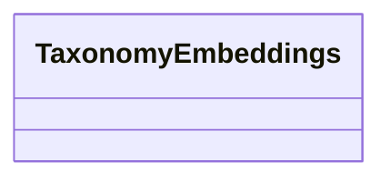

# Class: TaxonomyEmbeddings 


_Taxonomic embeddings_


URI: [https://w3id.org/kbase/nmdc_core/TaxonomyEmbeddings](https://w3id.org/kbase/nmdc_core/TaxonomyEmbeddings)





<!-- no inheritance hierarchy -->


## Slots

| Name | Cardinality and Range | Description | Inheritance |
| ---  | --- | --- | --- |


## Identifier and Mapping Information


### Annotations

| property | value |
| --- | --- |
| source_table | taxonomy_embeddings |


### Schema Source


* from schema: https://w3id.org/kbase/nmdc_core


## Mappings

| Mapping Type | Mapped Value |
| ---  | ---  |
| self | https://w3id.org/kbase/nmdc_core/TaxonomyEmbeddings |
| native | https://w3id.org/kbase/nmdc_core/TaxonomyEmbeddings |


## LinkML Source

<!-- TODO: investigate https://stackoverflow.com/questions/37606292/how-to-create-tabbed-code-blocks-in-mkdocs-or-sphinx -->

### Direct

<details>
```yaml
name: TaxonomyEmbeddings
annotations:
  source_table:
    tag: source_table
    value: taxonomy_embeddings
description: Taxonomic embeddings
from_schema: https://w3id.org/kbase/nmdc_core

```
</details>

### Induced

<details>
```yaml
name: TaxonomyEmbeddings
annotations:
  source_table:
    tag: source_table
    value: taxonomy_embeddings
description: Taxonomic embeddings
from_schema: https://w3id.org/kbase/nmdc_core

```
</details>