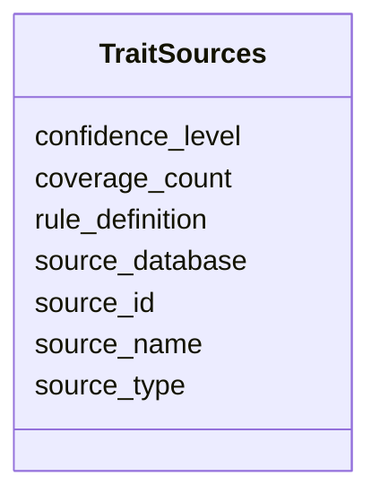

# Class: TraitSources 


_Sources for trait data (databases, literature, predictions). Provenance information for trait assignments._

_STATUS: PLANNED - Not yet implemented in NMDC database._

_This table will track where trait annotations come from, distinguishing between curated assertions, rule-based predictions, and literature mining._

_INTENDED SOURCE TYPES:_

_1. GOLD Curated Phenotypes (gold_curated)_

_   - Source: GOLD database cvphenotype + organism_phenotype tables_

_   - Method: Manual curation by GOLD annotators_

_   - Coverage: 7,113 organism-phenotype mappings across 159 phenotype terms_

_   - Confidence: High (expert-curated)_

_   - Example: Picrophilus torridus -> Acidophile (curator-assigned)_

__

_2. IMG Phenotype Rules (img_rules)_

_   - Source: IMG phenotype_rule + phenotype_rule_taxons tables_

_   - Method: Pathway-based logical inference (65 rules)_

_   - Coverage: 2,059,203 taxon-trait predictions_

_   - Confidence: Medium-High (rule-based)_

_   - Rule example: "L-histidine auxotroph" = absence of pathway 162_

_   - Top predictions: L-histidine auxotroph (74,695 taxa),_

_     L-glutamate prototroph (73,791 taxa)_

__

_3. Literature Mining (literature)_

_   - Source: PubMed abstracts, full-text papers_

_   - Method: NLP extraction_

_   - Confidence: Variable (requires validation)_

__

_4. Computational Prediction (computed)_

_   - Source: Genome-based prediction tools_

_   - Method: ML models, homology-based inference_

_   - Confidence: Requires benchmarking_

__

_IMG PHENOTYPE RULE EXAMPLES: | rule_id | name                          | rule                           | taxa_count | |---------|-------------------------------|--------------------------------|------------| | 22      | L-histidine auxotroph         | !pathway(162)                  | 74,695     | | 2       | Aerobe                        | pathway(768|769|770)           | 45,956     | | 4       | Denitrifier                   | pathway(764) AND (765) AND...  | 1,653      | | 53      | Nitrogen fixer                | pathway(798)                   | (variable) | | 52      | Dissimilatory sulfate reducer | pathway(870) AND (864) AND...  | 626        | | 6       | Carbon fixation               | pathway(527|335|285|...)       | 483        |_


URI: [https://w3id.org/kbase/nmdc_core/TraitSources](https://w3id.org/kbase/nmdc_core/TraitSources)





<!-- no inheritance hierarchy -->


## Slots

| Name | Cardinality and Range | Description | Inheritance |
| ---  | --- | --- | --- |
| [source_id](source_id.md) | 1 <br/> [String](String.md) | Unique identifier for the trait source | direct |
| [source_name](source_name.md) | 0..1 <br/> [String](String.md) | Human-readable source name | direct |
| [source_type](source_type.md) | 0..1 <br/> [String](String.md) | Type of source (curated, rule_based, literature, computed) | direct |
| [source_database](source_database.md) | 0..1 <br/> [String](String.md) | Database of origin | direct |
| [rule_definition](rule_definition.md) | 0..1 <br/> [String](String.md) | For rule-based sources, the logical rule definition | direct |
| [confidence_level](confidence_level.md) | 0..1 <br/> [String](String.md) | Confidence assessment of annotations from this source | direct |
| [coverage_count](coverage_count.md) | 0..1 <br/> [Integer](Integer.md) | Number of trait-taxon assignments from this source | direct |


## Identifier and Mapping Information


### Annotations

| property | value |
| --- | --- |
| source_table | trait_sources |
| status | planned |


### Schema Source


* from schema: https://w3id.org/kbase/nmdc_core


## Mappings

| Mapping Type | Mapped Value |
| ---  | ---  |
| self | https://w3id.org/kbase/nmdc_core/TraitSources |
| native | https://w3id.org/kbase/nmdc_core/TraitSources |


## LinkML Source

<!-- TODO: investigate https://stackoverflow.com/questions/37606292/how-to-create-tabbed-code-blocks-in-mkdocs-or-sphinx -->

### Direct

<details>
```yaml
name: TraitSources
annotations:
  source_table:
    tag: source_table
    value: trait_sources
  status:
    tag: status
    value: planned
description: "Sources for trait data (databases, literature, predictions). Provenance\
  \ information for trait assignments.\nSTATUS: PLANNED - Not yet implemented in NMDC\
  \ database.\nThis table will track where trait annotations come from, distinguishing\
  \ between curated assertions, rule-based predictions, and literature mining.\nINTENDED\
  \ SOURCE TYPES:\n1. GOLD Curated Phenotypes (gold_curated)\n   - Source: GOLD database\
  \ cvphenotype + organism_phenotype tables\n   - Method: Manual curation by GOLD\
  \ annotators\n   - Coverage: 7,113 organism-phenotype mappings across 159 phenotype\
  \ terms\n   - Confidence: High (expert-curated)\n   - Example: Picrophilus torridus\
  \ -> Acidophile (curator-assigned)\n\n2. IMG Phenotype Rules (img_rules)\n   - Source:\
  \ IMG phenotype_rule + phenotype_rule_taxons tables\n   - Method: Pathway-based\
  \ logical inference (65 rules)\n   - Coverage: 2,059,203 taxon-trait predictions\n\
  \   - Confidence: Medium-High (rule-based)\n   - Rule example: \"L-histidine auxotroph\"\
  \ = absence of pathway 162\n   - Top predictions: L-histidine auxotroph (74,695\
  \ taxa),\n     L-glutamate prototroph (73,791 taxa)\n\n3. Literature Mining (literature)\n\
  \   - Source: PubMed abstracts, full-text papers\n   - Method: NLP extraction\n\
  \   - Confidence: Variable (requires validation)\n\n4. Computational Prediction\
  \ (computed)\n   - Source: Genome-based prediction tools\n   - Method: ML models,\
  \ homology-based inference\n   - Confidence: Requires benchmarking\n\nIMG PHENOTYPE\
  \ RULE EXAMPLES: | rule_id | name                          | rule              \
  \             | taxa_count | |---------|-------------------------------|--------------------------------|------------|\
  \ | 22      | L-histidine auxotroph         | !pathway(162)                  | 74,695\
  \     | | 2       | Aerobe                        | pathway(768|769|770)       \
  \    | 45,956     | | 4       | Denitrifier                   | pathway(764) AND\
  \ (765) AND...  | 1,653      | | 53      | Nitrogen fixer                | pathway(798)\
  \                   | (variable) | | 52      | Dissimilatory sulfate reducer | pathway(870)\
  \ AND (864) AND...  | 626        | | 6       | Carbon fixation               | pathway(527|335|285|...)\
  \       | 483        |"
from_schema: https://w3id.org/kbase/nmdc_core
attributes:
  source_id:
    name: source_id
    description: Unique identifier for the trait source
    examples:
    - value: gold_curated
      description: GOLD curator-assigned phenotypes
    - value: img_rule_2
      description: IMG aerobe prediction rule
    - value: img_rule_53
      description: IMG nitrogen fixer prediction rule
    - value: pubmed_nlp
      description: PubMed literature mining
    from_schema: https://w3id.org/kbase/nmdc_core
    rank: 1000
    identifier: true
    domain_of:
    - TraitSources
    - TraitTaxonomyMapping
    range: string
    required: true
  source_name:
    name: source_name
    description: Human-readable source name
    examples:
    - value: GOLD Curated Phenotypes
    - value: 'IMG Phenotype Rule: Aerobe'
    - value: 'IMG Phenotype Rule: Nitrogen Fixer'
    from_schema: https://w3id.org/kbase/nmdc_core
    rank: 1000
    domain_of:
    - TraitSources
    range: string
  source_type:
    name: source_type
    description: Type of source (curated, rule_based, literature, computed)
    examples:
    - value: curated
      description: Expert-curated assertions
    - value: rule_based
      description: Pathway-based logical rules
    - value: literature
      description: Literature-mined annotations
    - value: computed
      description: Computationally predicted
    from_schema: https://w3id.org/kbase/nmdc_core
    rank: 1000
    domain_of:
    - TraitSources
    range: string
  source_database:
    name: source_database
    description: Database of origin
    examples:
    - value: GOLD
    - value: IMG
    - value: PubMed
    from_schema: https://w3id.org/kbase/nmdc_core
    rank: 1000
    domain_of:
    - TraitSources
    range: string
  rule_definition:
    name: rule_definition
    description: 'For rule-based sources, the logical rule definition. Uses IMG pathway
      IDs with operators: | (OR), , (AND), ! (NOT).'
    examples:
    - value: (768|769|770)
      description: Aerobe = has cytochrome c oxidase pathway
    - value: (!162)
      description: His auxotroph = lacks histidine biosynthesis
    - value: (798)
      description: Nitrogen fixer = has nitrogenase pathway
    from_schema: https://w3id.org/kbase/nmdc_core
    rank: 1000
    domain_of:
    - TraitSources
    range: string
  confidence_level:
    name: confidence_level
    description: Confidence assessment of annotations from this source
    examples:
    - value: high
      description: Expert curated
    - value: medium-high
      description: Validated rule-based
    - value: medium
      description: Computational prediction
    from_schema: https://w3id.org/kbase/nmdc_core
    rank: 1000
    domain_of:
    - TraitSources
    range: string
  coverage_count:
    name: coverage_count
    description: Number of trait-taxon assignments from this source
    examples:
    - value: '7113'
      description: GOLD curated phenotypes
    - value: '2059203'
      description: IMG rule-based predictions
    from_schema: https://w3id.org/kbase/nmdc_core
    rank: 1000
    domain_of:
    - TraitSources
    range: integer

```
</details>

### Induced

<details>
```yaml
name: TraitSources
annotations:
  source_table:
    tag: source_table
    value: trait_sources
  status:
    tag: status
    value: planned
description: "Sources for trait data (databases, literature, predictions). Provenance\
  \ information for trait assignments.\nSTATUS: PLANNED - Not yet implemented in NMDC\
  \ database.\nThis table will track where trait annotations come from, distinguishing\
  \ between curated assertions, rule-based predictions, and literature mining.\nINTENDED\
  \ SOURCE TYPES:\n1. GOLD Curated Phenotypes (gold_curated)\n   - Source: GOLD database\
  \ cvphenotype + organism_phenotype tables\n   - Method: Manual curation by GOLD\
  \ annotators\n   - Coverage: 7,113 organism-phenotype mappings across 159 phenotype\
  \ terms\n   - Confidence: High (expert-curated)\n   - Example: Picrophilus torridus\
  \ -> Acidophile (curator-assigned)\n\n2. IMG Phenotype Rules (img_rules)\n   - Source:\
  \ IMG phenotype_rule + phenotype_rule_taxons tables\n   - Method: Pathway-based\
  \ logical inference (65 rules)\n   - Coverage: 2,059,203 taxon-trait predictions\n\
  \   - Confidence: Medium-High (rule-based)\n   - Rule example: \"L-histidine auxotroph\"\
  \ = absence of pathway 162\n   - Top predictions: L-histidine auxotroph (74,695\
  \ taxa),\n     L-glutamate prototroph (73,791 taxa)\n\n3. Literature Mining (literature)\n\
  \   - Source: PubMed abstracts, full-text papers\n   - Method: NLP extraction\n\
  \   - Confidence: Variable (requires validation)\n\n4. Computational Prediction\
  \ (computed)\n   - Source: Genome-based prediction tools\n   - Method: ML models,\
  \ homology-based inference\n   - Confidence: Requires benchmarking\n\nIMG PHENOTYPE\
  \ RULE EXAMPLES: | rule_id | name                          | rule              \
  \             | taxa_count | |---------|-------------------------------|--------------------------------|------------|\
  \ | 22      | L-histidine auxotroph         | !pathway(162)                  | 74,695\
  \     | | 2       | Aerobe                        | pathway(768|769|770)       \
  \    | 45,956     | | 4       | Denitrifier                   | pathway(764) AND\
  \ (765) AND...  | 1,653      | | 53      | Nitrogen fixer                | pathway(798)\
  \                   | (variable) | | 52      | Dissimilatory sulfate reducer | pathway(870)\
  \ AND (864) AND...  | 626        | | 6       | Carbon fixation               | pathway(527|335|285|...)\
  \       | 483        |"
from_schema: https://w3id.org/kbase/nmdc_core
attributes:
  source_id:
    name: source_id
    description: Unique identifier for the trait source
    examples:
    - value: gold_curated
      description: GOLD curator-assigned phenotypes
    - value: img_rule_2
      description: IMG aerobe prediction rule
    - value: img_rule_53
      description: IMG nitrogen fixer prediction rule
    - value: pubmed_nlp
      description: PubMed literature mining
    from_schema: https://w3id.org/kbase/nmdc_core
    rank: 1000
    identifier: true
    alias: source_id
    owner: TraitSources
    domain_of:
    - TraitSources
    - TraitTaxonomyMapping
    range: string
    required: true
  source_name:
    name: source_name
    description: Human-readable source name
    examples:
    - value: GOLD Curated Phenotypes
    - value: 'IMG Phenotype Rule: Aerobe'
    - value: 'IMG Phenotype Rule: Nitrogen Fixer'
    from_schema: https://w3id.org/kbase/nmdc_core
    rank: 1000
    alias: source_name
    owner: TraitSources
    domain_of:
    - TraitSources
    range: string
  source_type:
    name: source_type
    description: Type of source (curated, rule_based, literature, computed)
    examples:
    - value: curated
      description: Expert-curated assertions
    - value: rule_based
      description: Pathway-based logical rules
    - value: literature
      description: Literature-mined annotations
    - value: computed
      description: Computationally predicted
    from_schema: https://w3id.org/kbase/nmdc_core
    rank: 1000
    alias: source_type
    owner: TraitSources
    domain_of:
    - TraitSources
    range: string
  source_database:
    name: source_database
    description: Database of origin
    examples:
    - value: GOLD
    - value: IMG
    - value: PubMed
    from_schema: https://w3id.org/kbase/nmdc_core
    rank: 1000
    alias: source_database
    owner: TraitSources
    domain_of:
    - TraitSources
    range: string
  rule_definition:
    name: rule_definition
    description: 'For rule-based sources, the logical rule definition. Uses IMG pathway
      IDs with operators: | (OR), , (AND), ! (NOT).'
    examples:
    - value: (768|769|770)
      description: Aerobe = has cytochrome c oxidase pathway
    - value: (!162)
      description: His auxotroph = lacks histidine biosynthesis
    - value: (798)
      description: Nitrogen fixer = has nitrogenase pathway
    from_schema: https://w3id.org/kbase/nmdc_core
    rank: 1000
    alias: rule_definition
    owner: TraitSources
    domain_of:
    - TraitSources
    range: string
  confidence_level:
    name: confidence_level
    description: Confidence assessment of annotations from this source
    examples:
    - value: high
      description: Expert curated
    - value: medium-high
      description: Validated rule-based
    - value: medium
      description: Computational prediction
    from_schema: https://w3id.org/kbase/nmdc_core
    rank: 1000
    alias: confidence_level
    owner: TraitSources
    domain_of:
    - TraitSources
    range: string
  coverage_count:
    name: coverage_count
    description: Number of trait-taxon assignments from this source
    examples:
    - value: '7113'
      description: GOLD curated phenotypes
    - value: '2059203'
      description: IMG rule-based predictions
    from_schema: https://w3id.org/kbase/nmdc_core
    rank: 1000
    alias: coverage_count
    owner: TraitSources
    domain_of:
    - TraitSources
    range: integer

```
</details>