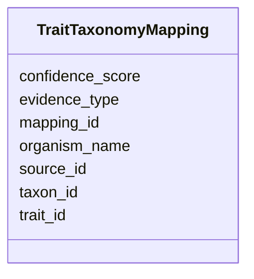

# Class: TraitTaxonomyMapping 


_Mapping between traits and taxonomic groups. Which taxa have which traits based on known biology._

_STATUS: PLANNED - Not yet implemented in NMDC database._

_This table will unify trait-to-taxon mappings from multiple sources, enabling trait-based queries across the NMDC ecosystem._

_INTENDED DATA SOURCES:_

_1. GOLD organism_phenotype_

_   - 7,113 curated organism-phenotype mappings_

_   - Links GOLD organism_id to phenotype terms_

_   - High confidence, expert-curated_

__

_2. IMG phenotype_rule_taxons_

_   - 2,059,203 predicted taxon-trait mappings_

_   - Derived from pathway presence/absence using 65 rules_

_   - Medium-high confidence for well-validated rules_

__

_EXAMPLE MAPPINGS (from GOLD): | organism_id | organism_name                              | taxid   | trait         | |-------------|-------------------------------------------|---------|---------------| | 574         | Picrophilus torridus DSM 9790             | 263820  | Acidophile    | | 778         | Archaeoglobus fulgidus VC-16, DSM 4304    | 224325  | Piezophile    | | 134         | Methanobrevibacter smithii PS, ATCC 35061 | 420247  | Symbiotic     | | 44          | Deinococcus radiodurans R1                | 243230  | Radiation resistant |_

_EXAMPLE MAPPINGS (from IMG rules): | taxon_oid   | trait_prediction    | rule                    | |-------------|---------------------|-------------------------| | 637000007   | L-histidine prototroph | Has pathway 162       | | 637000019   | Aerobe              | Has pathway 768|769|770 | | (many)      | Nitrogen fixer      | Has pathway 798         |_

_USAGE: Join with taxonomy_dim to get full taxonomic lineages, then aggregate traits by phylum, class, or other ranks._


URI: [https://w3id.org/kbase/nmdc_core/TraitTaxonomyMapping](https://w3id.org/kbase/nmdc_core/TraitTaxonomyMapping)





<!-- no inheritance hierarchy -->


## Slots

| Name | Cardinality and Range | Description | Inheritance |
| ---  | --- | --- | --- |
| [mapping_id](mapping_id.md) | 1 <br/> [String](String.md) | Unique identifier for this trait-taxon mapping | direct |
| [taxon_id](taxon_id.md) | 0..1 <br/> [Integer](Integer.md) | NCBI taxonomy ID or IMG taxon_oid | direct |
| [trait_id](trait_id.md) | 0..1 <br/> [String](String.md) | Reference to TraitUnified | direct |
| [source_id](source_id.md) | 0..1 <br/> [String](String.md) | Reference to TraitSources | direct |
| [organism_name](organism_name.md) | 0..1 <br/> [String](String.md) | Organism name from source database | direct |
| [confidence_score](confidence_score.md) | 0..1 <br/> [Float](Float.md) | Confidence score for this mapping (0-1) | direct |
| [evidence_type](evidence_type.md) | 0..1 <br/> [String](String.md) | Type of evidence supporting this mapping | direct |


## Identifier and Mapping Information


### Annotations

| property | value |
| --- | --- |
| source_table | trait_taxonomy_mapping |
| status | planned |


### Schema Source


* from schema: https://w3id.org/kbase/nmdc_core


## Mappings

| Mapping Type | Mapped Value |
| ---  | ---  |
| self | https://w3id.org/kbase/nmdc_core/TraitTaxonomyMapping |
| native | https://w3id.org/kbase/nmdc_core/TraitTaxonomyMapping |


## LinkML Source

<!-- TODO: investigate https://stackoverflow.com/questions/37606292/how-to-create-tabbed-code-blocks-in-mkdocs-or-sphinx -->

### Direct

<details>
```yaml
name: TraitTaxonomyMapping
annotations:
  source_table:
    tag: source_table
    value: trait_taxonomy_mapping
  status:
    tag: status
    value: planned
description: "Mapping between traits and taxonomic groups. Which taxa have which traits\
  \ based on known biology.\nSTATUS: PLANNED - Not yet implemented in NMDC database.\n\
  This table will unify trait-to-taxon mappings from multiple sources, enabling trait-based\
  \ queries across the NMDC ecosystem.\nINTENDED DATA SOURCES:\n1. GOLD organism_phenotype\n\
  \   - 7,113 curated organism-phenotype mappings\n   - Links GOLD organism_id to\
  \ phenotype terms\n   - High confidence, expert-curated\n\n2. IMG phenotype_rule_taxons\n\
  \   - 2,059,203 predicted taxon-trait mappings\n   - Derived from pathway presence/absence\
  \ using 65 rules\n   - Medium-high confidence for well-validated rules\n\nEXAMPLE\
  \ MAPPINGS (from GOLD): | organism_id | organism_name                          \
  \    | taxid   | trait         | |-------------|-------------------------------------------|---------|---------------|\
  \ | 574         | Picrophilus torridus DSM 9790             | 263820  | Acidophile\
  \    | | 778         | Archaeoglobus fulgidus VC-16, DSM 4304    | 224325  | Piezophile\
  \    | | 134         | Methanobrevibacter smithii PS, ATCC 35061 | 420247  | Symbiotic\
  \     | | 44          | Deinococcus radiodurans R1                | 243230  | Radiation\
  \ resistant |\nEXAMPLE MAPPINGS (from IMG rules): | taxon_oid   | trait_prediction\
  \    | rule                    | |-------------|---------------------|-------------------------|\
  \ | 637000007   | L-histidine prototroph | Has pathway 162       | | 637000019 \
  \  | Aerobe              | Has pathway 768|769|770 | | (many)      | Nitrogen fixer\
  \      | Has pathway 798         |\nUSAGE: Join with taxonomy_dim to get full taxonomic\
  \ lineages, then aggregate traits by phylum, class, or other ranks."
from_schema: https://w3id.org/kbase/nmdc_core
attributes:
  mapping_id:
    name: mapping_id
    description: Unique identifier for this trait-taxon mapping
    from_schema: https://w3id.org/kbase/nmdc_core
    rank: 1000
    identifier: true
    domain_of:
    - TraitTaxonomyMapping
    range: string
    required: true
  taxon_id:
    name: taxon_id
    description: NCBI taxonomy ID or IMG taxon_oid
    examples:
    - value: '263820'
      description: Picrophilus torridus DSM 9790
    - value: '224325'
      description: Archaeoglobus fulgidus
    - value: '243230'
      description: Deinococcus radiodurans
    from_schema: https://w3id.org/kbase/nmdc_core
    rank: 1000
    domain_of:
    - TraitTaxonomyMapping
    range: integer
  trait_id:
    name: trait_id
    description: Reference to TraitUnified.trait_id
    examples:
    - value: TRAIT:acidophile
    - value: TRAIT:aerobe
    - value: TRAIT:nitrogen_fixer
    from_schema: https://w3id.org/kbase/nmdc_core
    domain_of:
    - TraitUnified
    - TraitTaxonomyMapping
    range: string
  source_id:
    name: source_id
    description: Reference to TraitSources.source_id indicating provenance
    examples:
    - value: gold_curated
    - value: img_rule_2
    from_schema: https://w3id.org/kbase/nmdc_core
    domain_of:
    - TraitSources
    - TraitTaxonomyMapping
    range: string
  organism_name:
    name: organism_name
    description: Organism name from source database
    examples:
    - value: Picrophilus torridus DSM 9790
    - value: Deinococcus radiodurans R1
    from_schema: https://w3id.org/kbase/nmdc_core
    rank: 1000
    domain_of:
    - TraitTaxonomyMapping
    range: string
  confidence_score:
    name: confidence_score
    description: Confidence score for this mapping (0-1)
    examples:
    - value: '1.0'
      description: Expert-curated, high confidence
    - value: '0.85'
      description: Rule-based prediction
    from_schema: https://w3id.org/kbase/nmdc_core
    rank: 1000
    domain_of:
    - TraitTaxonomyMapping
    range: float
  evidence_type:
    name: evidence_type
    description: Type of evidence supporting this mapping
    examples:
    - value: curated
      description: GOLD curator assignment
    - value: pathway_rule
      description: IMG pathway presence/absence rule
    from_schema: https://w3id.org/kbase/nmdc_core
    rank: 1000
    domain_of:
    - TraitTaxonomyMapping
    range: string

```
</details>

### Induced

<details>
```yaml
name: TraitTaxonomyMapping
annotations:
  source_table:
    tag: source_table
    value: trait_taxonomy_mapping
  status:
    tag: status
    value: planned
description: "Mapping between traits and taxonomic groups. Which taxa have which traits\
  \ based on known biology.\nSTATUS: PLANNED - Not yet implemented in NMDC database.\n\
  This table will unify trait-to-taxon mappings from multiple sources, enabling trait-based\
  \ queries across the NMDC ecosystem.\nINTENDED DATA SOURCES:\n1. GOLD organism_phenotype\n\
  \   - 7,113 curated organism-phenotype mappings\n   - Links GOLD organism_id to\
  \ phenotype terms\n   - High confidence, expert-curated\n\n2. IMG phenotype_rule_taxons\n\
  \   - 2,059,203 predicted taxon-trait mappings\n   - Derived from pathway presence/absence\
  \ using 65 rules\n   - Medium-high confidence for well-validated rules\n\nEXAMPLE\
  \ MAPPINGS (from GOLD): | organism_id | organism_name                          \
  \    | taxid   | trait         | |-------------|-------------------------------------------|---------|---------------|\
  \ | 574         | Picrophilus torridus DSM 9790             | 263820  | Acidophile\
  \    | | 778         | Archaeoglobus fulgidus VC-16, DSM 4304    | 224325  | Piezophile\
  \    | | 134         | Methanobrevibacter smithii PS, ATCC 35061 | 420247  | Symbiotic\
  \     | | 44          | Deinococcus radiodurans R1                | 243230  | Radiation\
  \ resistant |\nEXAMPLE MAPPINGS (from IMG rules): | taxon_oid   | trait_prediction\
  \    | rule                    | |-------------|---------------------|-------------------------|\
  \ | 637000007   | L-histidine prototroph | Has pathway 162       | | 637000019 \
  \  | Aerobe              | Has pathway 768|769|770 | | (many)      | Nitrogen fixer\
  \      | Has pathway 798         |\nUSAGE: Join with taxonomy_dim to get full taxonomic\
  \ lineages, then aggregate traits by phylum, class, or other ranks."
from_schema: https://w3id.org/kbase/nmdc_core
attributes:
  mapping_id:
    name: mapping_id
    description: Unique identifier for this trait-taxon mapping
    from_schema: https://w3id.org/kbase/nmdc_core
    rank: 1000
    identifier: true
    alias: mapping_id
    owner: TraitTaxonomyMapping
    domain_of:
    - TraitTaxonomyMapping
    range: string
    required: true
  taxon_id:
    name: taxon_id
    description: NCBI taxonomy ID or IMG taxon_oid
    examples:
    - value: '263820'
      description: Picrophilus torridus DSM 9790
    - value: '224325'
      description: Archaeoglobus fulgidus
    - value: '243230'
      description: Deinococcus radiodurans
    from_schema: https://w3id.org/kbase/nmdc_core
    rank: 1000
    alias: taxon_id
    owner: TraitTaxonomyMapping
    domain_of:
    - TraitTaxonomyMapping
    range: integer
  trait_id:
    name: trait_id
    description: Reference to TraitUnified.trait_id
    examples:
    - value: TRAIT:acidophile
    - value: TRAIT:aerobe
    - value: TRAIT:nitrogen_fixer
    from_schema: https://w3id.org/kbase/nmdc_core
    alias: trait_id
    owner: TraitTaxonomyMapping
    domain_of:
    - TraitUnified
    - TraitTaxonomyMapping
    range: string
  source_id:
    name: source_id
    description: Reference to TraitSources.source_id indicating provenance
    examples:
    - value: gold_curated
    - value: img_rule_2
    from_schema: https://w3id.org/kbase/nmdc_core
    alias: source_id
    owner: TraitTaxonomyMapping
    domain_of:
    - TraitSources
    - TraitTaxonomyMapping
    range: string
  organism_name:
    name: organism_name
    description: Organism name from source database
    examples:
    - value: Picrophilus torridus DSM 9790
    - value: Deinococcus radiodurans R1
    from_schema: https://w3id.org/kbase/nmdc_core
    rank: 1000
    alias: organism_name
    owner: TraitTaxonomyMapping
    domain_of:
    - TraitTaxonomyMapping
    range: string
  confidence_score:
    name: confidence_score
    description: Confidence score for this mapping (0-1)
    examples:
    - value: '1.0'
      description: Expert-curated, high confidence
    - value: '0.85'
      description: Rule-based prediction
    from_schema: https://w3id.org/kbase/nmdc_core
    rank: 1000
    alias: confidence_score
    owner: TraitTaxonomyMapping
    domain_of:
    - TraitTaxonomyMapping
    range: float
  evidence_type:
    name: evidence_type
    description: Type of evidence supporting this mapping
    examples:
    - value: curated
      description: GOLD curator assignment
    - value: pathway_rule
      description: IMG pathway presence/absence rule
    from_schema: https://w3id.org/kbase/nmdc_core
    rank: 1000
    alias: evidence_type
    owner: TraitTaxonomyMapping
    domain_of:
    - TraitTaxonomyMapping
    range: string

```
</details>