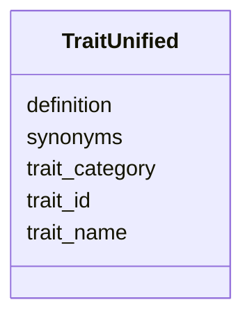

# Class: TraitUnified 


_Unified trait annotations across samples from multiple sources. Provides consistent trait vocabulary across studies._

_STATUS: PLANNED - Not yet implemented in NMDC database._

_INTENDED SOURCES: - GOLD organism_phenotype (7,113 curated organism-phenotype mappings) - IMG phenotype_rule_taxons (2M+ predicted trait-taxon mappings) - Literature-derived trait annotations_

_INTENDED TRAIT CATEGORIES (from available sources): - Phenotype: Acidophile, Alkaliphile, Pathogen, Symbiont, Biofilm, etc. (159 terms) - Metabolism: Denitrifying, Nitrogen fixation, Methanogen, Sulfate reducer, etc. (157 terms) - Energy source: Autotroph, Heterotroph, Phototroph, Chemolithotroph, etc. (31 terms) - Oxygen requirement: Aerobe, Anaerobe, Facultative, Microaerophilic (7 terms) - Cell shape: Rod-shaped, Coccus-shaped, Spiral-shaped, Filament-shaped, etc. (18 terms) - Motility: Motile, Nonmotile (2 terms) - Sporulation: Sporulating, Nonsporulating (2 terms)_

_EXAMPLE TRAITS (from GOLD cvphenotype): | ID | Term                  | Usage Count | |----|----------------------|-------------| | 122| Pathogen             | 3,132       | | 104| Non-Pathogen         | 576         | | 35 | Catalase negative    | 520         | | 36 | Catalase positive    | 414         | | 116| Opportunistic Pathogen| 279        | | 4  | Acidophile           | 143         | | 134| Probiotic            | 106         | | 138| Radiation resistant  | 49          | | 88 | Magnetotactic        | (rare)      | | 27 | Bioluminescent       | (rare)      |_


URI: [https://w3id.org/kbase/nmdc_core/TraitUnified](https://w3id.org/kbase/nmdc_core/TraitUnified)





<!-- no inheritance hierarchy -->


## Slots

| Name | Cardinality and Range | Description | Inheritance |
| ---  | --- | --- | --- |
| [trait_id](trait_id.md) | 1 <br/> [String](String.md) | Unified trait identifier | direct |
| [trait_name](trait_name.md) | 0..1 <br/> [String](String.md) | Human-readable trait name | direct |
| [trait_category](trait_category.md) | 0..1 <br/> [String](String.md) | Category of trait (phenotype, metabolism, energy_source, oxygen_req, cell_sha... | direct |
| [definition](definition.md) | 0..1 <br/> [String](String.md) | Formal definition of the trait | direct |
| [synonyms](synonyms.md) | 0..1 <br/> [String](String.md) | Semicolon-separated alternative names | direct |


## Identifier and Mapping Information


### Annotations

| property | value |
| --- | --- |
| source_table | trait_unified |
| status | planned |


### Schema Source


* from schema: https://w3id.org/kbase/nmdc_core


## Mappings

| Mapping Type | Mapped Value |
| ---  | ---  |
| self | https://w3id.org/kbase/nmdc_core/TraitUnified |
| native | https://w3id.org/kbase/nmdc_core/TraitUnified |


## LinkML Source

<!-- TODO: investigate https://stackoverflow.com/questions/37606292/how-to-create-tabbed-code-blocks-in-mkdocs-or-sphinx -->

### Direct

<details>
```yaml
name: TraitUnified
annotations:
  source_table:
    tag: source_table
    value: trait_unified
  status:
    tag: status
    value: planned
description: 'Unified trait annotations across samples from multiple sources. Provides
  consistent trait vocabulary across studies.

  STATUS: PLANNED - Not yet implemented in NMDC database.

  INTENDED SOURCES: - GOLD organism_phenotype (7,113 curated organism-phenotype mappings)
  - IMG phenotype_rule_taxons (2M+ predicted trait-taxon mappings) - Literature-derived
  trait annotations

  INTENDED TRAIT CATEGORIES (from available sources): - Phenotype: Acidophile, Alkaliphile,
  Pathogen, Symbiont, Biofilm, etc. (159 terms) - Metabolism: Denitrifying, Nitrogen
  fixation, Methanogen, Sulfate reducer, etc. (157 terms) - Energy source: Autotroph,
  Heterotroph, Phototroph, Chemolithotroph, etc. (31 terms) - Oxygen requirement:
  Aerobe, Anaerobe, Facultative, Microaerophilic (7 terms) - Cell shape: Rod-shaped,
  Coccus-shaped, Spiral-shaped, Filament-shaped, etc. (18 terms) - Motility: Motile,
  Nonmotile (2 terms) - Sporulation: Sporulating, Nonsporulating (2 terms)

  EXAMPLE TRAITS (from GOLD cvphenotype): | ID | Term                  | Usage Count
  | |----|----------------------|-------------| | 122| Pathogen             | 3,132       |
  | 104| Non-Pathogen         | 576         | | 35 | Catalase negative    | 520         |
  | 36 | Catalase positive    | 414         | | 116| Opportunistic Pathogen| 279        |
  | 4  | Acidophile           | 143         | | 134| Probiotic            | 106         |
  | 138| Radiation resistant  | 49          | | 88 | Magnetotactic        | (rare)      |
  | 27 | Bioluminescent       | (rare)      |'
from_schema: https://w3id.org/kbase/nmdc_core
attributes:
  trait_id:
    name: trait_id
    description: Unified trait identifier
    examples:
    - value: TRAIT:0000122
      description: Pathogen trait
    - value: TRAIT:0000004
      description: Acidophile trait
    from_schema: https://w3id.org/kbase/nmdc_core
    rank: 1000
    identifier: true
    domain_of:
    - TraitUnified
    - TraitTaxonomyMapping
    range: string
    required: true
  trait_name:
    name: trait_name
    description: Human-readable trait name
    examples:
    - value: Pathogen
    - value: Acidophile
    - value: Nitrogen fixation
    - value: Aerobe
    from_schema: https://w3id.org/kbase/nmdc_core
    rank: 1000
    domain_of:
    - TraitUnified
    range: string
  trait_category:
    name: trait_category
    description: Category of trait (phenotype, metabolism, energy_source, oxygen_req,
      cell_shape, motility, sporulation)
    examples:
    - value: phenotype
    - value: metabolism
    - value: energy_source
    - value: oxygen_req
    from_schema: https://w3id.org/kbase/nmdc_core
    rank: 1000
    domain_of:
    - TraitUnified
    range: string
  definition:
    name: definition
    description: Formal definition of the trait
    from_schema: https://w3id.org/kbase/nmdc_core
    domain_of:
    - GoTerms
    - KeggKoTerms
    - TraitUnified
    range: string
  synonyms:
    name: synonyms
    description: Semicolon-separated alternative names
    from_schema: https://w3id.org/kbase/nmdc_core
    domain_of:
    - GoTerms
    - EcTerms
    - TraitUnified
    range: string

```
</details>

### Induced

<details>
```yaml
name: TraitUnified
annotations:
  source_table:
    tag: source_table
    value: trait_unified
  status:
    tag: status
    value: planned
description: 'Unified trait annotations across samples from multiple sources. Provides
  consistent trait vocabulary across studies.

  STATUS: PLANNED - Not yet implemented in NMDC database.

  INTENDED SOURCES: - GOLD organism_phenotype (7,113 curated organism-phenotype mappings)
  - IMG phenotype_rule_taxons (2M+ predicted trait-taxon mappings) - Literature-derived
  trait annotations

  INTENDED TRAIT CATEGORIES (from available sources): - Phenotype: Acidophile, Alkaliphile,
  Pathogen, Symbiont, Biofilm, etc. (159 terms) - Metabolism: Denitrifying, Nitrogen
  fixation, Methanogen, Sulfate reducer, etc. (157 terms) - Energy source: Autotroph,
  Heterotroph, Phototroph, Chemolithotroph, etc. (31 terms) - Oxygen requirement:
  Aerobe, Anaerobe, Facultative, Microaerophilic (7 terms) - Cell shape: Rod-shaped,
  Coccus-shaped, Spiral-shaped, Filament-shaped, etc. (18 terms) - Motility: Motile,
  Nonmotile (2 terms) - Sporulation: Sporulating, Nonsporulating (2 terms)

  EXAMPLE TRAITS (from GOLD cvphenotype): | ID | Term                  | Usage Count
  | |----|----------------------|-------------| | 122| Pathogen             | 3,132       |
  | 104| Non-Pathogen         | 576         | | 35 | Catalase negative    | 520         |
  | 36 | Catalase positive    | 414         | | 116| Opportunistic Pathogen| 279        |
  | 4  | Acidophile           | 143         | | 134| Probiotic            | 106         |
  | 138| Radiation resistant  | 49          | | 88 | Magnetotactic        | (rare)      |
  | 27 | Bioluminescent       | (rare)      |'
from_schema: https://w3id.org/kbase/nmdc_core
attributes:
  trait_id:
    name: trait_id
    description: Unified trait identifier
    examples:
    - value: TRAIT:0000122
      description: Pathogen trait
    - value: TRAIT:0000004
      description: Acidophile trait
    from_schema: https://w3id.org/kbase/nmdc_core
    rank: 1000
    identifier: true
    alias: trait_id
    owner: TraitUnified
    domain_of:
    - TraitUnified
    - TraitTaxonomyMapping
    range: string
    required: true
  trait_name:
    name: trait_name
    description: Human-readable trait name
    examples:
    - value: Pathogen
    - value: Acidophile
    - value: Nitrogen fixation
    - value: Aerobe
    from_schema: https://w3id.org/kbase/nmdc_core
    rank: 1000
    alias: trait_name
    owner: TraitUnified
    domain_of:
    - TraitUnified
    range: string
  trait_category:
    name: trait_category
    description: Category of trait (phenotype, metabolism, energy_source, oxygen_req,
      cell_shape, motility, sporulation)
    examples:
    - value: phenotype
    - value: metabolism
    - value: energy_source
    - value: oxygen_req
    from_schema: https://w3id.org/kbase/nmdc_core
    rank: 1000
    alias: trait_category
    owner: TraitUnified
    domain_of:
    - TraitUnified
    range: string
  definition:
    name: definition
    description: Formal definition of the trait
    from_schema: https://w3id.org/kbase/nmdc_core
    alias: definition
    owner: TraitUnified
    domain_of:
    - GoTerms
    - KeggKoTerms
    - TraitUnified
    range: string
  synonyms:
    name: synonyms
    description: Semicolon-separated alternative names
    from_schema: https://w3id.org/kbase/nmdc_core
    alias: synonyms
    owner: TraitUnified
    domain_of:
    - GoTerms
    - EcTerms
    - TraitUnified
    range: string

```
</details>