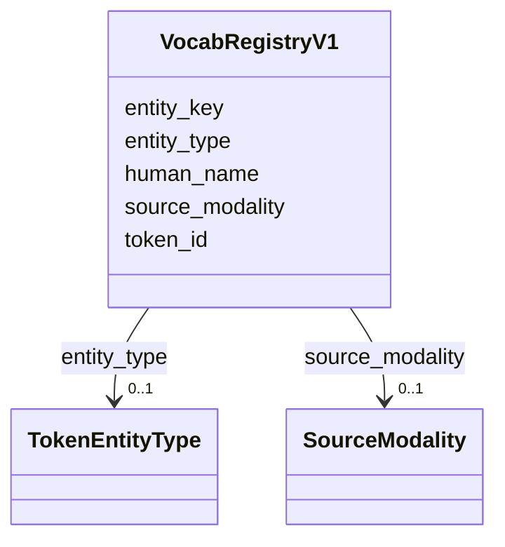

# Class: VocabRegistryV1 


_Vocabulary registry for multi-modal tokenization. Maps features to token IDs for embedding models._

_TOKEN TYPES: - special: System tokens ([PAD], [CLS], [SEP], [MASK], [UNK]) - taxon: Taxonomic entities - go_term: Gene Ontology terms - compound: Chemical compounds - environmental: Environmental parameters_

_SPECIAL TOKENS (IDs 0-4): - 0: [PAD] - padding token - 1: [CLS] - classification token - 2: [SEP] - separator token - 3: [MASK] - mask token for MLM - 4: [UNK] - unknown token_


URI: [https://w3id.org/kbase/nmdc_core/VocabRegistryV1](https://w3id.org/kbase/nmdc_core/VocabRegistryV1)





<!-- no inheritance hierarchy -->


## Slots

| Name | Cardinality and Range | Description | Inheritance |
| ---  | --- | --- | --- |
| [token_id](token_id.md) | 1 <br/> [Integer](Integer.md) | Unique token ID in vocabulary | direct |
| [entity_type](entity_type.md) | 0..1 <br/> [TokenEntityType](TokenEntityType.md) | Type of entity this token represents | direct |
| [entity_key](entity_key.md) | 0..1 <br/> [String](String.md) | Unique key for this entity within its type | direct |
| [human_name](human_name.md) | 0..1 <br/> [String](String.md) | Human-readable name for the token | direct |
| [source_modality](source_modality.md) | 0..1 <br/> [SourceModality](SourceModality.md) | Data modality this token comes from | direct |


## Identifier and Mapping Information


### Annotations

| property | value |
| --- | --- |
| source_table | vocab_registry_v1 |


### Schema Source


* from schema: https://w3id.org/kbase/nmdc_core


## Mappings

| Mapping Type | Mapped Value |
| ---  | ---  |
| self | https://w3id.org/kbase/nmdc_core/VocabRegistryV1 |
| native | https://w3id.org/kbase/nmdc_core/VocabRegistryV1 |


## LinkML Source

<!-- TODO: investigate https://stackoverflow.com/questions/37606292/how-to-create-tabbed-code-blocks-in-mkdocs-or-sphinx -->

### Direct

<details>
```yaml
name: VocabRegistryV1
annotations:
  source_table:
    tag: source_table
    value: vocab_registry_v1
description: 'Vocabulary registry for multi-modal tokenization. Maps features to token
  IDs for embedding models.

  TOKEN TYPES: - special: System tokens ([PAD], [CLS], [SEP], [MASK], [UNK]) - taxon:
  Taxonomic entities - go_term: Gene Ontology terms - compound: Chemical compounds
  - environmental: Environmental parameters

  SPECIAL TOKENS (IDs 0-4): - 0: [PAD] - padding token - 1: [CLS] - classification
  token - 2: [SEP] - separator token - 3: [MASK] - mask token for MLM - 4: [UNK] -
  unknown token'
from_schema: https://w3id.org/kbase/nmdc_core
attributes:
  token_id:
    name: token_id
    description: Unique token ID in vocabulary
    examples:
    - value: '0'
      description: '[PAD] token'
    - value: '1'
      description: '[CLS] token'
    - value: '2'
      description: '[SEP] token'
    - value: '3'
      description: '[MASK] token'
    - value: '4'
      description: '[UNK] token'
    from_schema: https://w3id.org/kbase/nmdc_core
    rank: 1000
    identifier: true
    domain_of:
    - VocabRegistryV1
    - SampleTokensV1
    range: integer
    required: true
    minimum_value: 0
  entity_type:
    name: entity_type
    description: Type of entity this token represents
    examples:
    - value: special
      description: System tokens
    - value: taxon
      description: Taxonomic entities
    from_schema: https://w3id.org/kbase/nmdc_core
    rank: 1000
    domain_of:
    - VocabRegistryV1
    range: TokenEntityType
  entity_key:
    name: entity_key
    description: Unique key for this entity within its type
    examples:
    - value: '[PAD]'
    - value: '[CLS]'
    - value: '[SEP]'
    from_schema: https://w3id.org/kbase/nmdc_core
    rank: 1000
    domain_of:
    - VocabRegistryV1
    range: string
  human_name:
    name: human_name
    description: Human-readable name for the token
    examples:
    - value: '[PAD]'
    - value: '[CLS]'
    from_schema: https://w3id.org/kbase/nmdc_core
    rank: 1000
    domain_of:
    - VocabRegistryV1
    range: string
  source_modality:
    name: source_modality
    description: Data modality this token comes from
    examples:
    - value: system
      description: System/special tokens
    - value: taxonomy
      description: Taxonomic features
    from_schema: https://w3id.org/kbase/nmdc_core
    rank: 1000
    domain_of:
    - VocabRegistryV1
    range: SourceModality

```
</details>

### Induced

<details>
```yaml
name: VocabRegistryV1
annotations:
  source_table:
    tag: source_table
    value: vocab_registry_v1
description: 'Vocabulary registry for multi-modal tokenization. Maps features to token
  IDs for embedding models.

  TOKEN TYPES: - special: System tokens ([PAD], [CLS], [SEP], [MASK], [UNK]) - taxon:
  Taxonomic entities - go_term: Gene Ontology terms - compound: Chemical compounds
  - environmental: Environmental parameters

  SPECIAL TOKENS (IDs 0-4): - 0: [PAD] - padding token - 1: [CLS] - classification
  token - 2: [SEP] - separator token - 3: [MASK] - mask token for MLM - 4: [UNK] -
  unknown token'
from_schema: https://w3id.org/kbase/nmdc_core
attributes:
  token_id:
    name: token_id
    description: Unique token ID in vocabulary
    examples:
    - value: '0'
      description: '[PAD] token'
    - value: '1'
      description: '[CLS] token'
    - value: '2'
      description: '[SEP] token'
    - value: '3'
      description: '[MASK] token'
    - value: '4'
      description: '[UNK] token'
    from_schema: https://w3id.org/kbase/nmdc_core
    rank: 1000
    identifier: true
    alias: token_id
    owner: VocabRegistryV1
    domain_of:
    - VocabRegistryV1
    - SampleTokensV1
    range: integer
    required: true
    minimum_value: 0
  entity_type:
    name: entity_type
    description: Type of entity this token represents
    examples:
    - value: special
      description: System tokens
    - value: taxon
      description: Taxonomic entities
    from_schema: https://w3id.org/kbase/nmdc_core
    rank: 1000
    alias: entity_type
    owner: VocabRegistryV1
    domain_of:
    - VocabRegistryV1
    range: TokenEntityType
  entity_key:
    name: entity_key
    description: Unique key for this entity within its type
    examples:
    - value: '[PAD]'
    - value: '[CLS]'
    - value: '[SEP]'
    from_schema: https://w3id.org/kbase/nmdc_core
    rank: 1000
    alias: entity_key
    owner: VocabRegistryV1
    domain_of:
    - VocabRegistryV1
    range: string
  human_name:
    name: human_name
    description: Human-readable name for the token
    examples:
    - value: '[PAD]'
    - value: '[CLS]'
    from_schema: https://w3id.org/kbase/nmdc_core
    rank: 1000
    alias: human_name
    owner: VocabRegistryV1
    domain_of:
    - VocabRegistryV1
    range: string
  source_modality:
    name: source_modality
    description: Data modality this token comes from
    examples:
    - value: system
      description: System/special tokens
    - value: taxonomy
      description: Taxonomic features
    from_schema: https://w3id.org/kbase/nmdc_core
    rank: 1000
    alias: source_modality
    owner: VocabRegistryV1
    domain_of:
    - VocabRegistryV1
    range: SourceModality

```
</details>