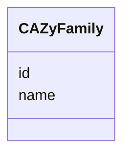

# Class: CAZyFamily 


_Carbohydrate-Active enZYme family classification. CAZy database families (GH, GT, PL, CE, AA, CBM)._


URI: [https://w3id.org/kbase/phagefoundry_genome_browser/CAZyFamily](https://w3id.org/kbase/phagefoundry_genome_browser/CAZyFamily)





<!-- no inheritance hierarchy -->


## Slots

| Name | Cardinality and Range | Description | Inheritance |
| ---  | --- | --- | --- |
| [id](id.md) | 1 <br/> [Integer](Integer.md) |  | direct |
| [name](name.md) | 0..1 <br/> [String](String.md) | CAZy family name (e | direct |


## Identifier and Mapping Information


### Annotations

| property | value |
| --- | --- |
| source_table | browser_cazy_family |


### Schema Source


* from schema: https://w3id.org/kbase/phagefoundry_genome_browser


## Mappings

| Mapping Type | Mapped Value |
| ---  | ---  |
| self | https://w3id.org/kbase/phagefoundry_genome_browser/CAZyFamily |
| native | https://w3id.org/kbase/phagefoundry_genome_browser/CAZyFamily |


## LinkML Source

<!-- TODO: investigate https://stackoverflow.com/questions/37606292/how-to-create-tabbed-code-blocks-in-mkdocs-or-sphinx -->

### Direct

<details>
```yaml
name: CAZyFamily
annotations:
  source_table:
    tag: source_table
    value: browser_cazy_family
description: Carbohydrate-Active enZYme family classification. CAZy database families
  (GH, GT, PL, CE, AA, CBM).
from_schema: https://w3id.org/kbase/phagefoundry_genome_browser
attributes:
  id:
    name: id
    from_schema: https://w3id.org/kbase/phagefoundry_genome_browser
    identifier: true
    domain_of:
    - Genome
    - Contig
    - Gene
    - Protein
    - Annotation
    - CAZyFamily
    - COGClass
    - ECNumber
    - EggNOGDescription
    - GOTerm
    - KEGGOrtholog
    - KEGGPathway
    - KEGGReaction
    - Operon
    - OrthologGroup
    - Regulon
    - RegulonRegulator
    - Sample
    - SampleMetadata
    - Site
    - GenomeTag
    range: integer
    required: true
  name:
    name: name
    description: CAZy family name (e.g., GH13, GT2)
    from_schema: https://w3id.org/kbase/phagefoundry_genome_browser
    domain_of:
    - Genome
    - Contig
    - Protein
    - CAZyFamily
    - COGClass
    - ECNumber
    - GOTerm
    - Operon
    - OrthologGroup
    - Regulon
    - Sample
    - Site
    range: string

```
</details>

### Induced

<details>
```yaml
name: CAZyFamily
annotations:
  source_table:
    tag: source_table
    value: browser_cazy_family
description: Carbohydrate-Active enZYme family classification. CAZy database families
  (GH, GT, PL, CE, AA, CBM).
from_schema: https://w3id.org/kbase/phagefoundry_genome_browser
attributes:
  id:
    name: id
    from_schema: https://w3id.org/kbase/phagefoundry_genome_browser
    identifier: true
    alias: id
    owner: CAZyFamily
    domain_of:
    - Genome
    - Contig
    - Gene
    - Protein
    - Annotation
    - CAZyFamily
    - COGClass
    - ECNumber
    - EggNOGDescription
    - GOTerm
    - KEGGOrtholog
    - KEGGPathway
    - KEGGReaction
    - Operon
    - OrthologGroup
    - Regulon
    - RegulonRegulator
    - Sample
    - SampleMetadata
    - Site
    - GenomeTag
    range: integer
    required: true
  name:
    name: name
    description: CAZy family name (e.g., GH13, GT2)
    from_schema: https://w3id.org/kbase/phagefoundry_genome_browser
    alias: name
    owner: CAZyFamily
    domain_of:
    - Genome
    - Contig
    - Protein
    - CAZyFamily
    - COGClass
    - ECNumber
    - GOTerm
    - Operon
    - OrthologGroup
    - Regulon
    - Sample
    - Site
    range: string

```
</details>