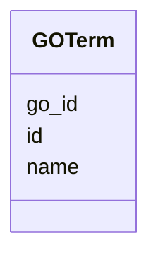

# Class: GOTerm 


_Gene Ontology term for functional annotation._


URI: [https://w3id.org/kbase/phagefoundry_genome_browser/GOTerm](https://w3id.org/kbase/phagefoundry_genome_browser/GOTerm)





<!-- no inheritance hierarchy -->


## Slots

| Name | Cardinality and Range | Description | Inheritance |
| ---  | --- | --- | --- |
| [id](id.md) | 1 <br/> [Integer](Integer.md) |  | direct |
| [go_id](go_id.md) | 0..1 <br/> [String](String.md) | GO term ID (GO:NNNNNNN) | direct |
| [name](name.md) | 0..1 <br/> [String](String.md) |  | direct |


## Identifier and Mapping Information


### Annotations

| property | value |
| --- | --- |
| source_table | browser_go_term |


### Schema Source


* from schema: https://w3id.org/kbase/phagefoundry_genome_browser


## Mappings

| Mapping Type | Mapped Value |
| ---  | ---  |
| self | https://w3id.org/kbase/phagefoundry_genome_browser/GOTerm |
| native | https://w3id.org/kbase/phagefoundry_genome_browser/GOTerm |


## LinkML Source

<!-- TODO: investigate https://stackoverflow.com/questions/37606292/how-to-create-tabbed-code-blocks-in-mkdocs-or-sphinx -->

### Direct

<details>
```yaml
name: GOTerm
annotations:
  source_table:
    tag: source_table
    value: browser_go_term
description: Gene Ontology term for functional annotation.
from_schema: https://w3id.org/kbase/phagefoundry_genome_browser
attributes:
  id:
    name: id
    from_schema: https://w3id.org/kbase/phagefoundry_genome_browser
    identifier: true
    domain_of:
    - Genome
    - Contig
    - Gene
    - Protein
    - Annotation
    - CAZyFamily
    - COGClass
    - ECNumber
    - EggNOGDescription
    - GOTerm
    - KEGGOrtholog
    - KEGGPathway
    - KEGGReaction
    - Operon
    - OrthologGroup
    - Regulon
    - RegulonRegulator
    - Sample
    - SampleMetadata
    - Site
    - GenomeTag
    range: integer
    required: true
  go_id:
    name: go_id
    description: GO term ID (GO:NNNNNNN)
    from_schema: https://w3id.org/kbase/phagefoundry_genome_browser
    rank: 1000
    domain_of:
    - GOTerm
    range: string
    pattern: GO:\d{7}
  name:
    name: name
    from_schema: https://w3id.org/kbase/phagefoundry_genome_browser
    domain_of:
    - Genome
    - Contig
    - Protein
    - CAZyFamily
    - COGClass
    - ECNumber
    - GOTerm
    - Operon
    - OrthologGroup
    - Regulon
    - Sample
    - Site
    range: string

```
</details>

### Induced

<details>
```yaml
name: GOTerm
annotations:
  source_table:
    tag: source_table
    value: browser_go_term
description: Gene Ontology term for functional annotation.
from_schema: https://w3id.org/kbase/phagefoundry_genome_browser
attributes:
  id:
    name: id
    from_schema: https://w3id.org/kbase/phagefoundry_genome_browser
    identifier: true
    alias: id
    owner: GOTerm
    domain_of:
    - Genome
    - Contig
    - Gene
    - Protein
    - Annotation
    - CAZyFamily
    - COGClass
    - ECNumber
    - EggNOGDescription
    - GOTerm
    - KEGGOrtholog
    - KEGGPathway
    - KEGGReaction
    - Operon
    - OrthologGroup
    - Regulon
    - RegulonRegulator
    - Sample
    - SampleMetadata
    - Site
    - GenomeTag
    range: integer
    required: true
  go_id:
    name: go_id
    description: GO term ID (GO:NNNNNNN)
    from_schema: https://w3id.org/kbase/phagefoundry_genome_browser
    rank: 1000
    alias: go_id
    owner: GOTerm
    domain_of:
    - GOTerm
    range: string
    pattern: GO:\d{7}
  name:
    name: name
    from_schema: https://w3id.org/kbase/phagefoundry_genome_browser
    alias: name
    owner: GOTerm
    domain_of:
    - Genome
    - Contig
    - Protein
    - CAZyFamily
    - COGClass
    - ECNumber
    - GOTerm
    - Operon
    - OrthologGroup
    - Regulon
    - Sample
    - Site
    range: string

```
</details>