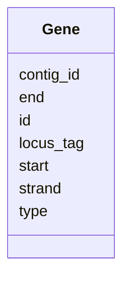

# Class: Gene 


_Predicted gene with coordinates and strand._


URI: [https://w3id.org/kbase/phagefoundry_genome_browser/Gene](https://w3id.org/kbase/phagefoundry_genome_browser/Gene)





<!-- no inheritance hierarchy -->


## Slots

| Name | Cardinality and Range | Description | Inheritance |
| ---  | --- | --- | --- |
| [id](id.md) | 1 <br/> [Integer](Integer.md) |  | direct |
| [locus_tag](locus_tag.md) | 0..1 <br/> [String](String.md) | Locus tag identifier | direct |
| [contig_id](contig_id.md) | 0..1 <br/> [Integer](Integer.md) |  | direct |
| [start](start.md) | 0..1 <br/> [Integer](Integer.md) | Start coordinate (1-based) | direct |
| [end](end.md) | 0..1 <br/> [Integer](Integer.md) | End coordinate | direct |
| [strand](strand.md) | 0..1 <br/> [Integer](Integer.md) | Strand (1 or -1) | direct |
| [type](type.md) | 0..1 <br/> [String](String.md) | Gene type (CDS, tRNA, rRNA, etc | direct |


## Identifier and Mapping Information


### Annotations

| property | value |
| --- | --- |
| source_table | browser_gene |


### Schema Source


* from schema: https://w3id.org/kbase/phagefoundry_genome_browser


## Mappings

| Mapping Type | Mapped Value |
| ---  | ---  |
| self | https://w3id.org/kbase/phagefoundry_genome_browser/Gene |
| native | https://w3id.org/kbase/phagefoundry_genome_browser/Gene |


## LinkML Source

<!-- TODO: investigate https://stackoverflow.com/questions/37606292/how-to-create-tabbed-code-blocks-in-mkdocs-or-sphinx -->

### Direct

<details>
```yaml
name: Gene
annotations:
  source_table:
    tag: source_table
    value: browser_gene
description: Predicted gene with coordinates and strand.
from_schema: https://w3id.org/kbase/phagefoundry_genome_browser
attributes:
  id:
    name: id
    from_schema: https://w3id.org/kbase/phagefoundry_genome_browser
    identifier: true
    domain_of:
    - Genome
    - Contig
    - Gene
    - Protein
    - Annotation
    - CAZyFamily
    - COGClass
    - ECNumber
    - EggNOGDescription
    - GOTerm
    - KEGGOrtholog
    - KEGGPathway
    - KEGGReaction
    - Operon
    - OrthologGroup
    - Regulon
    - RegulonRegulator
    - Sample
    - SampleMetadata
    - Site
    - GenomeTag
    range: integer
    required: true
  locus_tag:
    name: locus_tag
    description: Locus tag identifier
    from_schema: https://w3id.org/kbase/phagefoundry_genome_browser
    rank: 1000
    domain_of:
    - Gene
    range: string
  contig_id:
    name: contig_id
    comments:
    - Foreign key to Contig.id
    from_schema: https://w3id.org/kbase/phagefoundry_genome_browser
    rank: 1000
    domain_of:
    - Gene
    range: integer
  start:
    name: start
    description: Start coordinate (1-based)
    from_schema: https://w3id.org/kbase/phagefoundry_genome_browser
    rank: 1000
    domain_of:
    - Gene
    range: integer
  end:
    name: end
    description: End coordinate
    from_schema: https://w3id.org/kbase/phagefoundry_genome_browser
    rank: 1000
    domain_of:
    - Gene
    range: integer
  strand:
    name: strand
    description: Strand (1 or -1)
    from_schema: https://w3id.org/kbase/phagefoundry_genome_browser
    rank: 1000
    domain_of:
    - Gene
    range: integer
  type:
    name: type
    description: Gene type (CDS, tRNA, rRNA, etc.)
    from_schema: https://w3id.org/kbase/phagefoundry_genome_browser
    rank: 1000
    domain_of:
    - Gene
    range: string

```
</details>

### Induced

<details>
```yaml
name: Gene
annotations:
  source_table:
    tag: source_table
    value: browser_gene
description: Predicted gene with coordinates and strand.
from_schema: https://w3id.org/kbase/phagefoundry_genome_browser
attributes:
  id:
    name: id
    from_schema: https://w3id.org/kbase/phagefoundry_genome_browser
    identifier: true
    alias: id
    owner: Gene
    domain_of:
    - Genome
    - Contig
    - Gene
    - Protein
    - Annotation
    - CAZyFamily
    - COGClass
    - ECNumber
    - EggNOGDescription
    - GOTerm
    - KEGGOrtholog
    - KEGGPathway
    - KEGGReaction
    - Operon
    - OrthologGroup
    - Regulon
    - RegulonRegulator
    - Sample
    - SampleMetadata
    - Site
    - GenomeTag
    range: integer
    required: true
  locus_tag:
    name: locus_tag
    description: Locus tag identifier
    from_schema: https://w3id.org/kbase/phagefoundry_genome_browser
    rank: 1000
    alias: locus_tag
    owner: Gene
    domain_of:
    - Gene
    range: string
  contig_id:
    name: contig_id
    comments:
    - Foreign key to Contig.id
    from_schema: https://w3id.org/kbase/phagefoundry_genome_browser
    rank: 1000
    alias: contig_id
    owner: Gene
    domain_of:
    - Gene
    range: integer
  start:
    name: start
    description: Start coordinate (1-based)
    from_schema: https://w3id.org/kbase/phagefoundry_genome_browser
    rank: 1000
    alias: start
    owner: Gene
    domain_of:
    - Gene
    range: integer
  end:
    name: end
    description: End coordinate
    from_schema: https://w3id.org/kbase/phagefoundry_genome_browser
    rank: 1000
    alias: end
    owner: Gene
    domain_of:
    - Gene
    range: integer
  strand:
    name: strand
    description: Strand (1 or -1)
    from_schema: https://w3id.org/kbase/phagefoundry_genome_browser
    rank: 1000
    alias: strand
    owner: Gene
    domain_of:
    - Gene
    range: integer
  type:
    name: type
    description: Gene type (CDS, tRNA, rRNA, etc.)
    from_schema: https://w3id.org/kbase/phagefoundry_genome_browser
    rank: 1000
    alias: type
    owner: Gene
    domain_of:
    - Gene
    range: string

```
</details>