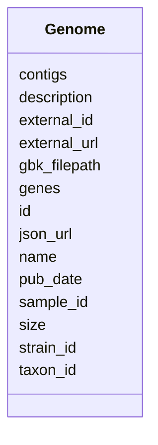

# Class: Genome 


_Bacterial genome assembly with basic statistics. Links to NCBI via external_id and external_url._

_EXAMPLE GENOMES (Acinetobacter): - ARLG-6271: 143 contigs, 4.0 Mb, 3,901 genes - ARLG-6273: 205 contigs, 4.0 Mb, 3,955 genes - ARLG-6274: 159 contigs, 4.0 Mb, 3,951 genes_


URI: [https://w3id.org/kbase/phagefoundry_genome_browser/Genome](https://w3id.org/kbase/phagefoundry_genome_browser/Genome)





<!-- no inheritance hierarchy -->


## Slots

| Name | Cardinality and Range | Description | Inheritance |
| ---  | --- | --- | --- |
| [id](id.md) | 1 <br/> [Integer](Integer.md) | Internal genome ID | direct |
| [name](name.md) | 1 <br/> [String](String.md) | Genome/strain name | direct |
| [description](description.md) | 0..1 <br/> [String](String.md) | Genome description (often same as name) | direct |
| [contigs](contigs.md) | 0..1 <br/> [Integer](Integer.md) | Number of contigs in assembly | direct |
| [size](size.md) | 0..1 <br/> [Integer](Integer.md) | Total genome size in base pairs | direct |
| [genes](genes.md) | 0..1 <br/> [Integer](Integer.md) | Total number of predicted genes | direct |
| [json_url](json_url.md) | 0..1 <br/> [String](String.md) | Relative URL to genome JSON data | direct |
| [pub_date](pub_date.md) | 0..1 <br/> [Datetime](Datetime.md) | Publication/upload date | direct |
| [external_url](external_url.md) | 0..1 <br/> [Uri](Uri.md) | NCBI nucleotide URL | direct |
| [external_id](external_id.md) | 0..1 <br/> [String](String.md) | NCBI accession number | direct |
| [gbk_filepath](gbk_filepath.md) | 0..1 <br/> [String](String.md) | Path to GenBank file on server | direct |
| [sample_id](sample_id.md) | 0..1 <br/> [Integer](Integer.md) | Link to sample metadata | direct |
| [strain_id](strain_id.md) | 0..1 <br/> [Integer](Integer.md) | Strain identifier | direct |
| [taxon_id](taxon_id.md) | 0..1 <br/> [Integer](Integer.md) | Taxonomy reference | direct |


## Identifier and Mapping Information


### Annotations

| property | value |
| --- | --- |
| source_table | browser_genome |


### Schema Source


* from schema: https://w3id.org/kbase/phagefoundry_genome_browser


## Mappings

| Mapping Type | Mapped Value |
| ---  | ---  |
| self | https://w3id.org/kbase/phagefoundry_genome_browser/Genome |
| native | https://w3id.org/kbase/phagefoundry_genome_browser/Genome |


## LinkML Source

<!-- TODO: investigate https://stackoverflow.com/questions/37606292/how-to-create-tabbed-code-blocks-in-mkdocs-or-sphinx -->

### Direct

<details>
```yaml
name: Genome
annotations:
  source_table:
    tag: source_table
    value: browser_genome
description: 'Bacterial genome assembly with basic statistics. Links to NCBI via external_id
  and external_url.

  EXAMPLE GENOMES (Acinetobacter): - ARLG-6271: 143 contigs, 4.0 Mb, 3,901 genes -
  ARLG-6273: 205 contigs, 4.0 Mb, 3,955 genes - ARLG-6274: 159 contigs, 4.0 Mb, 3,951
  genes'
from_schema: https://w3id.org/kbase/phagefoundry_genome_browser
attributes:
  id:
    name: id
    description: Internal genome ID
    examples:
    - value: '501'
    - value: '502'
    from_schema: https://w3id.org/kbase/phagefoundry_genome_browser
    rank: 1000
    identifier: true
    domain_of:
    - Genome
    - Contig
    - Gene
    - Protein
    - Annotation
    - CAZyFamily
    - COGClass
    - ECNumber
    - EggNOGDescription
    - GOTerm
    - KEGGOrtholog
    - KEGGPathway
    - KEGGReaction
    - Operon
    - OrthologGroup
    - Regulon
    - RegulonRegulator
    - Sample
    - SampleMetadata
    - Site
    - GenomeTag
    range: integer
    required: true
  name:
    name: name
    description: Genome/strain name
    examples:
    - value: ARLG-6271
    - value: ARLG-6273
    from_schema: https://w3id.org/kbase/phagefoundry_genome_browser
    rank: 1000
    domain_of:
    - Genome
    - Contig
    - Protein
    - CAZyFamily
    - COGClass
    - ECNumber
    - GOTerm
    - Operon
    - OrthologGroup
    - Regulon
    - Sample
    - Site
    range: string
    required: true
  description:
    name: description
    description: Genome description (often same as name)
    from_schema: https://w3id.org/kbase/phagefoundry_genome_browser
    rank: 1000
    domain_of:
    - Genome
    - EggNOGDescription
    range: string
  contigs:
    name: contigs
    description: Number of contigs in assembly
    examples:
    - value: '143'
    - value: '205'
    - value: '159'
    from_schema: https://w3id.org/kbase/phagefoundry_genome_browser
    rank: 1000
    domain_of:
    - Genome
    range: integer
    minimum_value: 1
  size:
    name: size
    description: Total genome size in base pairs
    examples:
    - value: '4015922'
      description: ~4.0 Mb
    - value: '4031673'
    - value: '4035956'
    from_schema: https://w3id.org/kbase/phagefoundry_genome_browser
    rank: 1000
    domain_of:
    - Genome
    - Contig
    range: integer
    minimum_value: 0
  genes:
    name: genes
    description: Total number of predicted genes
    examples:
    - value: '3901'
    - value: '3955'
    - value: '3951'
    from_schema: https://w3id.org/kbase/phagefoundry_genome_browser
    rank: 1000
    domain_of:
    - Genome
    range: integer
    minimum_value: 0
  json_url:
    name: json_url
    description: Relative URL to genome JSON data
    from_schema: https://w3id.org/kbase/phagefoundry_genome_browser
    rank: 1000
    domain_of:
    - Genome
    range: string
  pub_date:
    name: pub_date
    description: Publication/upload date
    examples:
    - value: '2023-12-23 01:14:13.381489'
    from_schema: https://w3id.org/kbase/phagefoundry_genome_browser
    rank: 1000
    domain_of:
    - Genome
    range: datetime
  external_url:
    name: external_url
    description: NCBI nucleotide URL
    examples:
    - value: https://www.ncbi.nlm.nih.gov/nuccore/DAKMEH010000000
    from_schema: https://w3id.org/kbase/phagefoundry_genome_browser
    rank: 1000
    domain_of:
    - Genome
    range: uri
  external_id:
    name: external_id
    description: NCBI accession number
    examples:
    - value: DAKMEH010000000
    from_schema: https://w3id.org/kbase/phagefoundry_genome_browser
    rank: 1000
    domain_of:
    - Genome
    range: string
  gbk_filepath:
    name: gbk_filepath
    description: Path to GenBank file on server
    from_schema: https://w3id.org/kbase/phagefoundry_genome_browser
    rank: 1000
    domain_of:
    - Genome
    range: string
  sample_id:
    name: sample_id
    description: Link to sample metadata
    comments:
    - Foreign key to Sample.id
    from_schema: https://w3id.org/kbase/phagefoundry_genome_browser
    rank: 1000
    domain_of:
    - Genome
    - SampleMetadata
    range: integer
  strain_id:
    name: strain_id
    description: Strain identifier
    examples:
    - value: '501'
    from_schema: https://w3id.org/kbase/phagefoundry_genome_browser
    rank: 1000
    domain_of:
    - Genome
    range: integer
  taxon_id:
    name: taxon_id
    description: Taxonomy reference
    examples:
    - value: '2'
    from_schema: https://w3id.org/kbase/phagefoundry_genome_browser
    rank: 1000
    domain_of:
    - Genome
    range: integer

```
</details>

### Induced

<details>
```yaml
name: Genome
annotations:
  source_table:
    tag: source_table
    value: browser_genome
description: 'Bacterial genome assembly with basic statistics. Links to NCBI via external_id
  and external_url.

  EXAMPLE GENOMES (Acinetobacter): - ARLG-6271: 143 contigs, 4.0 Mb, 3,901 genes -
  ARLG-6273: 205 contigs, 4.0 Mb, 3,955 genes - ARLG-6274: 159 contigs, 4.0 Mb, 3,951
  genes'
from_schema: https://w3id.org/kbase/phagefoundry_genome_browser
attributes:
  id:
    name: id
    description: Internal genome ID
    examples:
    - value: '501'
    - value: '502'
    from_schema: https://w3id.org/kbase/phagefoundry_genome_browser
    rank: 1000
    identifier: true
    alias: id
    owner: Genome
    domain_of:
    - Genome
    - Contig
    - Gene
    - Protein
    - Annotation
    - CAZyFamily
    - COGClass
    - ECNumber
    - EggNOGDescription
    - GOTerm
    - KEGGOrtholog
    - KEGGPathway
    - KEGGReaction
    - Operon
    - OrthologGroup
    - Regulon
    - RegulonRegulator
    - Sample
    - SampleMetadata
    - Site
    - GenomeTag
    range: integer
    required: true
  name:
    name: name
    description: Genome/strain name
    examples:
    - value: ARLG-6271
    - value: ARLG-6273
    from_schema: https://w3id.org/kbase/phagefoundry_genome_browser
    rank: 1000
    alias: name
    owner: Genome
    domain_of:
    - Genome
    - Contig
    - Protein
    - CAZyFamily
    - COGClass
    - ECNumber
    - GOTerm
    - Operon
    - OrthologGroup
    - Regulon
    - Sample
    - Site
    range: string
    required: true
  description:
    name: description
    description: Genome description (often same as name)
    from_schema: https://w3id.org/kbase/phagefoundry_genome_browser
    rank: 1000
    alias: description
    owner: Genome
    domain_of:
    - Genome
    - EggNOGDescription
    range: string
  contigs:
    name: contigs
    description: Number of contigs in assembly
    examples:
    - value: '143'
    - value: '205'
    - value: '159'
    from_schema: https://w3id.org/kbase/phagefoundry_genome_browser
    rank: 1000
    alias: contigs
    owner: Genome
    domain_of:
    - Genome
    range: integer
    minimum_value: 1
  size:
    name: size
    description: Total genome size in base pairs
    examples:
    - value: '4015922'
      description: ~4.0 Mb
    - value: '4031673'
    - value: '4035956'
    from_schema: https://w3id.org/kbase/phagefoundry_genome_browser
    rank: 1000
    alias: size
    owner: Genome
    domain_of:
    - Genome
    - Contig
    range: integer
    minimum_value: 0
  genes:
    name: genes
    description: Total number of predicted genes
    examples:
    - value: '3901'
    - value: '3955'
    - value: '3951'
    from_schema: https://w3id.org/kbase/phagefoundry_genome_browser
    rank: 1000
    alias: genes
    owner: Genome
    domain_of:
    - Genome
    range: integer
    minimum_value: 0
  json_url:
    name: json_url
    description: Relative URL to genome JSON data
    from_schema: https://w3id.org/kbase/phagefoundry_genome_browser
    rank: 1000
    alias: json_url
    owner: Genome
    domain_of:
    - Genome
    range: string
  pub_date:
    name: pub_date
    description: Publication/upload date
    examples:
    - value: '2023-12-23 01:14:13.381489'
    from_schema: https://w3id.org/kbase/phagefoundry_genome_browser
    rank: 1000
    alias: pub_date
    owner: Genome
    domain_of:
    - Genome
    range: datetime
  external_url:
    name: external_url
    description: NCBI nucleotide URL
    examples:
    - value: https://www.ncbi.nlm.nih.gov/nuccore/DAKMEH010000000
    from_schema: https://w3id.org/kbase/phagefoundry_genome_browser
    rank: 1000
    alias: external_url
    owner: Genome
    domain_of:
    - Genome
    range: uri
  external_id:
    name: external_id
    description: NCBI accession number
    examples:
    - value: DAKMEH010000000
    from_schema: https://w3id.org/kbase/phagefoundry_genome_browser
    rank: 1000
    alias: external_id
    owner: Genome
    domain_of:
    - Genome
    range: string
  gbk_filepath:
    name: gbk_filepath
    description: Path to GenBank file on server
    from_schema: https://w3id.org/kbase/phagefoundry_genome_browser
    rank: 1000
    alias: gbk_filepath
    owner: Genome
    domain_of:
    - Genome
    range: string
  sample_id:
    name: sample_id
    description: Link to sample metadata
    comments:
    - Foreign key to Sample.id
    from_schema: https://w3id.org/kbase/phagefoundry_genome_browser
    rank: 1000
    alias: sample_id
    owner: Genome
    domain_of:
    - Genome
    - SampleMetadata
    range: integer
  strain_id:
    name: strain_id
    description: Strain identifier
    examples:
    - value: '501'
    from_schema: https://w3id.org/kbase/phagefoundry_genome_browser
    rank: 1000
    alias: strain_id
    owner: Genome
    domain_of:
    - Genome
    range: integer
  taxon_id:
    name: taxon_id
    description: Taxonomy reference
    examples:
    - value: '2'
    from_schema: https://w3id.org/kbase/phagefoundry_genome_browser
    rank: 1000
    alias: taxon_id
    owner: Genome
    domain_of:
    - Genome
    range: integer

```
</details>