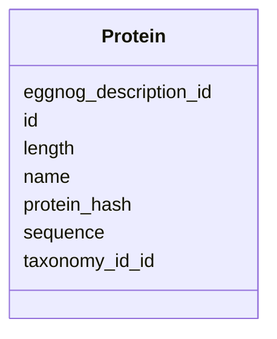

# Class: Protein 


_Protein sequence with functional annotations. Links to multiple annotation systems via protein_* tables._

_EXAMPLE PROTEINS: - DUF4054 domain-containing protein (127aa) - DUF2184 domain-containing protein (324aa)_


URI: [https://w3id.org/kbase/phagefoundry_genome_browser/Protein](https://w3id.org/kbase/phagefoundry_genome_browser/Protein)





<!-- no inheritance hierarchy -->


## Slots

| Name | Cardinality and Range | Description | Inheritance |
| ---  | --- | --- | --- |
| [id](id.md) | 1 <br/> [Integer](Integer.md) |  | direct |
| [name](name.md) | 0..1 <br/> [String](String.md) | Protein name with locus tag, length, and description | direct |
| [length](length.md) | 0..1 <br/> [Integer](Integer.md) | Protein length in amino acids | direct |
| [protein_hash](protein_hash.md) | 0..1 <br/> [String](String.md) | MD5 hash of protein sequence | direct |
| [sequence](sequence.md) | 0..1 <br/> [String](String.md) | Amino acid sequence | direct |
| [eggnog_description_id](eggnog_description_id.md) | 0..1 <br/> [Integer](Integer.md) | Link to eggNOG functional description | direct |
| [taxonomy_id_id](taxonomy_id_id.md) | 0..1 <br/> [Integer](Integer.md) | Taxonomy reference | direct |


## Identifier and Mapping Information


### Annotations

| property | value |
| --- | --- |
| source_table | browser_protein |


### Schema Source


* from schema: https://w3id.org/kbase/phagefoundry_genome_browser


## Mappings

| Mapping Type | Mapped Value |
| ---  | ---  |
| self | https://w3id.org/kbase/phagefoundry_genome_browser/Protein |
| native | https://w3id.org/kbase/phagefoundry_genome_browser/Protein |


## LinkML Source

<!-- TODO: investigate https://stackoverflow.com/questions/37606292/how-to-create-tabbed-code-blocks-in-mkdocs-or-sphinx -->

### Direct

<details>
```yaml
name: Protein
annotations:
  source_table:
    tag: source_table
    value: browser_protein
description: 'Protein sequence with functional annotations. Links to multiple annotation
  systems via protein_* tables.

  EXAMPLE PROTEINS: - DUF4054 domain-containing protein (127aa) - DUF2184 domain-containing
  protein (324aa)'
from_schema: https://w3id.org/kbase/phagefoundry_genome_browser
attributes:
  id:
    name: id
    examples:
    - value: '90841'
    - value: '90842'
    from_schema: https://w3id.org/kbase/phagefoundry_genome_browser
    identifier: true
    domain_of:
    - Genome
    - Contig
    - Gene
    - Protein
    - Annotation
    - CAZyFamily
    - COGClass
    - ECNumber
    - EggNOGDescription
    - GOTerm
    - KEGGOrtholog
    - KEGGPathway
    - KEGGReaction
    - Operon
    - OrthologGroup
    - Regulon
    - RegulonRegulator
    - Sample
    - SampleMetadata
    - Site
    - GenomeTag
    range: integer
    required: true
  name:
    name: name
    description: Protein name with locus tag, length, and description
    examples:
    - value: OXR37_002879|127aa|DUF4054 domain-containing protein
    - value: OXR37_002880|127aa|hypothetical protein
    from_schema: https://w3id.org/kbase/phagefoundry_genome_browser
    domain_of:
    - Genome
    - Contig
    - Protein
    - CAZyFamily
    - COGClass
    - ECNumber
    - GOTerm
    - Operon
    - OrthologGroup
    - Regulon
    - Sample
    - Site
    range: string
  length:
    name: length
    description: Protein length in amino acids
    examples:
    - value: '127'
    - value: '324'
    from_schema: https://w3id.org/kbase/phagefoundry_genome_browser
    rank: 1000
    domain_of:
    - Protein
    range: integer
    minimum_value: 1
  protein_hash:
    name: protein_hash
    description: MD5 hash of protein sequence
    examples:
    - value: 178a9653b894a8ace53dcdc33777cf2e
    from_schema: https://w3id.org/kbase/phagefoundry_genome_browser
    rank: 1000
    domain_of:
    - Protein
    range: string
    pattern: '[a-f0-9]{32}'
  sequence:
    name: sequence
    description: Amino acid sequence
    from_schema: https://w3id.org/kbase/phagefoundry_genome_browser
    rank: 1000
    domain_of:
    - Protein
    range: string
  eggnog_description_id:
    name: eggnog_description_id
    description: Link to eggNOG functional description
    comments:
    - Foreign key to EggNOGDescription.id
    examples:
    - value: '2174'
    - value: '6'
    from_schema: https://w3id.org/kbase/phagefoundry_genome_browser
    rank: 1000
    domain_of:
    - Protein
    range: integer
  taxonomy_id_id:
    name: taxonomy_id_id
    description: Taxonomy reference
    examples:
    - value: '7'
    from_schema: https://w3id.org/kbase/phagefoundry_genome_browser
    rank: 1000
    domain_of:
    - Protein
    range: integer

```
</details>

### Induced

<details>
```yaml
name: Protein
annotations:
  source_table:
    tag: source_table
    value: browser_protein
description: 'Protein sequence with functional annotations. Links to multiple annotation
  systems via protein_* tables.

  EXAMPLE PROTEINS: - DUF4054 domain-containing protein (127aa) - DUF2184 domain-containing
  protein (324aa)'
from_schema: https://w3id.org/kbase/phagefoundry_genome_browser
attributes:
  id:
    name: id
    examples:
    - value: '90841'
    - value: '90842'
    from_schema: https://w3id.org/kbase/phagefoundry_genome_browser
    identifier: true
    alias: id
    owner: Protein
    domain_of:
    - Genome
    - Contig
    - Gene
    - Protein
    - Annotation
    - CAZyFamily
    - COGClass
    - ECNumber
    - EggNOGDescription
    - GOTerm
    - KEGGOrtholog
    - KEGGPathway
    - KEGGReaction
    - Operon
    - OrthologGroup
    - Regulon
    - RegulonRegulator
    - Sample
    - SampleMetadata
    - Site
    - GenomeTag
    range: integer
    required: true
  name:
    name: name
    description: Protein name with locus tag, length, and description
    examples:
    - value: OXR37_002879|127aa|DUF4054 domain-containing protein
    - value: OXR37_002880|127aa|hypothetical protein
    from_schema: https://w3id.org/kbase/phagefoundry_genome_browser
    alias: name
    owner: Protein
    domain_of:
    - Genome
    - Contig
    - Protein
    - CAZyFamily
    - COGClass
    - ECNumber
    - GOTerm
    - Operon
    - OrthologGroup
    - Regulon
    - Sample
    - Site
    range: string
  length:
    name: length
    description: Protein length in amino acids
    examples:
    - value: '127'
    - value: '324'
    from_schema: https://w3id.org/kbase/phagefoundry_genome_browser
    rank: 1000
    alias: length
    owner: Protein
    domain_of:
    - Protein
    range: integer
    minimum_value: 1
  protein_hash:
    name: protein_hash
    description: MD5 hash of protein sequence
    examples:
    - value: 178a9653b894a8ace53dcdc33777cf2e
    from_schema: https://w3id.org/kbase/phagefoundry_genome_browser
    rank: 1000
    alias: protein_hash
    owner: Protein
    domain_of:
    - Protein
    range: string
    pattern: '[a-f0-9]{32}'
  sequence:
    name: sequence
    description: Amino acid sequence
    from_schema: https://w3id.org/kbase/phagefoundry_genome_browser
    rank: 1000
    alias: sequence
    owner: Protein
    domain_of:
    - Protein
    range: string
  eggnog_description_id:
    name: eggnog_description_id
    description: Link to eggNOG functional description
    comments:
    - Foreign key to EggNOGDescription.id
    examples:
    - value: '2174'
    - value: '6'
    from_schema: https://w3id.org/kbase/phagefoundry_genome_browser
    rank: 1000
    alias: eggnog_description_id
    owner: Protein
    domain_of:
    - Protein
    range: integer
  taxonomy_id_id:
    name: taxonomy_id_id
    description: Taxonomy reference
    examples:
    - value: '7'
    from_schema: https://w3id.org/kbase/phagefoundry_genome_browser
    rank: 1000
    alias: taxonomy_id_id
    owner: Protein
    domain_of:
    - Protein
    range: integer

```
</details>