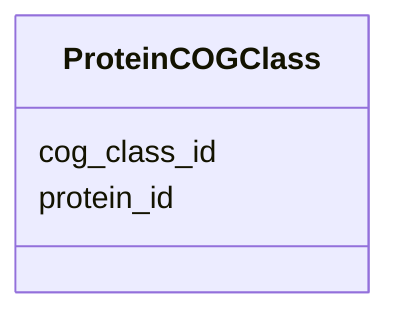

# Class: ProteinCOGClass 


_Protein to COG class assignments_


URI: [https://w3id.org/kbase/phagefoundry_genome_browser/ProteinCOGClass](https://w3id.org/kbase/phagefoundry_genome_browser/ProteinCOGClass)





<!-- no inheritance hierarchy -->


## Slots

| Name | Cardinality and Range | Description | Inheritance |
| ---  | --- | --- | --- |
| [protein_id](protein_id.md) | 0..1 <br/> [Integer](Integer.md) |  | direct |
| [cog_class_id](cog_class_id.md) | 0..1 <br/> [Integer](Integer.md) |  | direct |


## Identifier and Mapping Information


### Annotations

| property | value |
| --- | --- |
| source_table | browser_protein_cog_classes |


### Schema Source


* from schema: https://w3id.org/kbase/phagefoundry_genome_browser


## Mappings

| Mapping Type | Mapped Value |
| ---  | ---  |
| self | https://w3id.org/kbase/phagefoundry_genome_browser/ProteinCOGClass |
| native | https://w3id.org/kbase/phagefoundry_genome_browser/ProteinCOGClass |


## LinkML Source

<!-- TODO: investigate https://stackoverflow.com/questions/37606292/how-to-create-tabbed-code-blocks-in-mkdocs-or-sphinx -->

### Direct

<details>
```yaml
name: ProteinCOGClass
annotations:
  source_table:
    tag: source_table
    value: browser_protein_cog_classes
description: Protein to COG class assignments
from_schema: https://w3id.org/kbase/phagefoundry_genome_browser
attributes:
  protein_id:
    name: protein_id
    from_schema: https://w3id.org/kbase/phagefoundry_genome_browser
    domain_of:
    - ProteinCAZyFamily
    - ProteinCOGClass
    - ProteinECNumber
    - ProteinGOTerm
    - ProteinKEGGOrtholog
    - ProteinKEGGPathway
    - ProteinKEGGReaction
    - ProteinOrthologGroup
    - ProteinTCFamily
    range: integer
  cog_class_id:
    name: cog_class_id
    from_schema: https://w3id.org/kbase/phagefoundry_genome_browser
    rank: 1000
    domain_of:
    - ProteinCOGClass
    range: integer

```
</details>

### Induced

<details>
```yaml
name: ProteinCOGClass
annotations:
  source_table:
    tag: source_table
    value: browser_protein_cog_classes
description: Protein to COG class assignments
from_schema: https://w3id.org/kbase/phagefoundry_genome_browser
attributes:
  protein_id:
    name: protein_id
    from_schema: https://w3id.org/kbase/phagefoundry_genome_browser
    alias: protein_id
    owner: ProteinCOGClass
    domain_of:
    - ProteinCAZyFamily
    - ProteinCOGClass
    - ProteinECNumber
    - ProteinGOTerm
    - ProteinKEGGOrtholog
    - ProteinKEGGPathway
    - ProteinKEGGReaction
    - ProteinOrthologGroup
    - ProteinTCFamily
    range: integer
  cog_class_id:
    name: cog_class_id
    from_schema: https://w3id.org/kbase/phagefoundry_genome_browser
    rank: 1000
    alias: cog_class_id
    owner: ProteinCOGClass
    domain_of:
    - ProteinCOGClass
    range: integer

```
</details>