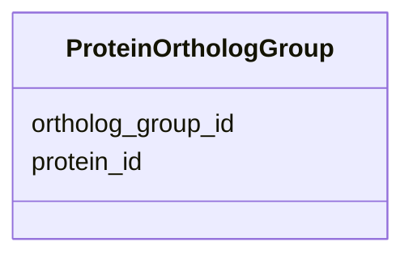

# Class: ProteinOrthologGroup 


_Protein to ortholog group assignments_


URI: [https://w3id.org/kbase/phagefoundry_genome_browser/ProteinOrthologGroup](https://w3id.org/kbase/phagefoundry_genome_browser/ProteinOrthologGroup)





<!-- no inheritance hierarchy -->


## Slots

| Name | Cardinality and Range | Description | Inheritance |
| ---  | --- | --- | --- |
| [protein_id](protein_id.md) | 0..1 <br/> [Integer](Integer.md) |  | direct |
| [ortholog_group_id](ortholog_group_id.md) | 0..1 <br/> [Integer](Integer.md) |  | direct |


## Identifier and Mapping Information


### Annotations

| property | value |
| --- | --- |
| source_table | browser_protein_ortholog_groups |


### Schema Source


* from schema: https://w3id.org/kbase/phagefoundry_genome_browser


## Mappings

| Mapping Type | Mapped Value |
| ---  | ---  |
| self | https://w3id.org/kbase/phagefoundry_genome_browser/ProteinOrthologGroup |
| native | https://w3id.org/kbase/phagefoundry_genome_browser/ProteinOrthologGroup |


## LinkML Source

<!-- TODO: investigate https://stackoverflow.com/questions/37606292/how-to-create-tabbed-code-blocks-in-mkdocs-or-sphinx -->

### Direct

<details>
```yaml
name: ProteinOrthologGroup
annotations:
  source_table:
    tag: source_table
    value: browser_protein_ortholog_groups
description: Protein to ortholog group assignments
from_schema: https://w3id.org/kbase/phagefoundry_genome_browser
attributes:
  protein_id:
    name: protein_id
    from_schema: https://w3id.org/kbase/phagefoundry_genome_browser
    domain_of:
    - ProteinCAZyFamily
    - ProteinCOGClass
    - ProteinECNumber
    - ProteinGOTerm
    - ProteinKEGGOrtholog
    - ProteinKEGGPathway
    - ProteinKEGGReaction
    - ProteinOrthologGroup
    - ProteinTCFamily
    range: integer
  ortholog_group_id:
    name: ortholog_group_id
    from_schema: https://w3id.org/kbase/phagefoundry_genome_browser
    rank: 1000
    domain_of:
    - ProteinOrthologGroup
    range: integer

```
</details>

### Induced

<details>
```yaml
name: ProteinOrthologGroup
annotations:
  source_table:
    tag: source_table
    value: browser_protein_ortholog_groups
description: Protein to ortholog group assignments
from_schema: https://w3id.org/kbase/phagefoundry_genome_browser
attributes:
  protein_id:
    name: protein_id
    from_schema: https://w3id.org/kbase/phagefoundry_genome_browser
    alias: protein_id
    owner: ProteinOrthologGroup
    domain_of:
    - ProteinCAZyFamily
    - ProteinCOGClass
    - ProteinECNumber
    - ProteinGOTerm
    - ProteinKEGGOrtholog
    - ProteinKEGGPathway
    - ProteinKEGGReaction
    - ProteinOrthologGroup
    - ProteinTCFamily
    range: integer
  ortholog_group_id:
    name: ortholog_group_id
    from_schema: https://w3id.org/kbase/phagefoundry_genome_browser
    rank: 1000
    alias: ortholog_group_id
    owner: ProteinOrthologGroup
    domain_of:
    - ProteinOrthologGroup
    range: integer

```
</details>