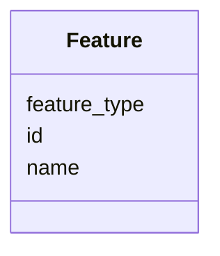

# Class: Feature 


_Genomic or phenotypic feature relevant to phage interaction._


URI: [https://w3id.org/kbase/phagefoundry_strain_modelling/Feature](https://w3id.org/kbase/phagefoundry_strain_modelling/Feature)





<!-- no inheritance hierarchy -->


## Slots

| Name | Cardinality and Range | Description | Inheritance |
| ---  | --- | --- | --- |
| [id](id.md) | 1 <br/> [Integer](Integer.md) |  | direct |
| [name](name.md) | 0..1 <br/> [String](String.md) |  | direct |
| [feature_type](feature_type.md) | 0..1 <br/> [String](String.md) | Type of feature (e | direct |


## Identifier and Mapping Information


### Annotations

| property | value |
| --- | --- |
| source_table | strainmodelling_feature |


### Schema Source


* from schema: https://w3id.org/kbase/phagefoundry_strain_modelling


## Mappings

| Mapping Type | Mapped Value |
| ---  | ---  |
| self | https://w3id.org/kbase/phagefoundry_strain_modelling/Feature |
| native | https://w3id.org/kbase/phagefoundry_strain_modelling/Feature |


## LinkML Source

<!-- TODO: investigate https://stackoverflow.com/questions/37606292/how-to-create-tabbed-code-blocks-in-mkdocs-or-sphinx -->

### Direct

<details>
```yaml
name: Feature
annotations:
  source_table:
    tag: source_table
    value: strainmodelling_feature
description: Genomic or phenotypic feature relevant to phage interaction.
from_schema: https://w3id.org/kbase/phagefoundry_strain_modelling
attributes:
  id:
    name: id
    from_schema: https://w3id.org/kbase/phagefoundry_strain_modelling
    identifier: true
    domain_of:
    - Organism
    - OrganismMetadata
    - Genome
    - GenomeSet
    - Sequence
    - Gene
    - Experiment
    - ExperimentMetadata
    - ExperimentMetric
    - Feature
    - FeatureMetric
    - FeatureInterval
    - Interaction
    - Interval
    - ProteinFamily
    range: integer
    required: true
  name:
    name: name
    from_schema: https://w3id.org/kbase/phagefoundry_strain_modelling
    domain_of:
    - Organism
    - Genome
    - GenomeSet
    - Sequence
    - Experiment
    - Feature
    - ProteinFamily
    range: string
  feature_type:
    name: feature_type
    description: Type of feature (e.g., receptor, defense system)
    from_schema: https://w3id.org/kbase/phagefoundry_strain_modelling
    rank: 1000
    domain_of:
    - Feature
    range: string

```
</details>

### Induced

<details>
```yaml
name: Feature
annotations:
  source_table:
    tag: source_table
    value: strainmodelling_feature
description: Genomic or phenotypic feature relevant to phage interaction.
from_schema: https://w3id.org/kbase/phagefoundry_strain_modelling
attributes:
  id:
    name: id
    from_schema: https://w3id.org/kbase/phagefoundry_strain_modelling
    identifier: true
    alias: id
    owner: Feature
    domain_of:
    - Organism
    - OrganismMetadata
    - Genome
    - GenomeSet
    - Sequence
    - Gene
    - Experiment
    - ExperimentMetadata
    - ExperimentMetric
    - Feature
    - FeatureMetric
    - FeatureInterval
    - Interaction
    - Interval
    - ProteinFamily
    range: integer
    required: true
  name:
    name: name
    from_schema: https://w3id.org/kbase/phagefoundry_strain_modelling
    alias: name
    owner: Feature
    domain_of:
    - Organism
    - Genome
    - GenomeSet
    - Sequence
    - Experiment
    - Feature
    - ProteinFamily
    range: string
  feature_type:
    name: feature_type
    description: Type of feature (e.g., receptor, defense system)
    from_schema: https://w3id.org/kbase/phagefoundry_strain_modelling
    rank: 1000
    alias: feature_type
    owner: Feature
    domain_of:
    - Feature
    range: string

```
</details>