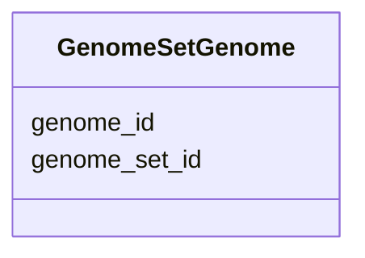

# Class: GenomeSetGenome 


_Many-to-many link between genome sets and genomes._


URI: [https://w3id.org/kbase/phagefoundry_strain_modelling/GenomeSetGenome](https://w3id.org/kbase/phagefoundry_strain_modelling/GenomeSetGenome)





<!-- no inheritance hierarchy -->


## Slots

| Name | Cardinality and Range | Description | Inheritance |
| ---  | --- | --- | --- |
| [genome_set_id](genome_set_id.md) | 0..1 <br/> [Integer](Integer.md) |  | direct |
| [genome_id](genome_id.md) | 0..1 <br/> [Integer](Integer.md) |  | direct |


## Identifier and Mapping Information


### Annotations

| property | value |
| --- | --- |
| source_table | strainmodelling_genome_set_genomes |


### Schema Source


* from schema: https://w3id.org/kbase/phagefoundry_strain_modelling


## Mappings

| Mapping Type | Mapped Value |
| ---  | ---  |
| self | https://w3id.org/kbase/phagefoundry_strain_modelling/GenomeSetGenome |
| native | https://w3id.org/kbase/phagefoundry_strain_modelling/GenomeSetGenome |


## LinkML Source

<!-- TODO: investigate https://stackoverflow.com/questions/37606292/how-to-create-tabbed-code-blocks-in-mkdocs-or-sphinx -->

### Direct

<details>
```yaml
name: GenomeSetGenome
annotations:
  source_table:
    tag: source_table
    value: strainmodelling_genome_set_genomes
description: Many-to-many link between genome sets and genomes.
from_schema: https://w3id.org/kbase/phagefoundry_strain_modelling
attributes:
  genome_set_id:
    name: genome_set_id
    comments:
    - Foreign key to GenomeSet.id
    from_schema: https://w3id.org/kbase/phagefoundry_strain_modelling
    rank: 1000
    domain_of:
    - GenomeSetGenome
    range: integer
  genome_id:
    name: genome_id
    comments:
    - Foreign key to Genome.id
    from_schema: https://w3id.org/kbase/phagefoundry_strain_modelling
    rank: 1000
    domain_of:
    - GenomeSetGenome
    - Sequence
    range: integer

```
</details>

### Induced

<details>
```yaml
name: GenomeSetGenome
annotations:
  source_table:
    tag: source_table
    value: strainmodelling_genome_set_genomes
description: Many-to-many link between genome sets and genomes.
from_schema: https://w3id.org/kbase/phagefoundry_strain_modelling
attributes:
  genome_set_id:
    name: genome_set_id
    comments:
    - Foreign key to GenomeSet.id
    from_schema: https://w3id.org/kbase/phagefoundry_strain_modelling
    rank: 1000
    alias: genome_set_id
    owner: GenomeSetGenome
    domain_of:
    - GenomeSetGenome
    range: integer
  genome_id:
    name: genome_id
    comments:
    - Foreign key to Genome.id
    from_schema: https://w3id.org/kbase/phagefoundry_strain_modelling
    rank: 1000
    alias: genome_id
    owner: GenomeSetGenome
    domain_of:
    - GenomeSetGenome
    - Sequence
    range: integer

```
</details>