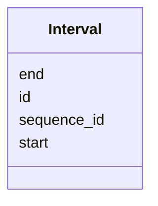

# Class: Interval 


_Genomic interval (coordinate range)._


URI: [https://w3id.org/kbase/phagefoundry_strain_modelling/Interval](https://w3id.org/kbase/phagefoundry_strain_modelling/Interval)





<!-- no inheritance hierarchy -->


## Slots

| Name | Cardinality and Range | Description | Inheritance |
| ---  | --- | --- | --- |
| [id](id.md) | 1 <br/> [Integer](Integer.md) |  | direct |
| [sequence_id](sequence_id.md) | 0..1 <br/> [Integer](Integer.md) |  | direct |
| [start](start.md) | 0..1 <br/> [Integer](Integer.md) |  | direct |
| [end](end.md) | 0..1 <br/> [Integer](Integer.md) |  | direct |


## Identifier and Mapping Information


### Annotations

| property | value |
| --- | --- |
| source_table | strainmodelling_interval |


### Schema Source


* from schema: https://w3id.org/kbase/phagefoundry_strain_modelling


## Mappings

| Mapping Type | Mapped Value |
| ---  | ---  |
| self | https://w3id.org/kbase/phagefoundry_strain_modelling/Interval |
| native | https://w3id.org/kbase/phagefoundry_strain_modelling/Interval |


## LinkML Source

<!-- TODO: investigate https://stackoverflow.com/questions/37606292/how-to-create-tabbed-code-blocks-in-mkdocs-or-sphinx -->

### Direct

<details>
```yaml
name: Interval
annotations:
  source_table:
    tag: source_table
    value: strainmodelling_interval
description: Genomic interval (coordinate range).
from_schema: https://w3id.org/kbase/phagefoundry_strain_modelling
attributes:
  id:
    name: id
    from_schema: https://w3id.org/kbase/phagefoundry_strain_modelling
    identifier: true
    domain_of:
    - Organism
    - OrganismMetadata
    - Genome
    - GenomeSet
    - Sequence
    - Gene
    - Experiment
    - ExperimentMetadata
    - ExperimentMetric
    - Feature
    - FeatureMetric
    - FeatureInterval
    - Interaction
    - Interval
    - ProteinFamily
    range: integer
    required: true
  sequence_id:
    name: sequence_id
    comments:
    - Foreign key to Sequence.id
    from_schema: https://w3id.org/kbase/phagefoundry_strain_modelling
    domain_of:
    - Gene
    - Interval
    range: integer
  start:
    name: start
    from_schema: https://w3id.org/kbase/phagefoundry_strain_modelling
    domain_of:
    - Gene
    - Interval
    range: integer
  end:
    name: end
    from_schema: https://w3id.org/kbase/phagefoundry_strain_modelling
    domain_of:
    - Gene
    - Interval
    range: integer

```
</details>

### Induced

<details>
```yaml
name: Interval
annotations:
  source_table:
    tag: source_table
    value: strainmodelling_interval
description: Genomic interval (coordinate range).
from_schema: https://w3id.org/kbase/phagefoundry_strain_modelling
attributes:
  id:
    name: id
    from_schema: https://w3id.org/kbase/phagefoundry_strain_modelling
    identifier: true
    alias: id
    owner: Interval
    domain_of:
    - Organism
    - OrganismMetadata
    - Genome
    - GenomeSet
    - Sequence
    - Gene
    - Experiment
    - ExperimentMetadata
    - ExperimentMetric
    - Feature
    - FeatureMetric
    - FeatureInterval
    - Interaction
    - Interval
    - ProteinFamily
    range: integer
    required: true
  sequence_id:
    name: sequence_id
    comments:
    - Foreign key to Sequence.id
    from_schema: https://w3id.org/kbase/phagefoundry_strain_modelling
    alias: sequence_id
    owner: Interval
    domain_of:
    - Gene
    - Interval
    range: integer
  start:
    name: start
    from_schema: https://w3id.org/kbase/phagefoundry_strain_modelling
    alias: start
    owner: Interval
    domain_of:
    - Gene
    - Interval
    range: integer
  end:
    name: end
    from_schema: https://w3id.org/kbase/phagefoundry_strain_modelling
    alias: end
    owner: Interval
    domain_of:
    - Gene
    - Interval
    range: integer

```
</details>