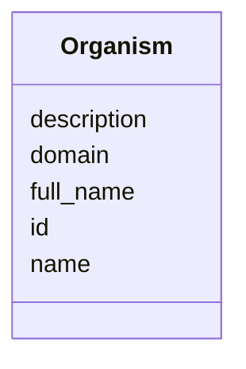

# Class: Organism 


_Bacterial organism/strain used in phage interaction studies. Primarily E. coli strains for phage therapy research._

_EXAMPLE ORGANISMS: - E. coli 370D - E. coli 381A - E. coli 536_


URI: [https://w3id.org/kbase/phagefoundry_strain_modelling/Organism](https://w3id.org/kbase/phagefoundry_strain_modelling/Organism)





<!-- no inheritance hierarchy -->


## Slots

| Name | Cardinality and Range | Description | Inheritance |
| ---  | --- | --- | --- |
| [id](id.md) | 1 <br/> [Integer](Integer.md) | Internal organism ID | direct |
| [name](name.md) | 1 <br/> [String](String.md) | Short organism/strain name | direct |
| [full_name](full_name.md) | 0..1 <br/> [String](String.md) | Full organism name with species | direct |
| [domain](domain.md) | 0..1 <br/> [String](String.md) | Taxonomic domain | direct |
| [description](description.md) | 0..1 <br/> [String](String.md) | Organism description (optional) | direct |


## Identifier and Mapping Information


### Annotations

| property | value |
| --- | --- |
| source_table | strainmodelling_organism |


### Schema Source


* from schema: https://w3id.org/kbase/phagefoundry_strain_modelling


## Mappings

| Mapping Type | Mapped Value |
| ---  | ---  |
| self | https://w3id.org/kbase/phagefoundry_strain_modelling/Organism |
| native | https://w3id.org/kbase/phagefoundry_strain_modelling/Organism |


## LinkML Source

<!-- TODO: investigate https://stackoverflow.com/questions/37606292/how-to-create-tabbed-code-blocks-in-mkdocs-or-sphinx -->

### Direct

<details>
```yaml
name: Organism
annotations:
  source_table:
    tag: source_table
    value: strainmodelling_organism
description: 'Bacterial organism/strain used in phage interaction studies. Primarily
  E. coli strains for phage therapy research.

  EXAMPLE ORGANISMS: - E. coli 370D - E. coli 381A - E. coli 536'
from_schema: https://w3id.org/kbase/phagefoundry_strain_modelling
attributes:
  id:
    name: id
    description: Internal organism ID
    examples:
    - value: '297'
    - value: '298'
    - value: '299'
    from_schema: https://w3id.org/kbase/phagefoundry_strain_modelling
    rank: 1000
    identifier: true
    domain_of:
    - Organism
    - OrganismMetadata
    - Genome
    - GenomeSet
    - Sequence
    - Gene
    - Experiment
    - ExperimentMetadata
    - ExperimentMetric
    - Feature
    - FeatureMetric
    - FeatureInterval
    - Interaction
    - Interval
    - ProteinFamily
    range: integer
    required: true
  name:
    name: name
    description: Short organism/strain name
    examples:
    - value: 370D
    - value: 381A
    - value: '536'
    from_schema: https://w3id.org/kbase/phagefoundry_strain_modelling
    rank: 1000
    domain_of:
    - Organism
    - Genome
    - GenomeSet
    - Sequence
    - Experiment
    - Feature
    - ProteinFamily
    range: string
    required: true
  full_name:
    name: full_name
    description: Full organism name with species
    examples:
    - value: E. coli 370D
    - value: E. coli 381A
    - value: E. coli 536
    from_schema: https://w3id.org/kbase/phagefoundry_strain_modelling
    rank: 1000
    domain_of:
    - Organism
    range: string
  domain:
    name: domain
    description: Taxonomic domain
    examples:
    - value: Bacteria
    from_schema: https://w3id.org/kbase/phagefoundry_strain_modelling
    rank: 1000
    domain_of:
    - Organism
    range: string
  description:
    name: description
    description: Organism description (optional)
    from_schema: https://w3id.org/kbase/phagefoundry_strain_modelling
    rank: 1000
    domain_of:
    - Organism
    - GenomeSet
    - Experiment
    - ProteinFamily
    range: string

```
</details>

### Induced

<details>
```yaml
name: Organism
annotations:
  source_table:
    tag: source_table
    value: strainmodelling_organism
description: 'Bacterial organism/strain used in phage interaction studies. Primarily
  E. coli strains for phage therapy research.

  EXAMPLE ORGANISMS: - E. coli 370D - E. coli 381A - E. coli 536'
from_schema: https://w3id.org/kbase/phagefoundry_strain_modelling
attributes:
  id:
    name: id
    description: Internal organism ID
    examples:
    - value: '297'
    - value: '298'
    - value: '299'
    from_schema: https://w3id.org/kbase/phagefoundry_strain_modelling
    rank: 1000
    identifier: true
    alias: id
    owner: Organism
    domain_of:
    - Organism
    - OrganismMetadata
    - Genome
    - GenomeSet
    - Sequence
    - Gene
    - Experiment
    - ExperimentMetadata
    - ExperimentMetric
    - Feature
    - FeatureMetric
    - FeatureInterval
    - Interaction
    - Interval
    - ProteinFamily
    range: integer
    required: true
  name:
    name: name
    description: Short organism/strain name
    examples:
    - value: 370D
    - value: 381A
    - value: '536'
    from_schema: https://w3id.org/kbase/phagefoundry_strain_modelling
    rank: 1000
    alias: name
    owner: Organism
    domain_of:
    - Organism
    - Genome
    - GenomeSet
    - Sequence
    - Experiment
    - Feature
    - ProteinFamily
    range: string
    required: true
  full_name:
    name: full_name
    description: Full organism name with species
    examples:
    - value: E. coli 370D
    - value: E. coli 381A
    - value: E. coli 536
    from_schema: https://w3id.org/kbase/phagefoundry_strain_modelling
    rank: 1000
    alias: full_name
    owner: Organism
    domain_of:
    - Organism
    range: string
  domain:
    name: domain
    description: Taxonomic domain
    examples:
    - value: Bacteria
    from_schema: https://w3id.org/kbase/phagefoundry_strain_modelling
    rank: 1000
    alias: domain
    owner: Organism
    domain_of:
    - Organism
    range: string
  description:
    name: description
    description: Organism description (optional)
    from_schema: https://w3id.org/kbase/phagefoundry_strain_modelling
    rank: 1000
    alias: description
    owner: Organism
    domain_of:
    - Organism
    - GenomeSet
    - Experiment
    - ProteinFamily
    range: string

```
</details>