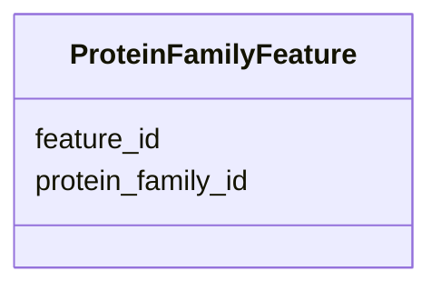

# Class: ProteinFamilyFeature 


_Features associated with protein families._


URI: [https://w3id.org/kbase/phagefoundry_strain_modelling/ProteinFamilyFeature](https://w3id.org/kbase/phagefoundry_strain_modelling/ProteinFamilyFeature)





<!-- no inheritance hierarchy -->


## Slots

| Name | Cardinality and Range | Description | Inheritance |
| ---  | --- | --- | --- |
| [protein_family_id](protein_family_id.md) | 0..1 <br/> [Integer](Integer.md) |  | direct |
| [feature_id](feature_id.md) | 0..1 <br/> [Integer](Integer.md) |  | direct |


## Identifier and Mapping Information


### Annotations

| property | value |
| --- | --- |
| source_table | strainmodelling_protein_family_features |


### Schema Source


* from schema: https://w3id.org/kbase/phagefoundry_strain_modelling


## Mappings

| Mapping Type | Mapped Value |
| ---  | ---  |
| self | https://w3id.org/kbase/phagefoundry_strain_modelling/ProteinFamilyFeature |
| native | https://w3id.org/kbase/phagefoundry_strain_modelling/ProteinFamilyFeature |


## LinkML Source

<!-- TODO: investigate https://stackoverflow.com/questions/37606292/how-to-create-tabbed-code-blocks-in-mkdocs-or-sphinx -->

### Direct

<details>
```yaml
name: ProteinFamilyFeature
annotations:
  source_table:
    tag: source_table
    value: strainmodelling_protein_family_features
description: Features associated with protein families.
from_schema: https://w3id.org/kbase/phagefoundry_strain_modelling
attributes:
  protein_family_id:
    name: protein_family_id
    comments:
    - Foreign key to ProteinFamily.id
    from_schema: https://w3id.org/kbase/phagefoundry_strain_modelling
    domain_of:
    - ProteinFamilyGene
    - ProteinFamilyFeature
    range: integer
  feature_id:
    name: feature_id
    comments:
    - Foreign key to Feature.id
    from_schema: https://w3id.org/kbase/phagefoundry_strain_modelling
    domain_of:
    - FeatureMetric
    - FeatureInterval
    - ProteinFamilyFeature
    range: integer

```
</details>

### Induced

<details>
```yaml
name: ProteinFamilyFeature
annotations:
  source_table:
    tag: source_table
    value: strainmodelling_protein_family_features
description: Features associated with protein families.
from_schema: https://w3id.org/kbase/phagefoundry_strain_modelling
attributes:
  protein_family_id:
    name: protein_family_id
    comments:
    - Foreign key to ProteinFamily.id
    from_schema: https://w3id.org/kbase/phagefoundry_strain_modelling
    alias: protein_family_id
    owner: ProteinFamilyFeature
    domain_of:
    - ProteinFamilyGene
    - ProteinFamilyFeature
    range: integer
  feature_id:
    name: feature_id
    comments:
    - Foreign key to Feature.id
    from_schema: https://w3id.org/kbase/phagefoundry_strain_modelling
    alias: feature_id
    owner: ProteinFamilyFeature
    domain_of:
    - FeatureMetric
    - FeatureInterval
    - ProteinFamilyFeature
    range: integer

```
</details>